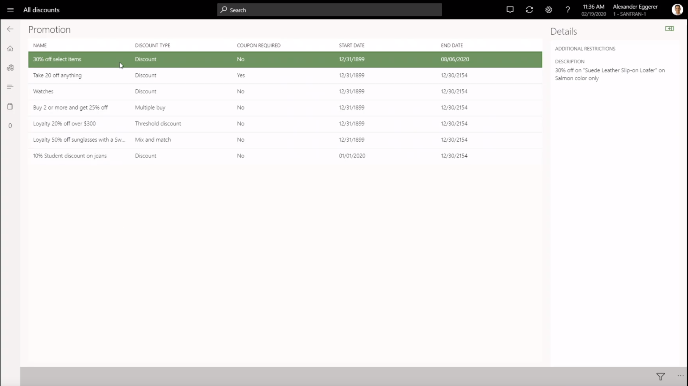
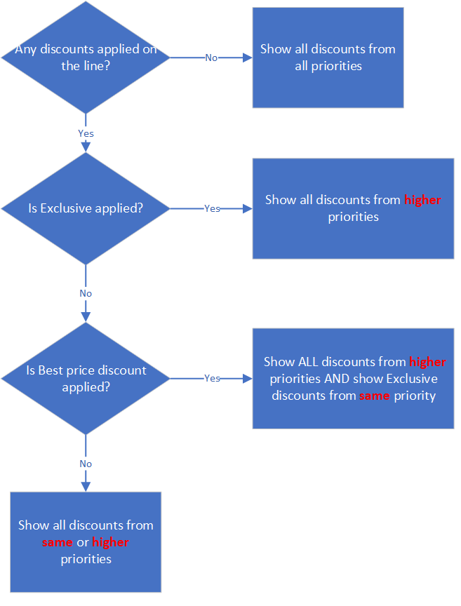

---
# required metadata

title: Display discounts in POS 
description: This document explains how Dynamics 365 Commerce enables sales associates to learn about promotions and helps them use the promotions for cross-sell and upsell motions.
author: ShalabhjainMSFT
manager: AnnBe
ms.date: 03/06/2020
ms.topic: article
ms.prod: 
ms.service: dynamics-365-Commerce
ms.technology: 

# optional metadata

ms.search.form: 
# ROBOTS: 
audience: Application User
# ms.devlang: 
ms.reviewer: josaw
ms.search.scope: Core, Operations, Retail, Commerce
# ms.tgt_pltfrm: 
ms.custom: 
ms.assetid: 
ms.search.region: global
ms.search.industry: Retail, Commerce
ms.author: asharchw
ms.search.validFrom: 2020-02-28
ms.dyn365.ops.version: Application update 10.0.10

---

# Display discounts in POS

[!include [banner](includes/banner.md)]
[!include [banner](includes/preview-banner.md)]

Promotions play an important role in motivating customers when making purchasing decisions. Holidays can result in the highest amount of sales for retailers, as the entire retail market is flooded with enticing promotions and discounts. If a store associate knows and understands the promotions that are available, the associate can easily leverage the promotions to upsell and cross-sell items. This document explains how Dynamics 365 Commerce enables sales associates to learn about promotions and helps them use the promotions for cross-sell and upsell motions.

## Learn about store discounts

Commerce includes an operation called "View all discounts" that displays all the discounts that are currently running in a store. The "View all discounts" operation can be mapped to a button in the point of sale (POS), and the button can be placed on the **Welcome**  or the **Transaction** screens. The image below is of the **All discounts** page.

 

To display discounts, the system looks for all the discounts that match one or more of the following conditions:

	- The price group of the discount matches the price group of the store.
	- The price group of the discount is mapped to an affiliation or loyalty program.
	- The price group of the discount is mapped to a catalog that is associated to the store.

Only some coupon-based discounts are shown in this view because in general, retailers create thousands of coupons and corresponding discounts for unique customers, and this view is not indended to show customer-specific discounts. Coupon-based discounts are shown only if **Apply without a coupon code** is enabled. The configuration is available on each coupon header. If enabled, cashiers can apply the coupon without typing or scanning any coupon code or barcode. Using this configuration enables scenarios such as when cashiers want to give additional discounts to customers, such as for customer appeasement, product defects, etc. Instead of having to distribute printed coupon codes or barcodes to cashiers, cashiers can press the **Apply coupon** button. The way, the coupon is automatically applied to the transaction. If multiple coupons exist for a coupon header, the system automatically chooses the first active coupon on the transaction.

On the **All discounts** page, sales associates can also search discounts by keywords. The keyword search looks in the discount name and discount description fields. Sales associates can also filter discounts by whether a discount requires a coupon code. 

## Upsell and cross-sell using discounts
Multi-line discounts such as quantity discounts, mix and match, and threshold discounts are a great way to motivate customers to buy additional products to get greater discounts. This, in turn, helps increase customer cart size and retailer revenue. These discounts can be publicized on e-commerce websites, social media, and on banners in the store. Even with all these measures, customers may miss the opportunity to take advantage of the promotions. To make it easy for sales associates to find out what promotions are applicable on a selected line or on the entire cart, retailers can place the button for the "View all discounts" operation on any button grid in POS. We recommend that retailers place the button on the button grid of the **Transaction** screen. That way, a sales associate can select a transaction line and click the button to display all the available discounts on the selected line, or click another tab to display discounts applicable on the entire transaction. 

The view mentioned above displays only the discounts which do not compete with any of the applied discounts. This is to ensure that if an associate informs a customer about a discount and the customer takes the required action (for example, buy one more item to get 10% off), the discount definitely gets applied to the transaction. As mentioned above, coupon-based discounts are only shown when **Apply without a coupon code** is enabled. For a simple scenario where all discounts are of the same priority, the discount concurrency mode is "Compounded", and the discount concurrency control is set to “Best price and compound within priority, never compound across priorities”, the available discount view shows all available discounts for a product. This is because all the discounts compound and do not compete with each other. 

For advanced scenarios, such as where the discount concurrency mode is "Best price" or "Exclusive" with two or more priorities, the diagrams below show the logic of which discounts are displayed. This is further affected by whether the discount concurrency control is set to "Best price and compound within priority, never compound across priorities" or "Best price only within priority, always compound across priority".

The diagram below illustrates when the discount concurrency control is "Best price and compound within priority, never compound across priorities". 

.

This next diagram illustrates when the discount concurrency control is "Best price only within priority, always compound across priority".

.
