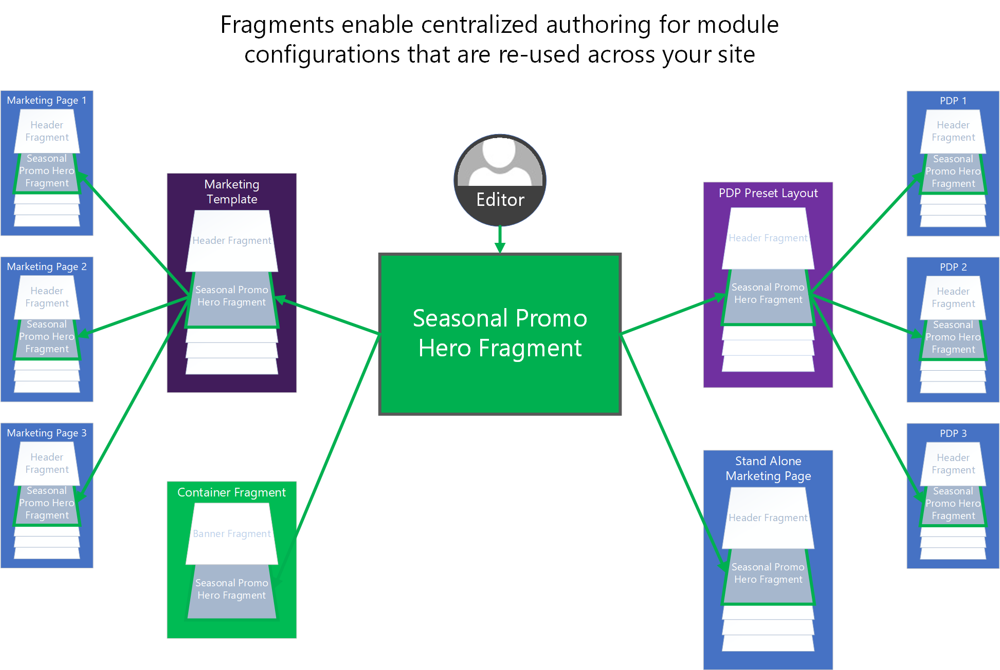

---
# required metadata

title: Fragments
description: This topic describes why, when, and how to use fragments within the e-commerce authoring toolset.
author: Nick Holman
manager: Brendan Sullivan
ms.date: 07/08/2019
ms.topic: article
ms.prod: 
ms.service: dynamics-365-commerce
ms.technology: 

# optional metadata

ms.search.form:  
audience: Application User
# ms.devlang: 
ms.reviewer: josaw
ms.search.scope: 
# ms.tgt_pltfrm: 
# ms.custom: 
ms.search.region: Global
ms.search.industry: retail
ms.author: phinneyridge
ms.search.validFrom: 
ms.dyn365.ops.version: 

---
# Create a fragment
# Add fragments to a page
# Edit a fragment

---
# Original Article:

# Fragments

Fragments enable a centralized authoring experience for re-usable module configurations needed throughout your site. For example: headers, footers, and banners are often configured as fragments because they are shared across many pages. A great way to think of fragments is that they act like mini webpages that can be inserted into other pages within your site. Fragments have their own lifecycle, which means they are created, referenced, updated, and deleted as independent entities within the authoring tools. Once fragments are configured, they are available to use everywhere that a module can be used within your site structure. Fragments can be referenced within pages, templates, master templates, and even within other fragments (note: fragments can nest up to 7 levels deep).

As an example, let’s imagine a seasonal event that we want to promote across many pages within our site. We could use a fragment to do this. Our new fragment will begin by choosing a module type to start from. For this example, we could choose for our fragment to be built from a Hero module (note: fragments can be built from any module type). We can then configure this Hero fragment with our specific promotional content, and localize it if necessary. This new stand-alone Hero fragment is now consumable as a pre-configured module throughout our site. We can easily add it to templates, specific pages, or even within other fragments that can contain Hero modules. All the places where the fragment is added are references to the central Hero fragment that we created. If we decide to publish changes to our fragment, these will immediately be reflected everywhere the fragment is referenced across our site. Fragments are a powerful and efficient way to re-use and centrally manage module configurations within a site, and effective use can add up to significant agility and cost savings when managing site content.

