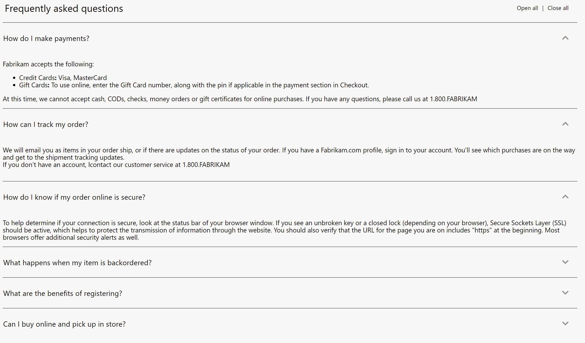

---
# required metadata

title: Breadcrumb module 
description: This topic covers Accordion module and describes how to add it to site pages in Microsoft Dynamics 365 Commerce.
author:  anupamar-ms
manager: annbe
ms.date: 04/24/2020
ms.topic: article
ms.prod: 
ms.service: dynamics-365-commerce
ms.technology: 

# optional metadata

# ms.search.form: 
# ROBOTS: 
audience: Application User
# ms.devlang: 
ms.reviewer: v-chgri
ms.search.scope: Retail, Core, Operations
# ms.tgt_pltfrm: 
ms.custom: 
ms.assetid: 
ms.search.region: Global
ms.search.industry: 
ms.author: anupamar
ms.search.validFrom: 2019-10-31
ms.dyn365.ops.version: 
---

# Accordion module

[!include [banner](includes/banner.md)]

This topic covers Accordion module and describes how to add it to site pages in Microsoft Dynamics 365 Commerce.

## Overview
Accordion module is used to organize information within a page. It provides a collapsible drawer like capability that makes it ideal for organizing information. It can be used on any page to organize information/modules.

Below is an example of Accordion module used on a Store FAQ page to organize information

## Details
**Accordion** is a container-like module that allows on or more **Accordion item** module to be added. Each Accordion item represents a collapsible drawer. Within each Accordion item 1 or more modules can be added. There are no restrictions on the type of modules that can be added within an Accordion item as its truly an organizer.

## Accordion module properties

| Property name  | Values | Description |
|----------------|--------|-------------|
| Root          | Link| A root can be defined for the breadcrumb, E.g. Home, Storefront etc. Its an optional field, if not configured there will be no root defined|
| Breadcrumb link  | Link | If a page needs a manually configured breadcrumb, the links can defined via this link property. The links appear in the order they are added.|

## Add a Accordion module to a new page

To add a Accordion module to a PDP and set the required properties, follow these steps.

1. Go to Site settings/Extension and choose a **Breadcrumb style for PDP**. In this e.g. choose "Category heirarchy only" type
1. Go to **Templates**, and choose the PDP template 
1. In the Container for the Buy Box, add the Breadcrumb module. 
1. Select **Save**, select **Finish editing** to check in the template, and then select **Publish** to publish it.
1. If you have a page for PDP, open the page or create a new page for PDP
1. In the **Container** for the BuyBox, add a module
1. In the **Add Module** dialog box, under **Select Modules**, select the Breadcrumb module, and then select **OK**.
1. In the outline tree on the left, select the Breadcrumb module
1. In the properties pane on the right, select a Root, define root as the **Home** page
1. Select **Save**, and then select **Preview** to preview the page.
1. Select **Finish editing** to check in the template, and then select **Publish** to publish it. 

## Additional resources

[Starter kit overview](starter-kit-overview.md)

[Search results](category-search-page-overview.mdt.md)

[Product collection](product-collection-module-overview.md)

[Buy box](add-buy-box.md)

