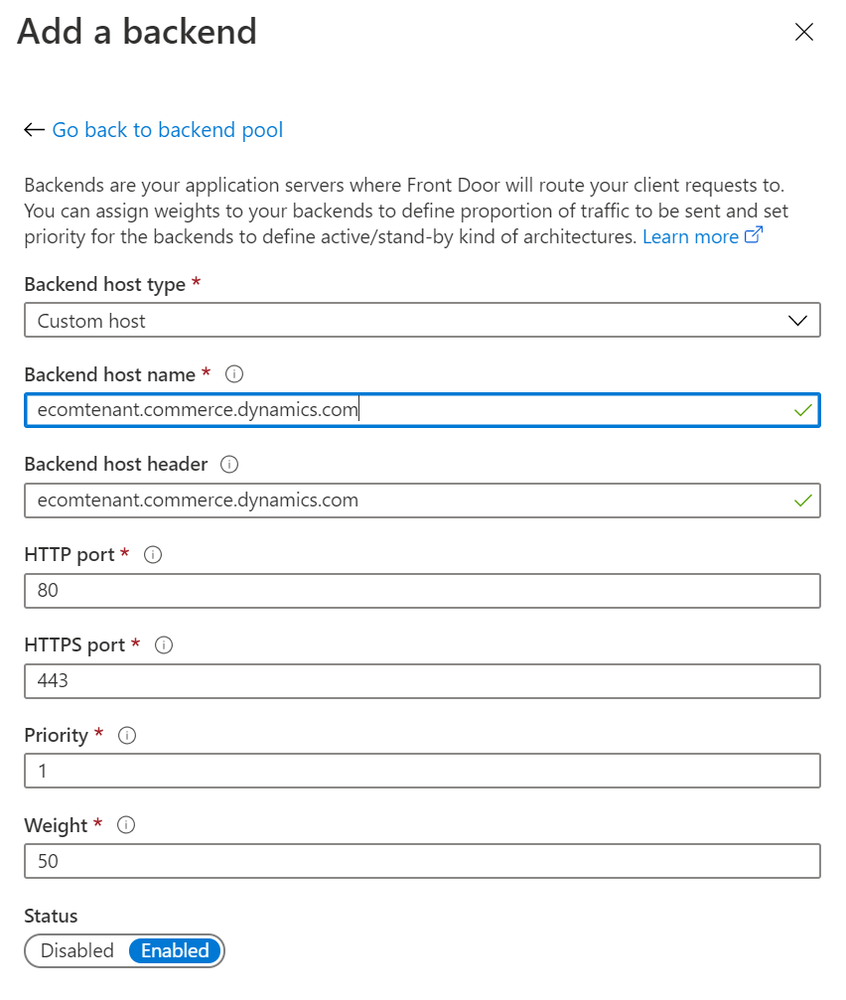
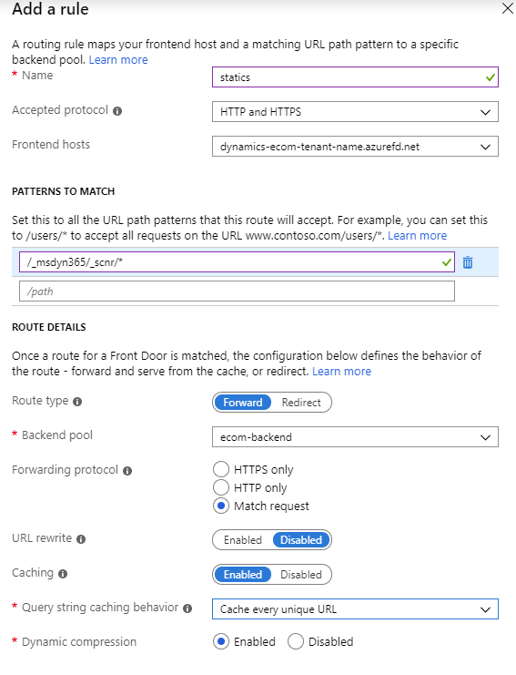
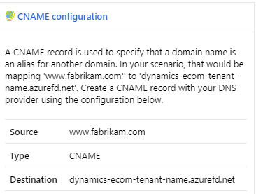
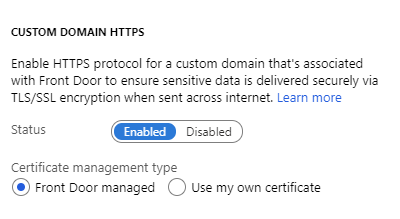

---
# required metadata

title: Add CDN support
description: This topic describes how to add a content delivery network (CDN) to your Dynamics 365 Commerce environment.
author: brianshook
manager: annbe
ms.date: 10/01/2019
ms.topic: article
ms.prod: 
ms.service: dynamics-ax-retail
ms.technology: 

# optional metadata

# ms.search.form: 
audience: Application user
# ms.devlang: 
ms.reviewer: v-chgri
ms.search.scope: Operations, Retail, Core
# ms.tgt_pltfrm: 
ms.custom: 
ms.assetid: 
ms.search.region: Global
# ms.search.industry: 
ms.author: brshoo
ms.search.validFrom: 2019-10-31
ms.dyn365.ops.version: Release 10.0.5

---

# Add CDN support

[!include [banner](../includes/preview-banner.md)]
[!include [banner](../includes/banner.md)]

This topic describes how to add a content delivery network (CDN) to your Dynamics 365 Commerce environment.

## Overview

When you set up an e-Commerce environment in Commerce, you can configure it to work with your CDN service. 

Your custom domain can be enabled during the e-Commerce environment provisioning process, or set up after provisioning using a service request. The provisioning process for your e-Commerce environment will generate a hostname associated with the environment, using the following format (where *e-commerce-tenant-name* is the name of your environment). 

`<e-commerce-tenant-name>.commerce.dynamics.com)` 

The Commerce hostname or endpoint generated during provisioning only supports a Secure Sockets Layer (SSL) certificate for &#42;.commerce.dynamics.com. This generated hostname or endpoint will not support SSL for custom domains. For this reason, you must terminate SSL for your custom domain in your CDN and forward traffic from the CDN to the Commerce-generated hostname or endpoint. 

Additionally, the statics (JavaScript or CSS files) from Commerce will get served from the Commerce-generated endpoint (&#42;.commerce.dynamics.com). To have the statics cached, the Commerce-generated hostname or endpoint must be placed behind the CDN.

## Set up SSL

To ensure that SSL is set up and statics are cached, you must configure your CDN to direct to the Commerce-generated hostname of your environment. You must also cache the following pattern for statics only: 

`/_msdyn365/_scnr/&#42;`

Once you have provisioned your Commerce environment with the custom domain provided (or provided the custom domain for your environment using a service request), point your custom domain to the Commerce-generated hostname or endpoint.

As noted, the generated hostname or endpoint will only support an SSL certificate for &#42;.commerce.dynamics.com; it will not support SSL for custom domains.

## CDN services

Any CDN service can be used with a Commerce environment, such as the following.

- **Azure Front Door**- Azure's CDN solution. For more information on Azure Front Door, see https://docs.microsoft.com/en-us/azure/frontdoor/.

- **Akamai** - https://www.akamai.com/us/en/products/performance/dynamic-site-accelerator.jsp

## CDN setup

CDN setup follows these general steps.

1. Add a frontend host.
1. Configure a backend pool.
1. Set up rules for routing and caching.

### Add a frontend host

Any CDN service can be used, but for the purposes of this CDN setup example we will use Azure Front Door for context. 

The documented Azure Front Door setup steps can be found at https://docs.microsoft.com/en-us/azure/frontdoor/quickstart-create-front-door.

### Configure a backend pool

To configure a backend pool in Commerce, do the following.

1. Add &lt;ecom-tenant-name&gt;.commerce.dynamics.com to a backend pool as a custom host (empty backend host header).
1. In the **Path** box under **HEALTH PROBES**, enter **/keepalive**
1. In the **Intervals (seconds)** box, enter **255**.
1. Under **LOAD BALANCING**, use the default values.

The following image shows the Commerce **Add a backend pool** screen.

### Set up rules

To set up a routing rule in Commerce, do the following.

1. Add a default routing rule (Name: default).
1. In the **Accepted protocol** drop-down list, select **HTTP and HTTPS**.
1. In the **Frontend hosts** box, enter **dynamics-ecom-tenant-name.azurefd.net**.
1. In the first box under **PATTERNS TO MATCH**, enter **/&#42;**.
1. For **Route type** under **Route Details**, select **Forward**.
1. In the **Backend pool**  drop-down list, select **ecom-backend**.
1. For **Forwarding protocol**, select **Match request**. 
1. For **URL rewrite**, select **Disabled**.
1. For **Caching**, select **Disabled**.

To set up a caching rule in Commerce, do the following.

1. In the **Name** box, enter **statics**.
1. In the **Accepted protocol** drop-down list, select **HTTP and HTTPS**.
1. In the **Frontend hosts** box, enter **dynamics-ecom-tenant-name.azurefd.net**.
1. In the first box under **PATTERNS TO MATCH**, enter **/_msdyn365/_scnr/&#42;**.
1. For **Route type** under **Route Details**, select **Forward**.
1. In the **Backend pool**  drop-down list, select **ecom-backend**.
1. For **Forwarding protocol**, select **Match request**.
1. For **URL rewrite**, select **Disabled**.
1. For **Caching**, select **Disabled**.
1. In the **Query string caching behavior** drop-down list, select **Cache every unique URL**.
1. For **Dynamic compression**, select **Enabled**.

The following image shows the Commerce **Add a rule** screen.

After this initial configuration is deployed, you must add your custom domain to the Azure Front Door configuration. To add the custom domain (for example, www.fabrikam.com), you need to configure a CNAME for the domain.

The following image shows the Commerce **CNAME configuration** screen.

>[!NOTE]
> If the domain to be used is already active and live, please reach out to support for enabling this domain with Azure Front Door to set up a test.
You can choose to use Azure Front Door to manage the certificate, or use your own certificate for the custom domain.

The following image shows the Commerce **Custom Domain HTTPS** screen.

Your CDN should now be configured for use with your Commerce site.
