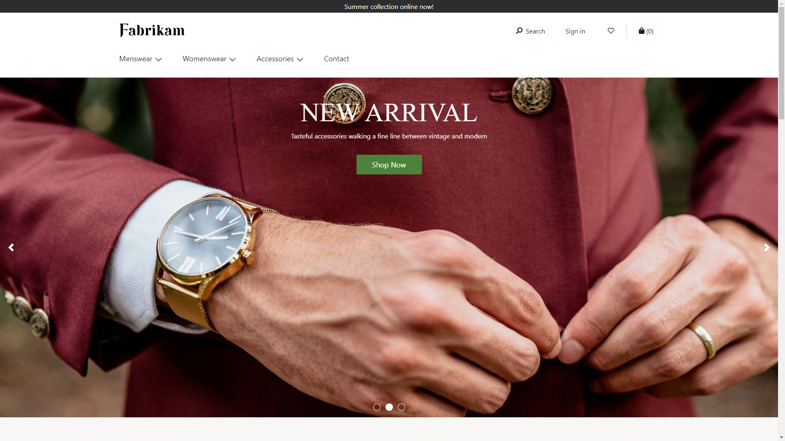

---
# required metadata

title: Content block module 
description: This topic covers content block modules and describes how to add them to site pages in Microsoft Dynamics 365 Commerce.
author:  anupamar-ms
manager: annbe
ms.date: 10/31/2019
ms.topic: article
ms.prod: 
ms.service: dynamics-365-commerce
ms.technology: 

# optional metadata

# ms.search.form: 
# ROBOTS: 
audience: Application User
# ms.devlang: 
ms.reviewer: v-chgri
ms.search.scope: Retail, Core, Operations
# ms.tgt_pltfrm: 
ms.custom: 
ms.assetid: 
ms.search.region: Global
ms.search.industry: 
ms.author: anupamar
ms.search.validFrom: 2019-10-31
ms.dyn365.ops.version: 
---

# Content block module

[!include [banner](includes/preview-banner.md)]
[!include [banner](includes/banner.md)]

This topic covers content block modules and describes how to add them to site pages in Microsoft Dynamics 365 Commerce.

## Overview

A content block module is used to market products or promotions through a combination of images and text. For example, a retailer can add a content block module to the home page of an e-Commerce site to promote a new product and attract the attention of customers.

A content block module is driven by data from the content management system (CMS). It's a stand-alone module that doesn't depend on any other modules on the page. A content block module can be put on any site page where a retailer wants to market or promote something (for example, products, sales, or features).

## Examples of content block module in e-Commerce

- A content block module can be used on the home page of an e-Commerce site to highlight promotions and new products.
- A content block module can be used on a product details page to showcase product information.
- Multiple content block modules can be put inside a carousel module to highlight multiple products or promotions.

## Theme on content block
Content block can support various layouts and styles based on theme. For instance the Fabrikam theme supports three layout variations of content block module - Hero, Feature, Tile. Hero layout shows image on the background with text overlay. Feature layout shows image and text side by side. Tile layout allows multiple content blocks in a tile format.

In addtion, the Theme can expose can different properties for each layout. A Theme developer can build more layouts with more styles using the content block module.

E.g. of content block with Hero layout

E.g. of content block with Feature layout
  

E.g. of content block with Tile layout

## Content block module properties

| Property name  | Values | Description |
|----------------|--------|-------------|
| Image          | Image file | An image can be used to showcase a product or a promotion. An image can be uploaded to the image gallery, or an existing image can be used. |
| Heading        | Heading text and heading tag (**H1**, **H2**, **H3**, **H4**, **H5**, or **H6**) | Every hero module can have a heading. By default, the **H2** heading tag is used for the heading. However, the tag can be changed to meet accessibility requirements. |
| Paragraph      | Paragraph text | Hero modules support paragraph text in rich text format. Some basic rich text capabilities are supported, such as bold, underlined, and italic text, and hyperlinks. Some of these capabilities can be overridden by the page theme that is applied to the module. |
| Link           | Link text, link URL, Accessible Rich Internet Applications (ARIA) label, and **Open link in new tab** | Hero modules support one or more "call to action" links. If a link is added, link text, a URL, and an ARIA label are required. ARIA labels should be descriptive to meet accessibility requirements. Links can be configured so that they are opened on a new tab. |

## Properties exposed by Fabrikam theme for content block
| Text placement | **Left**, **Right**, **Center** | This property defines the position of the text on the image. It only applies to Hero layout. |
| Text theme     | **Light** or **Dark** | A color scheme can be defined for the text, based on the background image. For example, if the image has a dark background, a light theme can be applied to make the text more visible and to meet color contrast ratios for accessibility purposes. It only applies to Hero layout.|
| Image placement       | **Left**,  **Right** |This applies only to Feature layout, it allows image to be left or right of the text. |

## Add a content block module to a new page

To add a hero module to a new page and set the required properties, follow these steps.

1. Go to **Templates**, and create a page template that is named **content block template**.
1. In the **Main** slot of the default page, add a hero module.
1. Check in the template, and publish it.
1. Use the hero template that you just created to create a page that is named **content block page**.
1. In the **Main** slot of the default page, select the ellipsis button (**...**), and then select **Add Module**.
1. In the **Add Module** dialog box, under **Select Modules**, select the hero module, and then select **OK**.
1. In the outline tree on the left, select the content block module.
1. In the properties pane on the right, select **Add an image**. Then either select an existing image or upload a new image.
1. Select **Heading**.
1. In the **Heading** dialog box, add the heading text, select the heading level, and then select **OK**.
1. Under **Rich Text**, add text as you require.
1. Select **Add Link**.
1. In the **Link** dialog box, add link text, a link URL, and an ARIA label for the link, and then select **OK**.
1. Choose a layout **Hero**
1. Save the page, and preview your changes.
1. Check in the page, and publish it.

## Additional resources

[Starter kit overview](starter-kit-overview.md)

[Promo banner module](add-alert.md)

[Carousel module](add-carousel.md)

[Text block module](add-content-rich-block.md)

[Video player module](add-video-player.md)
