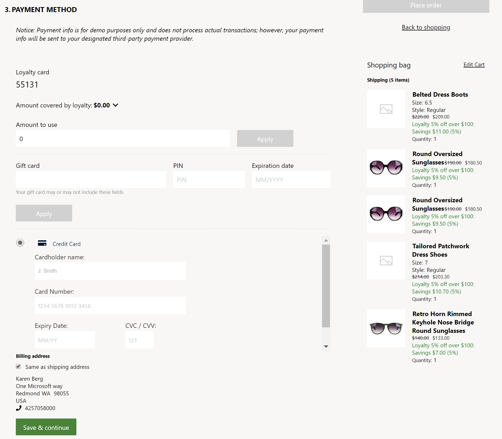

---
# required metadata

title: Payment module
description: This topic describes covers the payment module and how to configure it in Dynamics 365 Commerce.
author: anupamar-ms
manager: annbe
ms.date: 07/31/2020
ms.topic: article
ms.prod: 
ms.service: dynamics-365-commerce
ms.technology: 

# optional metadata

# ms.search.form: 
audience: Application user
# ms.devlang: 
ms.reviewer: v-chgri
ms.search.scope: Operations, Retail, Core
# ms.tgt_pltfrm: 
ms.custom: 
ms.assetid: 
ms.search.region: Global
# ms.search.industry: 
ms.author: anupamar
ms.search.validFrom: 2019-10-31
ms.dyn365.ops.version: Release 10.0.5

---

# Payment module

[!include [banner](includes/banner.md)]
[!include [banner](includes/preview-banner.md)]

This topic describes covers the payment module and how to configure it in Dynamics 365 Commerce.

## Overview

Te payment module module lets customers pay for orders using credit or debit cards. Payment integration for this module is provided by the Dynamics 365 Payment Connector for Adyen. For more information about how to use setup and configure the payment connector, see [Dynamics 365 Payment Connector for Adyen](dev-itpro/adyen-connector.md). 

The payment module hosts the payment information that is served via Adyen in an iframe. The module interacts with the Commerce Scale Unit and retrieves the Adyen information which is then hosted within the iframe. As part of the Commerce Scale Unit interaction, it can allow billing address to be served within the Adyen iframe or as a separate module. In the Fabrikam theme, the billing address is represented as a separate module since it allows more flexibility to format the address lines to look similar to those for shipping address. 

The module also allows a signed-in customer to persist their payment information. The payment information and billing address are saved and managed via the Dynamics 365 Payment Connector for Adyen.

THe payment module covers the order charges that are not already covered by loyalty points or a gift card. If an order total is fully covered by loyalty points or gift card credits, the payment module will be hidden and the customer can proceed to place the order.

The Adyen payment connector also supports Strong Customer Authentication (SCA). Part of the EU Payment Services Directive 2.0 (PSD2.0) requires online shoppers to be authenticated outside of their online shopping experience when paying with an electronic payment method. During the checkout flow, the customer is re-directed to their banking site and after authentication will be redirected back to the ecommerce checkout flow. During this redirection the information that was entered by the customer in the checkout flow such as Shipping address, Delivery options, Gift card and Loyalty information are persisted.  To turn on this features, the payment connector must be configured for SCA in HQ, refer to [Strong Customer Authentication using Adyen](adyen_redirect.md). The support for Strong Customer Authentication via payment module has been added in 10.0.12. 

The following is an example of the checkout page with Payment module along with Gift card and Loyalty
)

## Payment module properties
| Property name             | Value                 | Description |
|---------------------------|-----------------------|-------------|
| Heading                  | Heading| An optional heading can be provided for the module |
| Height of the iframe | pixels   | The iframe height can be adjusted as needed |
| Show billing address       | **True** or **False** | If True, Billing address is served  by Adyen inside the Payment iframe. If false, the billing address will not be served by Adyen and will require a C1 to configure a **Billing address module** to the checkout page  |
| Payment style override    |  CSS input | Since the payment module within an iframe it provides limited capabilty to style. Some styling can be achieved via this field. Its required for a C1 to copy/paste the entire CSS for this module along with additional changes in this property to override the styles. Site builder CSS overrides and styles do not apply to this module.|

## Billing address

This module lets a customer provide a billing address for their payment information. As mentioned earlier, this module should be configured on the checkout page if the **Show billing address** property on Payment module is set to false. This module also allows the customers to use their shipping address as the billing address to make the checkout flow easy and faster. 

## Add a payment module to a checkout page and set the required properties

A payment module can only be added to a checkout module. For more information on configuring a payment module for a checkout page, see [Checkout module](add-checkout-module.md].

## Additional resources

[Starter kit overview](starter-kit-overview.md)

[Container module](add-container-module.md)

[Buy box module](add-buy-box.md)

[Cart module](add-cart-module.md)

[Order confirmation module](order-confirmation-module.md)

[Header module](author-header-module.md)

[Footer module](author-footer-module.md)

[Dynamics 365 Payment Connector for Adyen](dev-itpro/adyen-connector.md)

[Strong Customer Authentication using Adyen](adyen_redirect.md)
