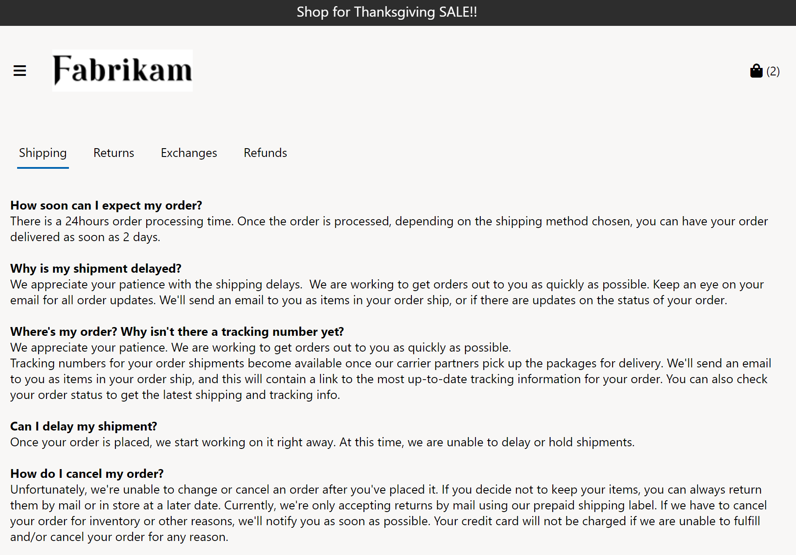

---
# required metadata

title: Tab module 
description: This topic covers tab modules and describes how to add it to site pages in Microsoft Dynamics 365 Commerce.
author:  anupamar-ms
manager: annbe
ms.date: 05/25/2020
ms.topic: article
ms.prod: 
ms.service: dynamics-365-commerce
ms.technology: 

# optional metadata

# ms.search.form: 
# ROBOTS: 
audience: Application User
# ms.devlang: 
ms.reviewer: v-chgri
ms.search.scope: Retail, Core, Operations
# ms.tgt_pltfrm: 
ms.custom: 
ms.assetid: 
ms.search.region: Global
ms.search.industry: 
ms.author: anupamar
ms.search.validFrom: 2019-10-31
ms.dyn365.ops.version: 
---

# Tab module

[!include [banner](includes/banner.md)]

This topic covers tab modules and describes how to add it to site pages in Microsoft Dynamics 365 Commerce.

## Overview

Tab modules are container-like modules used to organize information within tabs on a site page, and can be used on any page that requires information to be presented in tabs.

A tab module can have one or more tab item modules added to it, with each tab item module representing a single tab. Within each tab item module, one or more modules can be added. There are no restrictions on the type of modules that can be added to tab item modules.

The following image shows an example of a tabs module on a site page with the **Shipping** tab selected.

## Tab module properties

| Property name  | Values | Description |
|----------------|--------|-------------|
| Heading          | Text | This property specifies an optional text heading for the tab module.|
| Active tab index  | Number | This property specifies the tab index that should be active by default on page load. If no tab index is provided, it defaults to the first tab item as the active tab. |

## Tab item module properties

| Property name  | Values | Description |
|----------------|--------|-------------|
| Title          | Text|  This property specifies the title text for the tab item module.|

## Add a tab module to an example page

To add a tab module to an example page and set the properties, follow these steps.

1. Create a new page named **Store policies page** using the Fabrikam marketing template (or any template without restrictions).
1. In the **Main** slot of the **Default page**, select the ellipsis (**...**), and then select **Add Module**.
1. In the **Add Module** dialog box, select the **Container** module, and then select **OK**.
1. In the **Container** slot, select the ellipsis (**...**), and then select **Add Module**.
1. In the **Add Module** dialog box, select the **Tab** module, and then select **OK**.
1. In the tab module property pane, next to the pencil symbol select **Heading**.
1. In the **Heading** dialog box, enter "Policies" under **Heading Text**, and then select **OK**.
1. In the **Tab** slot, select the ellipsis (**...**), and then select **Add Module**.
1. In the **Add Module** dialog box, select the **Tab item** module, and then select **OK**.
1. In the tab item module property pane, enter "Delivery" under **Title**.
1. In the **Tab item** slot, select the ellipsis (**...**), and then select **Add Module**.
1. In the **Add Module** dialog box, select the **Text block** module, and then select **OK**.
1. In the text block module property pane, enter a paragraph of text explaining how deliveries work.
1. In the **Tab** slot, add a few more tab item modules with titles, each containing a text block with content added. 
1. Select **Save**, and then select **Preview** to preview the page. The page will show a tab module with the content that was added above.
1. Select **Finish editing** to check in the page, and then select **Publish** to publish it. 

## Additional resources

[Starter kit overview](starter-kit-overview.md)

[Text block](add-content-rich-block.md)
