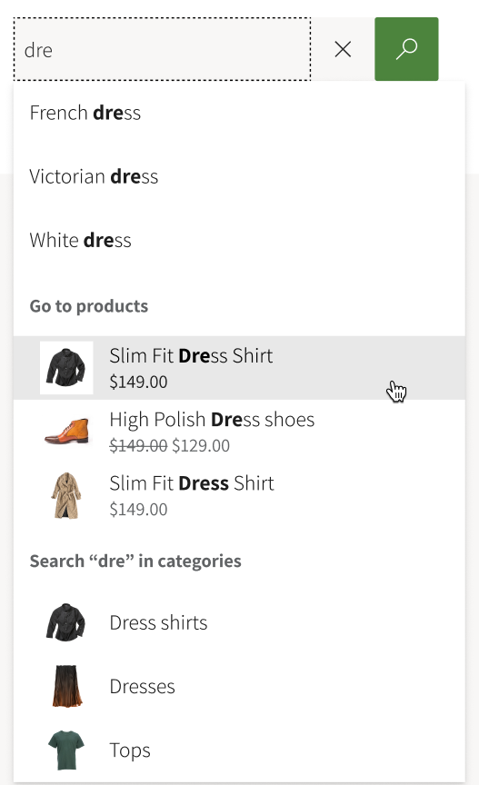

---
# required metadata

title: Default category landing page and search results page
description: This topic provides an overview of the default category landing page and search results page in Microsoft Dynamics 365 for Commerce e-Commerce.
author: asharchw
manager: annbe
ms.date: 10/01/2019
ms.topic: article
ms.prod: 
ms.service: dynamics-ax-retail
ms.technology: 

# optional metadata

# ms.search.form: 
audience: Application user
# ms.devlang: 
ms.reviewer: v-chgri
ms.search.scope: Operations, Retail, Core
# ms.tgt_pltfrm: 
ms.custom: 
ms.assetid: 
ms.search.region: Global
# ms.search.industry: 
ms.author: asharchw
ms.search.validFrom: 2019-10-31
ms.dyn365.ops.version: Release 10.0.5
---

# Default category landing page and search results page

This topic provides an overview of the default category landing page and search results page in Microsoft Dynamics 365 for Commerce e-Commerce.

## Default category landing page

The default category landing page is the page that website users typically are taken to when they select a category in the navigation hierarchy. It's part of the universal header-footer. The category page lets you browse, and you can also sort and refine the categorized products.

At the top of the page is a header that shows all the product categories and other pages that the merchandising manager has categorized. Configuration is done as part of the configuration of the channel navigation hierarchy. At the bottom of the page is a footer that includes quick links to various topics that a shopper might be interested in.

The following components are essential for a category:

- **Product placement tiles** show the products that the merchandising manager has defined in a category as part of the navigation hierarchy configuration.
- **Refiners and choice summary** are filters that provide counts and that can be used to refine items. The merchandising manager configures them as part of the configuration of the "channel categories and product attributes" metadata.
- **Sorting options** are used by website visitors to sort the products. By default, the following sorting options are available:

    - Price – low to high
    - Price – high to low
    - Product name – \[A-Z\]
    - Product name – \[Z-A\]
    - Ratings – low to high
    - Ratings – high to low

- **Pagination** lets website visitors move from one page of categorized product results to another page.
- **Total count** provides the total number of products that are defined in a category.

## Enrich a category landing page

If you want a category landing page to have a more tailored experience for a specific category, you can "enrich" the category landing page for that category. For example, you can add a marketing video and some category storytelling to get the shopper's attention. For more information, see [Enrich a category landing page](./articles/commerce/enrich-a-category.md).

## Auto-suggest and search results pages

Website users can explore a site either by going to a category from the navigation hierarchy or by typing a search term in the search bar.

As soon as users start to type in the search bar, they experience the immersive auto-suggest functionality that suggests search terms.

Here are some of the types of suggestions that might be shown:

- **Keywords** are used to find items across all products that are assorted to the channel.
- **Products** provide direct links to the product details page.
- **Scoped category search suggestions** list various categories and let users search for the keyword in a specific category.

When users click a keyword or a scoped category search suggestion, or when they enter a search that has no known suggestions, the search results page appears. Users can then browse, sort, and refine the list of search results to find the desired item.

In addition to the universal header and footer sections, the following components are essential for a search results page:

- **Product placement tiles** show the products for the user's search. By default, these tiles are sorted by the cloud-powered search relevancy score for the user search.
- **Refiners and choice summary** are filters that provide counts and that can be used to refine items. The merchandising manager configures them as part of the configuration of the "channel categories and product attributes" metadata.
- **Sorting options** are used by website visitors to sort the products. By default, the following sorting options are available:

    - Price – low to high
    - Price – high to low
    - Product name – \[A-Z\]
    - Product name – \[Z-A\]
    - Ratings – low to high
    - Ratings – high to low
    - Default

- **Pagination** lets website visitors move from one page of categorized product results to another page.
- **Total count** provides the total number of products that are defined in a category and that match the search criteria.
