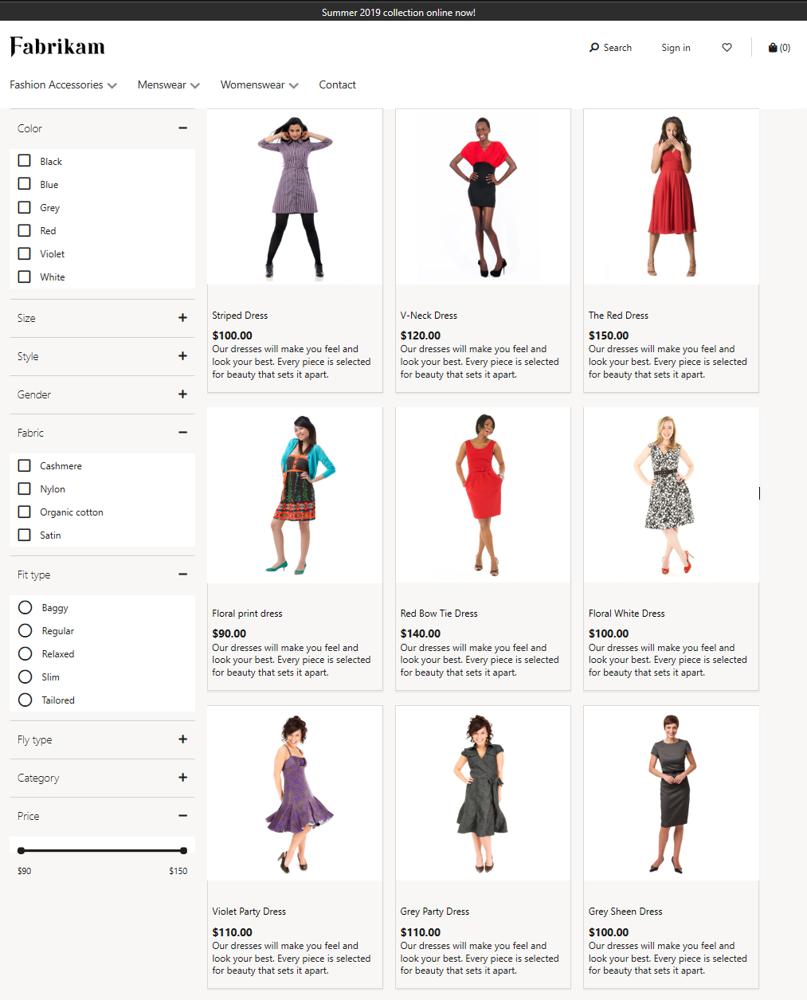

---
# required metadata

title: Quick tour of default category landing page & search results
description: 
author: Ashish Harchwani
manager: annbe
ms.date: 08/30/2019
ms.topic: article
ms.prod: 
ms.service: Dynamics365Operations
ms.technology: 

# optional metadata

# ms.search.form: 
audience: Consumer
# ms.devlang: 
ms.reviewer: josaw
ms.search.scope: Retail, Core, Operations
# ms.tgt_pltfrm: 
ms.custom: 
ms.assetid: 
ms.search.region: Global
# ms.search.industry: 
ms.author: Ashish Harchwani
ms.search.validFrom: 2019-08-30
ms.dyn365.ops.version: 
---

# Quick tour of default category landing page & search results

## Default category landing page

The **category default landing** page is the page that a website visitor generally lands on upon selecting a category from the navigation hierarchy that's part of the universal header footer. It allows a website visitor to be able to browse, sort and refine the categorized products for an individual category. 

  

The top of the page has a Header which shows all the product categories, based on configuration by Merchandising manager in the back-office as part of channel navigation hierarchy and other pages that retailer wants the shopper to browse. On the bottom of the page is a Footer with quick links to various topics that a shopper may be interested. Refer to the help topics for Header and Footer for more details.

These are the following components that are considered to be essential for category browse experience - 

1. **Product placement** - these are the product tiles of the products that are categorized to this category by a Merchandising manager as part of the navigation hierarchy configuration in back-office.
1. **Refiners & Choice summary** - these are the filters with counts that are marked to be available as an option to refine by  a Merchandising manager as part of the 'Channel categories & product attributes' metadata configuration in the back-office. 
1. **Sorting options** - these are the options a website visitor can sort these products. By default, sorting options that shall be available are the following 
	- Price low to high
	- Price high to low
	- Product name [A-Z]
	- Product name [Z-A]
	- Ratings low to high
	- Ratings high to low
1. **Pagination** - Allowing a website visitor to be able to navigate from one page results to another page of categorized product results. 
1. **Total count** - Providing hint to a website visitor about number of products that are in total categorized to a particular category. 

## Enriching a category landing page

If you want a category landing page to have a more tailored experience for a specific category, you can choose to enrich the category landing page for that category. For example, if you might choose to add a marketing video and some category storytelling to get the shoppers attention. This can be done via enriching the page for this category. Refer to [Enriching a category landing page](./articles/commerce/enrich-a-category.md) for more details.

 

## Auto-suggest & search results page

Journey of product discovery for a website visitor begins with either navigating to a category from the navigation hierarchy or by typing the search term in the search-bar. 

As soon as website visitor starts typing in the search bar they encounter the **immersive auto-suggest**. 

With new enhancements, here are the following kind of suggestions that a website visitor may discover as part of the immersive auto-suggest - 

+ **Keywords** search for keywords across all products assorted to the channel
+ **Products** directly navigable to product details page
+ **Scoped category search suggestions** support for "keywords" match in various categories, which enables users to trigger the search for the keyword for that category.
 

Now, if a website visitor would've clicked on the "Keywords" or "Scoped category search suggestions" or "entered triggered the search for no-known suggestions" then they are navigated to the search results page. 

**Search results page** allows a website visitor to be able to browse, sort and refine the search results for their intended action.

 

Apart from the Universal header footer section on the search page these are the following components that are considered to be essential for browsing of search results - 

1. **Product placement** - these are the product tiles of the products that are sorted (by default) based on the cloud-powered search relevancy score for the user-triggered search interaction.
1. **Refiners & Choice summary** - these are the filters with counts that are marked to be available as an option to refine by  a Merchandising manager as part of the 'Channel categories & product attributes' metadata configuration in the back-office. 
1. **Sorting options** - these are the options a website visitor can sort these search results. By default, sorting options that shall be available are the following 
	- Price low to high
	- Price high to low
	- Product name [A-Z]
	- Product name [Z-A]
	- Ratings low to high
	- Ratings high to low
	- Default
1. **Pagination** - Allowing a website visitor to be able to navigate from one page results to another page of search results. 
1. **Total count** - Providing hint to a website visitor about number of products that are in total matching their search criteria. 

