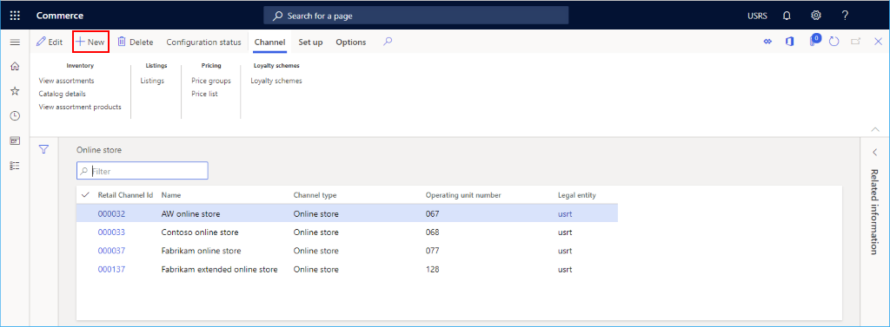
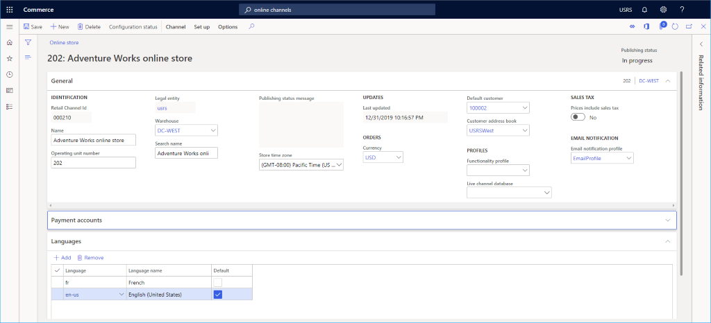
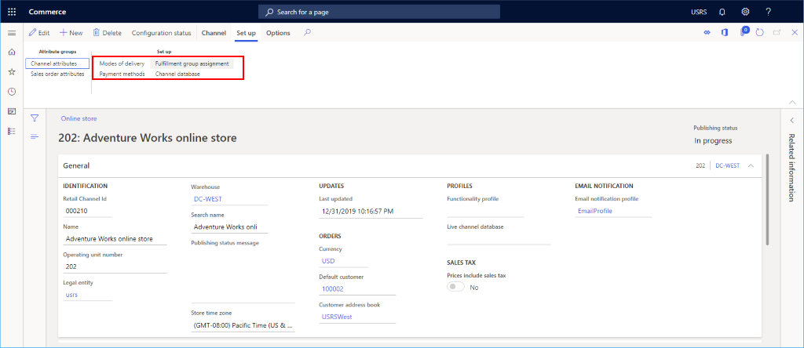
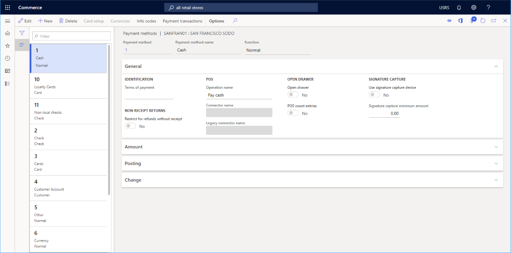

---
# required metadata

title: Set up an online channel
description: This topic describes how to create a new online channel in Microsoft Dynamics 365 Commerce.
author: samjarawan
manager: annbe
ms.date: 02/03/2020
ms.topic: article
ms.prod: 
ms.service: dynamics-365-commerce
ms.technology: 

# optional metadata

# ms.search.form: 
audience: Developer
# ms.devlang: 
ms.reviewer: v-chgri
ms.search.scope: Retail, Core, Operations
# ms.tgt_pltfrm: 
ms.custom: 
ms.assetid: 
ms.search.region: Global
# ms.search.industry: 
ms.author: samjar
ms.search.validFrom: 2020-02-03
ms.dyn365.ops.version: Release 10.0.8

---
# Set up an online channel

[!include [banner](../includes/preview-banner.md)]
[!include [banner](../includes/banner.md)]

This topic describes how to create a new online channel in Microsoft Dynamics 365 Commerce.

## Overview

Microsoft Dynamics 365 Commerce supports multiple retail channels. These retail channels include online stores, call centers, and retail stores (also known as brick-and-mortar stores). Online stores give an online presence to a retailer, so that customers can purchase products from the retailer's online store in addition to its retail stores.

To create an online store in Microsoft Dynamics 365 Commerce, you must first create an online channel. 

Before you create a new online channel, ensure that you have completed the [Channel set up prerequisites](channels-prerequisites.md).

## Create and configure a new online channel

To create and configure a new online channel, follow these steps.

1. Go to **Navigation pane \> Modules \> Channels \> Online Stores**.
1. On the **Action pane**, select **New**.
1. In the **Name** field, provide a name for the new channel.
1. In the **Legal entity** drop down, enter the appropriate legal entity.
1. In the **Warehouse** drop down, enter the appropriate warehouse.
1. In the **Store time zone** field, select the appropriate time zone.
1. In the **Currency** field, select the appropriate currency.
1. In the **Default customer** field, provide a valid default customer.
1. In the **Customer address book** field, provide a valid address book.
1. In the **Functionality profile** field, select a functionality profile if applicable.
1. In the **Email notification profile** field, provide a valid email notification profile.
1. On the **Action pane**, select **Save**.

The following image shows the creation of a new online channel.

The following image shows an example online channel.

## Set up languages

If your e-Commerce site will support multiple languages, expand the **Languages** section and add additional languages as needed.

## Set up payment account

From within the **Payment account** section you can add a third-party payment provider. For information on settting up an Adyen payment connector, see [Dynamics 365 Payment Connector for Adyen](../retail/dev-itpro/adyen-connector.md).

## Additional channel set up

Additional tasks required for online channel setup include setting up payment methods, modes of delivery, and the fulfillment group assignment.

The following image shows **Modes of delivery**, **Payment methods**, and **Fulfillment group assignment** actions on the **Set up** tab.

### Set up payment methods

To set up payment methods, for each payment type supported on this channel follow these steps.

1. On the **Action pane**, select the **Set Up** tab, then select **Payment methods**.
1. On the **Action pane**, select **New**.
1. In the navigation pane, select a desired payment method.
1. In the **General** section, provide an **Operation name** and configure any other desired settings.
1. Configure any additional settings as required for the payment type.
1. On the **Action pane**, select **Save**.

The following image shows an example for a cash payment method.

### Set up modes of delivery

You can see the configured modes of delivery by selecting **Modes of delivery** from the **Set up** tab on the **Action pane**.  

To change or add a mode of delivery, follow these steps.

1. Go to **Navigation pane \> Modules \> Inventory management \> Modes of delivery**.
1. On the **Action pane**, select **New** to create a new mode of delivery, or select an existing mode.
1. In the **Retail channels** section, select **Add line** to add the channel. Adding channels using organization nodes instead of adding each channel individually can streamline adding channels.

The following image shows an example of a mode of delivery.

### Set up a fulfillment group assignment

To set up a fulfillment group assignment, follow these steps.

1. On the **Action pane**, select the **Set up** tab, then select **Fulfillment group assignment**.
1. On the **Action pane**, select **New**.
1. In the **Fulfillment group** drop-down list, select a fulfillment group.
1. In the **Description** drop-down list, enter a description.
1. On the **Action pane**, select **Save**.

The following image shows an example of setting up a fulfillment group assignment.

## Additional resources

[Channels overview](channels-overview.md)

[Channel setup prerequisites](channels-prerequisites.md)

[Set up a retail channel](channel-setup-retail.md)

[Set up a call center channel](channel-setup-callcenter.md)

[Dynamics 365 Payment Connector for Adyen](../retail/dev-itpro/adyen-connector.md)
