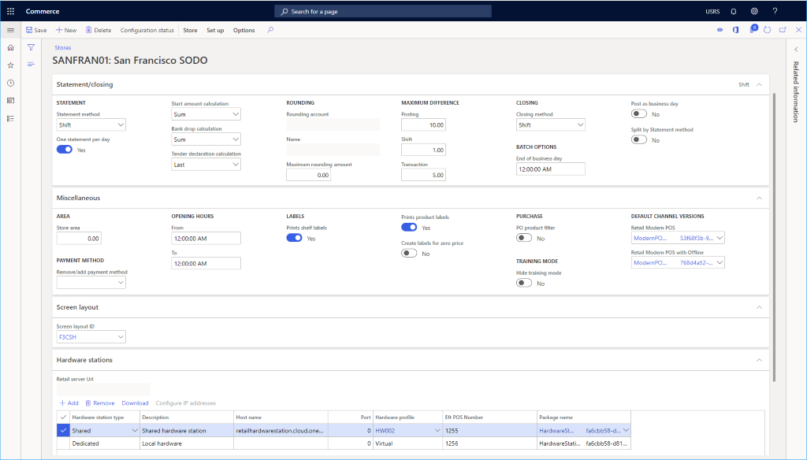
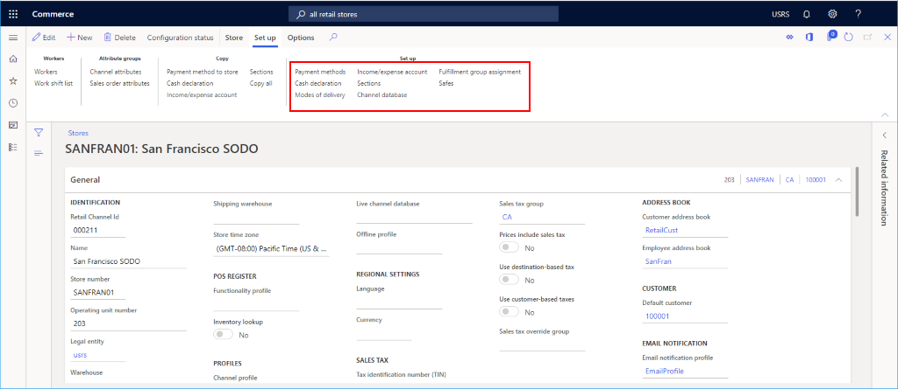
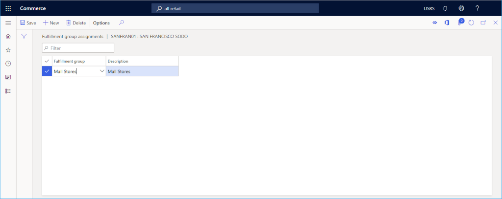

---
# required metadata

title: Set up a retail  channel
description: This topic describes how to create a new retail channel in Microsoft Dynamics 365 Commerce.
author: samjarawan
manager: annbe
ms.date: 01/31/2020
ms.topic: article
ms.prod: 
ms.service: dynamics-365-commerce
ms.technology: 

# optional metadata

# ms.search.form: 
audience: Application user
# ms.devlang: 
ms.reviewer: v-chgri
ms.search.scope: Retail, Core, Operations
# ms.tgt_pltfrm: 
ms.custom: 
ms.assetid: 
ms.search.region: Global
# ms.search.industry: 
ms.author: samjar
ms.search.validFrom: 2020-01-31
ms.dyn365.ops.version: Release 10.0.8

---
# Set up a retail channel

[!include [banner](../includes/preview-banner.md)]
[!include [banner](../includes/banner.md)]

This topic describes how to create a new retail channel in Microsoft Dynamics 365 Commerce.

## Overview
TBD

Microsoft Dynamics 365 Commerce supports multiple retail channels. These retail channels include online stores, call centers, and retail stores (also known as brick-and-mortar stores).

Before a retail channel is created ensure you follow the [channel prerequisites](channels-prerequisites.md).

## Create and configure a new retail channel

1. Go to **Navigation pane \> Modules \> Channels \> Retail stores \> All retail stores**.
1. On the **Action pane**, select **New**.
1. In the **Name** field, provide a name for the new channel.
1. In the **Store number** field, provide a unique store number. The number can be alphanumeric with a maximum of 10 characters.
1. In the **Legal entity** drop-down list, enter the appropriate legal entity.
1. In the **Warehouse** drop-down list, enter the appropriate warehouse.
1. In the **Store time zone** field, select the appropriate time zone.
1. In the **Sales tax group** drop-down list, select an appropriate sales tax group for the store.
1. In the **Currency** field, select the appropriate currency.
1. In the **Customer address book** field, provide a valid address book.
1. In the **Default customer** field, provide a valid default customer.
1. In the **Functionality profile** field, select a functionality profile if applicable.
1. In the **Email notification profile** field, provide a valid email notification profile.
1. On the **Action pane**, select **Save**.

The following image shows the creation of a new retail channel.

The following image shows an example retail channel.

## Other settings

There are numerous other optional settings that can be set in the **Statement/closing** and **Miscellaneous** sections, based on the needs of the retail store.

In addition, see [Screen layouts for the point of sale (POS)](https://docs.microsoft.com/en-us/dynamics365/retail/pos-screen-layouts?toc=/dynamics365/commerce/toc.json) for information on setting up the default screen layout in the **Screen layout** section and [Configure and install Retail hardware station](https://docs.microsoft.com/en-us/dynamics365/retail/retail-hardware-station-configuration-installation) for **Hardware stations** section setup information.

The following image shows an example retail channel setup configuration.

## Additional channel set up

There are additional items that need to be set up for a channel that can be found on the **Action pane** under the **Set up** section.

Additional tasks required for online channel setup include setting up payment methods, cash declaration, modes of delivery, income/expense account, sections, the fulfillment group assignment, and safes.

The following image shows various additional retail channel setup options on the **Set up** tab.

### Set up payment methods

To set up payment methods, for each payment type supported on this channel follow these steps.

1. On the **Action pane**, select the **Set Up** tab, then select **Payment methods**.
1. On the **Action pane**, select **New**.
1. In the navigation pane, select a desired payment method.
1. In the **General** section, provide an **Operation name** and configure any other desired settings.
1. Configure any additional settings as required for the payment type.
1. On the **Action pane**, select **Save**.

The following image shows an example of a cash payment method.

### Set up cash declaration

1. On the **Action pane**, select the **Set Up** tab, and then select **Cash declaration**.
1. On the **Action pane**, select **New**, and then create all **Coin** and **Note** denominations that are applicable.

The following image shows an example of a cash declaration.

### Set up modes of delivery

You can see the configured modes of delivery by selecting **Modes of delivery** from the **Set up** tab on the **Action pane**.  

To change or add a mode of delivery, follow these steps.

1. Go to **Navigation pane \> Modules \> Inventory management \> Modes of delivery**.
1. On the **Action pane**, select **New** to create a new mode of delivery, or select an existing mode.
1. In the **Retail channels** section, select **Add line** to add the channel. Adding channels using organization nodes instead of adding each channel individually can streamline adding channels.

The following image shows an example of a mode of delivery.

### Set up income/expense account

To set up income/expense account, follow these steps.

1. On the **Action pane**, select the **Set Up** tab, and then select **Income/Expense account**.
1. On the **Action pane**, select **New**.
1. Under **Name**, enter a name.
1. Under **Search name**, enter a search name.
1. Under **Account type**, enter the account type.
1. Enter text for **Message line 1**, **Message line 2**, **Slip text 1**, and **Slip text 2** as needed.
1. Under **Posting**, enter posting information.
1. On the **Action pane**, select **Save**.

The following image shows an example of an income/expense account.

### Set up sections

To set up sections, follow these steps.

1. On the **Action pane**, select the **Set Up** tab and click **Sections**.
1. On the **Action pane**, select **New**.
1. Under **Section number**, enter a section number.
1. Under **Description**, enter a description.
1. Under **Section size**, enter a section size.
1. Configure additional settings for **General** and **Sales statistics** as needed.
1. On the **Action pane**, select **Save**.

### Set up a fulfillment group assignment

To set up a fulfillment group assignment, follow these steps.

1. On the **Action pane**, select the **Set up** tab, then select **Fulfillment group assignment**.
1. On the **Action pane**, select **New**.
1. In the **Fulfillment group** drop-down list, select a fulfillment group.
1. In the **Description** drop-down list, enter a description.
1. On the **Action pane**, select **Save**

The following image shows an example of a fulfillment group assignment setup.

### Set up safes

To set up safes, follow these steps.

1. On the **Action pane**, select the **Set Up** tab and click **Safes**.
1. On the **Action pane**, select **New**.
1. Enter a name for the safe.
1. On the **Action pane**, select **Save**.

## Additional resources

[Channels overview](channels-overview.md)

[Channel setup prerequisites](channels-prerequisites.md)

[Set up an online channel](channel-setup-online.md)

[Set up a call center channel](channel-setup-callcenter.md)

