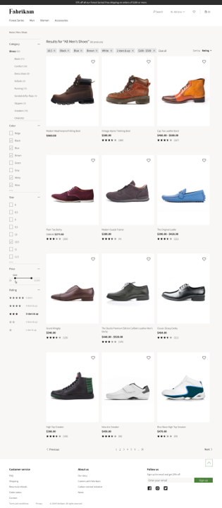
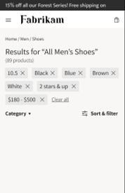

---
# required metadata

title: Cloud-powered search overview
description: This topic gives an overview of cloud-powered search in Dynamics 365 Commerce.
author: asharchw
manager: annbe
ms.date: 10/01/2019
ms.topic: article
ms.prod: 
ms.service: dynamics-ax-retail
ms.technology: 

# optional metadata

# ms.search.form: 
audience: Application user
# ms.devlang: 
ms.reviewer: v-chgri
ms.search.scope: Operations, Retail, Core
# ms.tgt_pltfrm: 
ms.custom: 
ms.assetid: 
ms.search.region: Global
# ms.search.industry: 
ms.author: asharchw
ms.search.validFrom: 2019-10-31
ms.dyn365.ops.version: Release 10.0.5
---

# Cloud-powered search overview in Dynamics 365 Commerce

[!include [banner](../includes/preview-banner.md)]
[!include [banner](../includes/banner.md)]

This topic gives an overview of cloud-powered search in Dynamics 365 Commerce.

## Overview

Product discoverability is the easiest and quickest way for customers to be able to find products by browsing categories, searching, and filtering. Retailers consider product discovery a primary tool for customer interaction across all retail channels.

Customers are used to the near-instantaneous response times of web search engines, sophisticated e-Commerce websites, social apps, as-you-type search suggestion, faceted navigation, and highlighting. If customers cannot find the right product quickly enough, they do not hesitate to move over to an e-Commerce store that will them find what they need quickly.

The cloud-powered product discoverability in Commerce helps retailers continue to grow their share of consumer retention and conversion rates across all channels including both e-Commerce & point of sale. 

The Commerce search experience has improved capabilities to help retailers achieve better product discoverability, while delivering the scalability and performance required for e-Commerce traffic.

### Browse and search 

Search relevance and performance is key to the omnichannel experience, since product discovery relies primarily on search for information retrieval and content navigation. An effective and efficient search experience helps increase conversion.

The following image shows an example of browse and search functionality.

    

### Faceted navigation and choice summary 

Faceted navigation helps customers browse for content more easily by filtering on refiners that are tied to terms in a term set. By using faceted navigation, you can configure different refiners for different terms in a term set without having to create additional pages. And after application of the customer's choice of refiners, a summary of the choices is displayed.

The following image shows an example of faceted navigation.

    

### Immersive autosuggest

Current autosuggest shows only keywords that trigger search for the matching keyword. With new enhancements, users will be able to surface links to products, directly navigable to product details. There will also be support for "keywords match in various categories," which enables users to see the count of matching keywords in categories and trigger the search for the keyword for that category.

The following image shows an example of immersive autosuggestion.

    

### Sort

With enhanced sorting in Commerce, users will be able to sort search, browse, and refine search results by criteria such as price, product name, and product number, and also by whether a product is new, top-selling, or recently added.

