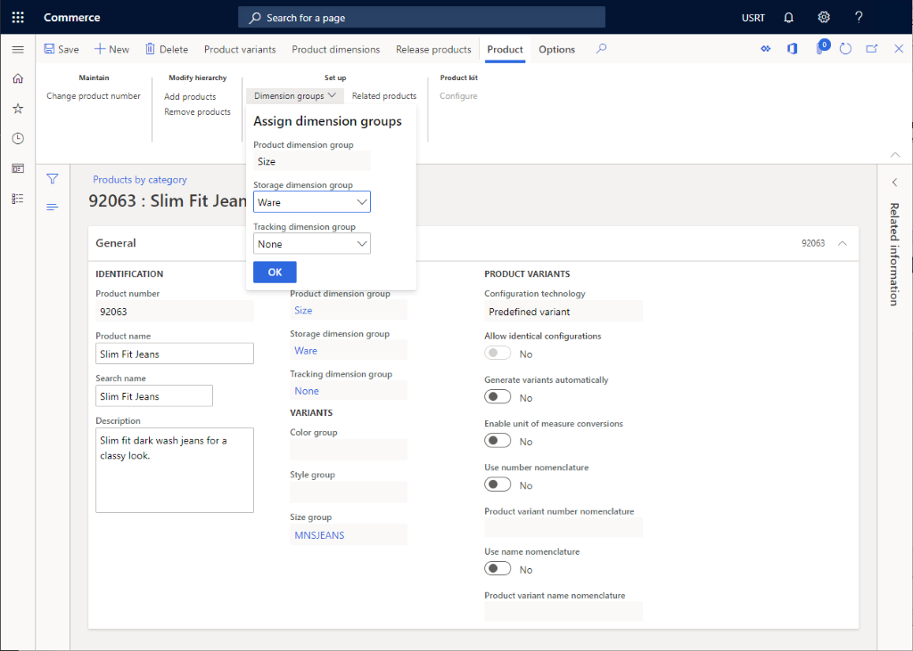
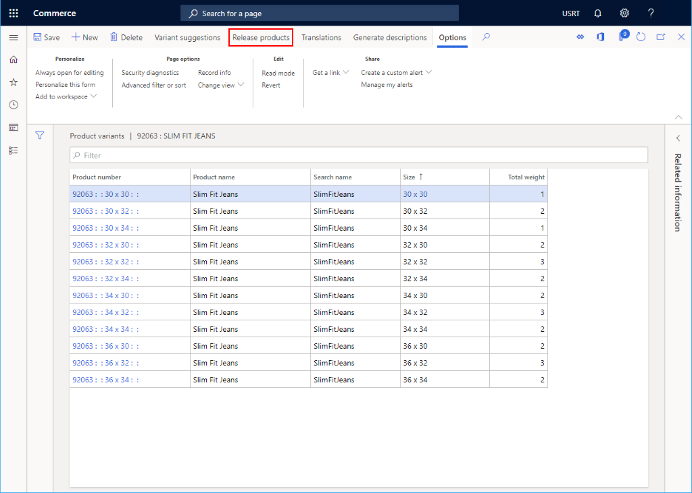
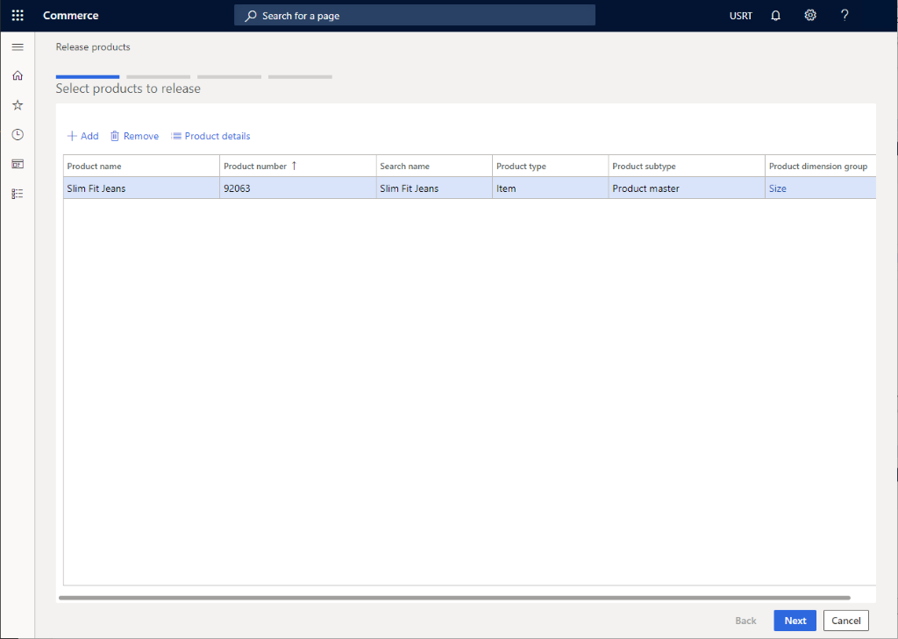
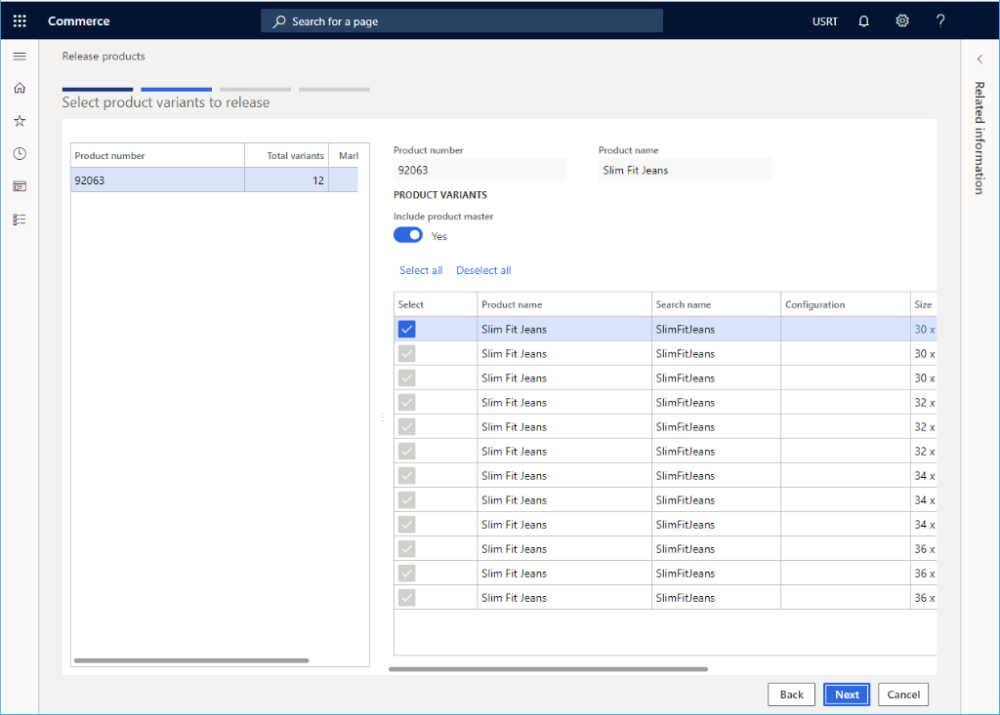
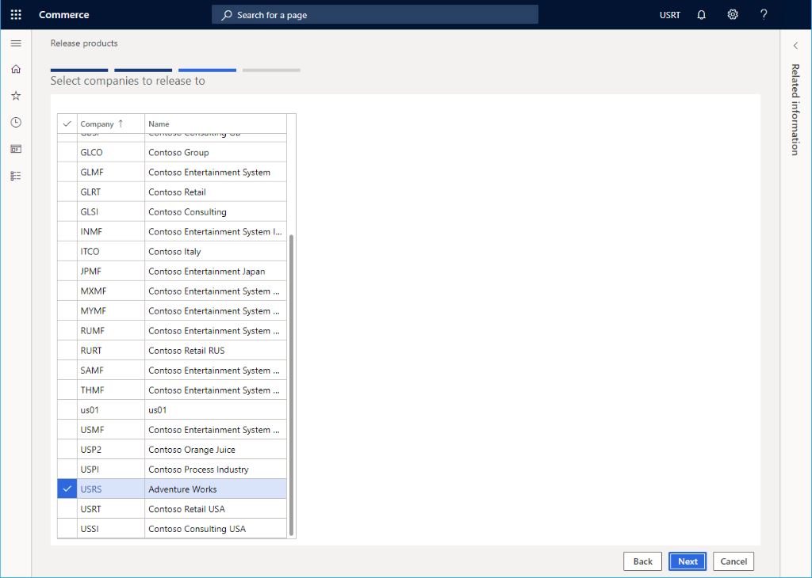
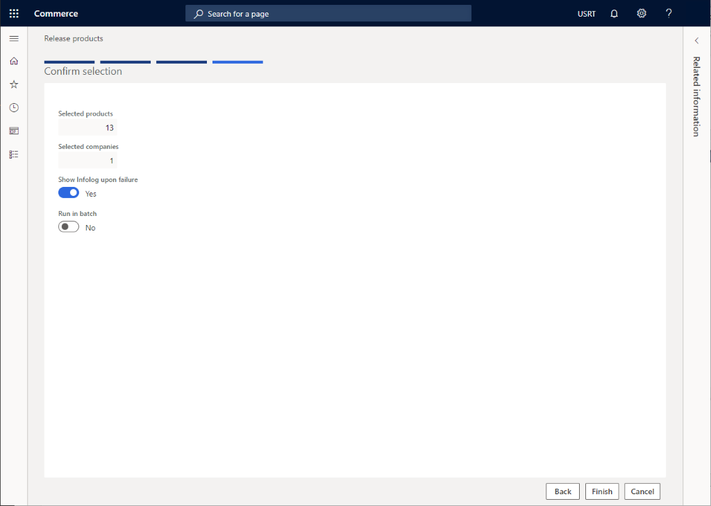
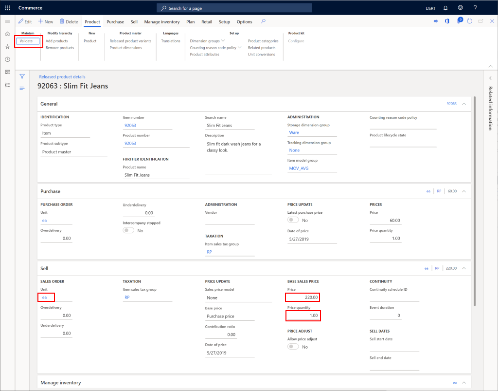

---
# required metadata

title: Create a product
description: This topic describes how to create a new product in Microsoft Dynamics 365 Commerce.
author: samjarawan
manager: annbe
ms.date: 01/20/2020
ms.topic: article
ms.prod: 
ms.service: dynamics-365-commerce
ms.technology: 

# optional metadata

# ms.search.form: 
audience: Application User
# ms.devlang: 
ms.reviewer: v-chgri
ms.search.scope: Retail, Core, Operations
# ms.tgt_pltfrm: 
ms.custom: 
ms.assetid: 
ms.search.region: Global
# ms.search.industry: 
ms.author: samjar
ms.search.validFrom: 2020-01-20
ms.dyn365.ops.version: Release 10.0.8

---
# Create a product

[!include [banner](../includes/preview-banner.md)]
[!include [banner](../includes/banner.md)]

This topic describes how to create a new product in Microsoft Dynamics 365 Commerce.

## Overview

A product is primarily defined by a product number, name, and description. However, other data is also required in order to describe a product or service:

## Create a product

1. Go to **Navigation pane \> Modules \> Retail \> Products and categories \> Products by category**.
1. On the **Action pane**, select **New** to create a new product.
1. Select **Product type** of **Item** or **Service**.
1. In the **Product subtype** drop down select either **Product** if the product will have no variants or **Product master** otherwise.
1. Provide a **Product number** if an auto number is not provided.
1. Provide a **Product name**.
1. Provide a **Search name**.
1. Select an appropriate category in the **Retail category** drop down.
1. If the product is a kit select Yes on the **Product kit** switch.
1. If the product subtype is product master then set the **Product dimension group** to include the supported variants.  Examples includ Color, Size, Style and Configuration.  You may need to create additional product dimension groups if needed.
1. Select an appropriate **Configuration technology**.
1. Select the "OK" button to save.

Below image shows an example product being added.

Once the product is added additional data can be set on it such as the **Product description**, **Variant groups**, **Dimension groups**, **Product attributes** and **Related products**.

Below image shows a products additional details.

### Product Variants
Specific variants need to be created for a product master.  
1. On the **Action pane**, select **Product variants**.
1. If variant groups have been selected on the **Action pane**, select **Variant suggestions*.
1. Select the variants you would like to support on the product.
1. Select the **Create** button to create the variants.

## Release product
To sell a product it must first be released to a legal entity.
* From the product page, select **Release products**.

Below image shows a sample product variants and where to find the **Release product** link.

* Select the product to release and the **Next** button.

* Select the set of variants of the product to release followed by selecting the **Next** button.

* Select the legal entity followed by the **Next** button.

* Select the **Finish** button to complete the product release.

## Configure Released product
Once a product is released, it will then require further configuration including adding a price to the product.
1. Go to **Navigation pane \> Modules \> Retail \> Products and categories \> Released products by category**.
1. Select the product category node for the product that was released and select the product in the product list.
1. On the **Action pane**, select **Edit** to edit the product.
1. Configure any required properties including the **Unit**, **Price** and **Quantity** in the **Purchase** section.
1. Once complete, on the **Action pane**, select **Validate** and ensure no errors are reported for missing fields.
1. On the **Action pane**, select **Save**.

Below image shows a sample released product configuration.

## Additional resources
legal entity
variant groups
