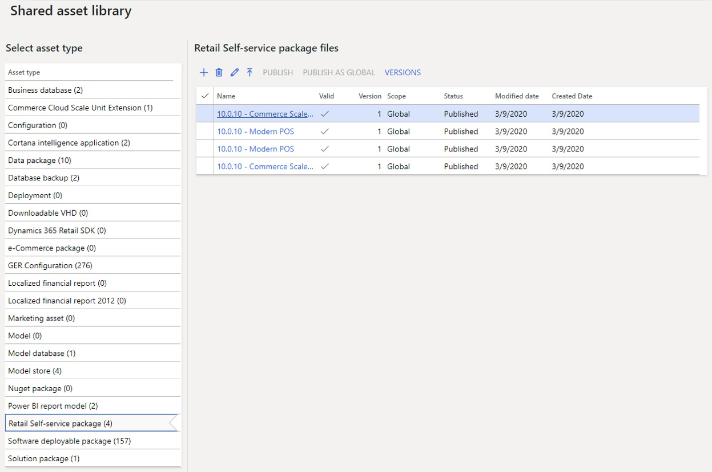

---
# required metadata

title: Synchronize Self-service installers in Dynamics 365 Commerce
description: This topic explains how to utilize LCS Asset and Shared Asset libraries and Dynamics 365 Headquarters to upload and synchronize Self-service installers (For use with the standard Self-service download mechanism).
author: jashanno
manager: AnnBe
ms.date: 04/15/2020
ms.topic: article
ms.prod: 
ms.service: Dynamics-365-retail
ms.technology:  

# optional metadata

ms.search.form: SysAADClientTable, RetailTransactionServiceProfile
# ROBOTS: 
audience: IT Pro
# ms.devlang: 
ms.reviewer: 
ms.search.scope: Operations, Retail, Core
# ms.tgt_pltfrm: 
ms.custom: 44351
ms.search.region: Global
# ms.search.industry: 
ms.author: jashanno
ms.search.validFrom: 2017-07-31
ms.dyn365.ops.version: 
---

# Synchronize Self-service installers in Dynamics 365 Commerce

[!include [banner](../../includes/banner.md)]

This topic explains how to utilize LCS Asset and Shared Asset libraries and Dynamics 365 Headquarters to upload and synchronize Self-service installers (For use with the standard Self-service download mechanism).

> [!IMPORTANT]
> The legacy Self-service package upload method is still supported at this time, but it is in a deprecated mode which will be removed in approximately one year’s time (April, 2021 at the earliest).

## Key terms
| Term | Description |
|---|---|
| Shared asset library | In Microsoft Dynamics Lifecycle Services (LCS), two types of Asset libraries are available: the Shared asset library and the project-level Asset library. More information can be found in the document [Asset library in Lifecycle Services (LCS)](../../fin-ops-core/dev-itpro/lifecycle-services/asset-library.md). |
| Asset Library | Lifecycle Services (LCS) has two types of Asset libraries available: the Shared asset library and the project-level Asset library. More information can be found in the document [Asset library in Lifecycle Services (LCS)](../../fin-ops-core/dev-itpro/lifecycle-services/asset-library.md). |
| Self-service installers | Self-service installers are the Commerce components  More information can be found in the relevant documents shown at the end of this document. |

## Overview
The **Retail Self-service package** sub-section in the Shared asset library stores all monthly releases for Self-service installers (Modern POS (Including the offline version), Commerce Scale Unit (Formerly RSSU), and hardware station).  Further, in both this library and the project-level Asset library, uploading of customized installers is also possible.  Using these locations, it is possible to then synchronize the available installers in Dynamics 365 Headquarters.  Once synchronized, all available installers between these two libraries (And what existed in the environment prior) will be accessible for the standard Self-service download processes detailed in separate articles (Listed in the terms above).

The following is a generic image of the **Retail Self-service package** sub-section in the Asset library (Or Shared asset library).

## How to synchronize installers in Dynamics 365 Headquarters
Installer synchronization requires the following steps to be performed.

1. Navigate to **Retail and Commerce** &gt; **Headquarters setup** &gt; **Parameters** &gt; **Commerce parameters**.
2. Select the **Channel deployment** tab.
3. Select the **Check for package updates** button to perform synchronization. which will synchronize and update the installers available to download (Per standard Self-service processes) based on what installers apply to the environment that are currently available in LCS.

> [!IMPORTANT]
> Previously, the RetailSelfService table was used as the source to pull all installer information. This table was populated based on which installers had been uploaded into headquarters through the legacy method of package application. The new Self-service population methodology combines all values in the RetailSelfService table (Now called the legacy Self-service package upload method) with all available installers in the LCS Shared asset library. The Self-service drop-down package selectors will showcase the options from this newly synchronized, combined source.
> As stated at the beginning of this document, the legacy Self-service package upload method will maintain support in a deprecated mode until removed in approximately one year’s time (April, 2021 at the earliest).
 
4. In this same page, default packages may be selected to be used throughout headquarters in their relevant locations (Devices, All stores, Channel database).
5. Perform standard Modern POS, hardware station, or Commerce Scale Unit (Formerly RSSU) configuration and installation flows per the documentation linked below.

| Component | Link |
|---|---|
| Retail Modern POS | [Configure, install, and activate Modern POS (MPOS)](../retail-modern-pos-device-activation.md) |
| Retail hardware station | [Configure and install Retail hardware station](../retail-hardware-station-configuration-installation.md) |
| Commerce Scale Unit | (Formerly titled Retail Store Scale Unit) [Configure and install Commerce Scale Unit](../retail-store-scale-unit-configuration-installation.md) |
