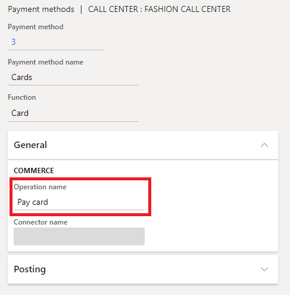
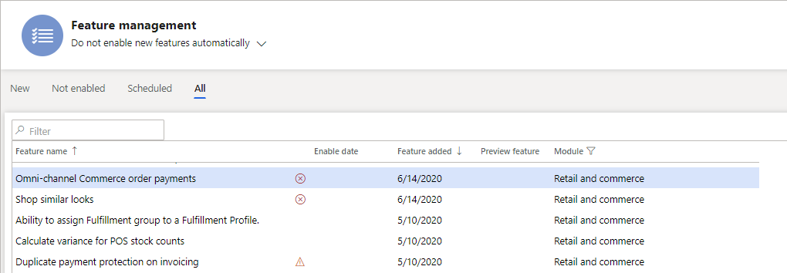
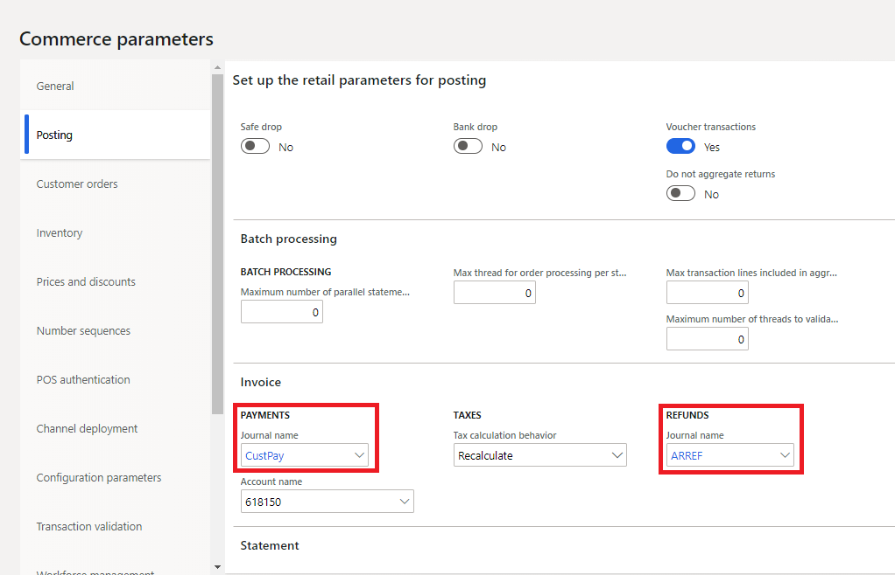

---
# required metadata

title: Support for incremental capture for back office invoicing
description: This topic describes payments SDK enhancements to support incremental capture as part of order invoicing
author: rubendel
manager: Tonya.Fehr
ms.date: 7/14/2020
ms.topic: article
ms.prod: 
ms.service: dynamics-365-retail
ms.technology: 

# optional metadata

# ms.search.form: 
# ROBOTS: 
audience: IT Pro
# ms.devlang: 
ms.reviewer: rhaertle
ms.search.scope: Operations, Retail
# ms.tgt_pltfrm: 
ms.custom: 141393
ms.assetid: e23e944c-15de-459d-bcc5-ea03615ebf4c
ms.search.region: Global
ms.search.industry: Retail
ms.author: rubendel
ms.search.validFrom: 2019-01-01
ms.dyn365.ops.version: AX 7.0.1

---

# Support for incremental capture for back office invoicing

[!include [banner](../includes/banner.md)]

This topic describes payments SDK enhancements to support incremental capture as part of order invoicing.

## Availability

This feature is available starting with the 10.0.13 monthly update.

## Key terms

| Term | Description |
|---|---|
| Incremental capture | Incremental capture indicates payment processing support for fulfilling an order with multiple invoices. Specifically, as invoices are processed against that order payment capture requests reference the original payment authorization, as opposed to getting a new payment authorization when the balance due changes because of previous payment captures. |

## Overview

Many merchants fulfill orders not in a single shipment, but in multiple shipments. The current out of box for dealing with credit card payments for orders that are fulfilled over multiple shipments is to capture payments as those shipments are invoiced, then get a new payment authorization for balance due for remaining items to be shipped. This method is used to ensure that payment capture can be consistently supported across payment processors. This method also comes with some downsides. Specifically, when an authorization is partially captured, then a new authorization is created for the balance due, the old authorization and new authorization may overlap. When this occurs, customers may see open authorizations against their payment cards which exceed the order total. The result is that authorizations may exceed open balances available for credit cards or card issuers may block cards from being processed due to suspicion of fraud. 

To address these issues, incremental capture support is being added to the payments SDK for back office payment captures. This means that, if a processor supports incremental capture, payment connectors can be updated to capture against a single authorization multiple times over the course of order fulfillment. The following diagram illustrates the difference between the currently supported payment capture framework and the newly supported incremental capture framework with mulitple captures against a single authorization. 

Order created in Call Center:

Order created in the point of sale:

This feature enables access to the payments form for orders created in e-commerce and the point of sale. In addition, with this feature enabled, those orders can be edited using the order completion function that was previously only available to Call Center orders.  

Order completion:

## Prerequisites

To enable Commerce payments, you first must enable several other features and configurations. The features should be enabled as a best practice because they address functional gaps related to orders. After the Commerce payments feature has been enabled, some these features may be disabled, but that is discouraged because all testing for OCOP has been done with these features enabled.

Prequisite configurations noted below are required for Commerce payments to function properly and may not be disabled or reverted while the feature is enabled. 

### Prerequisite features

| Feature name | Description | May be disabled later |
| --- | --- | --- |
| Omni-channel payments | Enables omni-channel payment scenarios such as buy online, pick up in store. For more information, visit the [Omni-channel payments overview](https://docs.microsoft.com/en-us/dynamics365/commerce/omni-channel-payments) topic. | No | 
| Unified payment posting journal defaults for Commerce | When this feature is enabled, business logic will be changed in regards to how customer payment and customer refund payment journals are created for orders created through Call Center, POS or e-Commerce channels. For more information, visit the [Unified payment posting journal defaults for Commerce](TBD) topic. | Yes |
| Duplicate payment protection on invoicing | This feature will enable duplicate payment protection for invoicing scenarios. It may affect customizations in invoicing scenarios. If your organization has customizations in this feature area, please ensure these customizations are refactored prior to enabling this option on production environments. | Yes |
| Enable refunds over multiple captures | This feature addresses an issue with performing multiple linked refunds against an order. | Yes |

### Prerequisite configurations

#### Map payment methods to operations to payment methods

This feature requires that payment methods in all channels are mapped to a corresponding operation. This was not previously required, but is neccesary to support management of order payments in the back office. When the feature is enabled, warnings will be issued in the feature management for each payment method which does not have an equivalent operation mapping. Payment methods should be mapped to operations prior to enabling the feature to avoid receiving these errors at the time of feature enablement.

Example from call center:

#### Call center is required

At least one Call Center channel must be configured in order to manage POS and e-commerce order payments through the back office. For more details on creating a call center, visit the [Set up a call center channel](https://docs.microsoft.com/en-us/dynamics365/commerce/channel-setup-callcenter#overview) article. 

#### Users must be set up as call center users

Users who will be editing Commerce payments in the back office must be set up as call center channel users. For more details on setting up call center users, visit the [Set up a call center channel user](https://docs.microsoft.com/en-us/dynamics365/commerce/channel-setup-callcenter#set-up-channel-users) section of the call center article. 

#### Enable order completion for call enters

Order completion must be enabled for call centers. This will enforce business logic to ensure orders can be paid during fulfillment. For more information on order completeion, visit the [Enable order completion](https://docs.microsoft.com/en-us/dynamics365/commerce/set-up-order-processing-options#enable-order-completion) of the article explaining call center order processing options.

#### Disable "Pay later"

When customer orders are created at the point of sale, the store associate has the option to collect a card payment for fulfillment or they can select **Pay later** to skip collection of card details. When this feature is enabled, the option to **Pay later** shoudl be removed from the point of sale. To remove that option, search for **Functionality profiles**. In the **General** fasttab for the functionality profile, change the **Require payment for fulfillment** to **Card required**. These changes need to be synced to the channel data base to take effect at the point of sale. 

## Enabling Omni-channel Commerce order payments

Once the prerequisites have been fulfilled, navigate search for **Feature management** to navigate to the feature managemen workspace. Click **All** to remove the **New** filter from the list of features, then search for "Omni-channel Commerce order payments". 

Select the feature from the list and then cick **Enable now**.

> [!NOTE]
> This feature includes many changes to payments and order management workflows. Exhaustive testing should be performed prior to enabling this feature in Production.

To easily distinguish between channel orders created with Commerce payments enabled from other orders, a **Payments type** field has been added to the order header. When this feature is enabled, POS and e-commerce orders will show as payments type **Commerce** on the order header.

For call center, payments type will be set to type **Call Center**. For sales orders created in Accounts Receivable, this field wil not be present. 

## Disabling Omni-channel Commerce order payments

POS and e-Commerce orders created while this feature is enabled must be fulfilled while the feature is enabled. If the feature is later disabled, those orders will be prevented from further processing while the feature is disabled or until it is re-enabled.

## Managing non-Commerce payments orders

Orders that were created prior to enabling the feature may be processed after the feature is enabled. The experience for editing those orders will not change once the feature is enabled and they will not be modified to accomodate Commerce order payment workflows. In addition, sales orders generated in **Accounts Receivable** by non-call center users will continue behave in the same was as they did prior to enabling the feature. 

## Key scenarios

When this feature is enabled, e-commerce and POS order credit card payments can easily be managed through order completion. For example, if a customer places an online order, then calls into the Call Center to request a change to the order, the order completion function will allow for the payments on that order to be adjusted to support the new balance due.

Properties on order line that can be edited prior to payment capture:
- Card type
- Card number
- Payment amount
- Percent amount

### Editing order payments

For order payments that were created in POS or the e-Commerce Storefront, the following scenarios in call center order completion apply: 

#### Uncaptured card payments

For any card payment line on an order that has not yet been partially invoiced, the following properties can be edited prior to payment capture:
- Card type
- Card number
- Payment amount
- Percent amount

After the payments have been edited, the order submittal process will rectify any changes required for payment lines that were edited. 

| Scenario | Description | Supported |
| --- | --- | --- |
| **Editing to specify a higher amount** | For card payments which have been authorized, but not yet captured, the payment amount may be increased. When this is done, a new authorization will be created for the new amount and the old authorization will be voided. | Yes |
| **Editing to specify a lower amount** | Card payments which have been authorized, but not yet captured, may be reduced. When a payment line amount is reduced, the previous authorization is cancelled and a new authorization is created for the lower amount. | Yes |
| **Removing an old card and adding a new one** | Uncaptured card payment authorizations may be removed from orders and be replaced by a payment on a different card. When this is done, the authorization for the first card is cancelled and an authorization for the new card will be obtained when the order is submitted. | Yes |

#### Editing partially and fully captured card payments

| Scenario | Description | Supported |
| --- | --- | --- |
| **Editing a payment that has already been used to invoice part of the order** | When an order with Commerce payments has already been partially invoiced, the card payment amount for the existing card may be edited through call center order completion down to the amount that has already been captured. A new card may then be applied to cover the balance due for the order.  | Yes |
| **Editing fully captured card payment lines to specify a higher amount** | If a card payment has already been fully captured, but the amount for that card payment is increased through call center order completion, upon submittal a new authorization for the card will be created for the amount that the payment was increased. | Yes |

### Removing order payments

| Scenario | Description | Supported |
| --- | --- | --- |
| **Authorized payments** | Commerce order card payments may be removed through order completion only if they have not been partially captured. | Yes |
| **Prepayments** | Prepayments may not be removed through order completion. Prepayments have payment vouchers already associated with them and may not be removed from an order once they have been applied. | No |
| **Partially captured payments** | If the payment is in a 'Paid' state, but has not been fully captured, then the payment cannot be removed. However, the payment amount can be reduced to the already posted amount and the uncaptured amount will be voided from the authorization. | No | 
| **Fully captured credit card payments and prepayments** | Cannot be removed from the order. | No |

### Order and sales line cancellation

| Scenario | Description | Supported |
| --- | --- | --- |
| **Order cancellation for credit card payments that have not been captured** | If an order is cancelled, card payment authorizations that have not yet been captured will be cancelled. | Yes |
| **Order cancellation for credit card payments that have been captured, but not invoiced** | If an order is created at the point of sale and a card payment is used to capture a deposit, then the order is cancelled prior to invoicing, the card payment will be automatically refunded as part of order cancellation. | Yes |
| **Order cancellation for orders that have been partially shipped and invoiced** | For orders that have been partially shipped and invoiced, cancellation will cancel the fulfillment of lines that have not alredy been invoiced. Open credit card authorizations for the the remaining balance on the order will not be automaticaly cancelled as part of order cancellation. | Requires manual refund |
| **Order cancellation for orders that have been invoiced, but not shipped** | If an order has been fully invoiced, but any of the items have not shipped, the order may be cancelled, but payments that have already been captured for that order will not automatically be refunded. Open authorizations for items that have not yet been invoiced will not be cancelled, but will exprire based on the card issueing bank's authorization expiration policies. | Requires manual refund |
| **Line cancellation for items that have not been fulfilled or invoiced** | If an order line that has not yet been fulfilled or invoiced is cancelled, the order completion process 

### Refunds  

| Scenario | Description | Supported |
| --- | --- | --- |
| **Linked refunds for POS and e-commerce orders** | Return orders generated from orders originating in POS and e-Commerce channels can issue linked refunds against the cards charged during invoicing. | Yes |
| **Linked refunds for AR sales order** | While their payments may not be edited in order completion, returns issued for AR sales orders are capable of linked refund to the original card charged during invoicing. | 
| **Unlinked refunds** | If allowed by the merchant's return policies and payment processor, unlinked refunds may designated for return orders in cases where the order was originally paid in cash, for example, or in cases where the original card used for payment is no longer active. | Yes |
| **Refunds to non-card prepayments** | Return orders that were orignally paid with non-card prepayments, such as cash or credit memo payments, will not be subject to linked refund. An appropriate payment method such as **Check** must be designated for the refund payment. Organizations that allow unlinked refunds may refund non-card prepayments to credit cards not previously used for the order if it is allowed by their payment processor. | Yes |

### Editing and removing orders with prepayments

| Scenario | Description | Supported |
| --- | --- | --- |
| **Editing prepayment tender lines** | Prepayment tender lines already have payment vouchers associated with them and may not be edited or removed. | No |

## Other enhancements 

To best support this feature, other enhancements have been introduced. 

### Consistent selection of payment journals when posting sales orderd and refund payments

Prior to this feature, payment journal designation has been inconsistent across channels. When this feature is enabled, all channels will use payment vouchers designated in **Commerce  parameters** on the **Posting** tab. 

### Enhacement for check payment method

Orders created in POS do not include check number when they are created in the back office. When this feature is enabled, orders created in POS that are paid for by check will have **9999** filled in as the check number

When a check is issued as refund payment in call center, the check number field was previously required. After this feature is enabled, check number will no longer be required when designating **Check** as the refund method of payment.  

## Out of scope

Certain other capabilities that are not included in this feature should be mentioned as they constitute areas for future improvement that did not fit the scope of this feature. 

- Support for editing call center originating orders in the point of sale is not included. That will be addressed as a separate feature. 
- When a payment is edited in call center and the result is that a new authorization is needed, that new authorization will be obtained using the call center's merchant properties. 
- Orders created during statement posting for point of sale cash and carry transactions will not be created as Omni-channel commerce orders. Specifically, those transaction will not support linked refund from the back office. 
