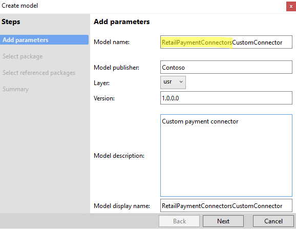

---
# required metadata

title: Create payment packaging for AOS in Service Fabric deployments.
description: This topic explains how to create payment packaging for Application Explorer and deploy it in Dynamics 365 for Commerce service fabric environments.
author: mugunthanm
manager: AnnBe
ms.date: 02/13/2020
ms.topic: article
ms.prod: 
ms.service: dynamics-365-commerce
ms.technology: 

# optional metadata

# ms.search.form: 
# ROBOTS: 
audience: Developer
# ms.devlang: 
ms.reviewer: rhaertle
ms.search.scope: Operations, Retail
# ms.tgt_pltfrm: 
ms.custom:
ms.assetid:
ms.search.region: Global
# ms.search.industry: 
ms.author: mumani
ms.search.validFrom: 2020-02-02
ms.dyn365.ops.version: 10.0.10

---

# Create payment packaging for AOS in Service Fabric deployments

[!include [banner](../../includes/banner.md)]

This topic explains how to create payment packaging for Application Explorer and deploy it in Dynamics 365 Commerce service fabric environments.

Before the 10.0.10 release you use the Commerce SDK (previously known as the Retail SDK) to create payment packaging. Starting with 10.0.10 AOS payment packaging can be created only by using Visual Studio. Packages created using this approach can be deployed in both Service Fabric and in IaaS environments.

> [!NOTE]
> Before 10.0.10, you can create one payment package for both Application Explorer and the commerce channel and cloud components (Commerce Scale unit). Starting with 10.0.01, you must create two packages, one for Application Explorer by using the Dynamics 365 packaging model and another the commerce channel and cloud components by using the Commerce SDK. The previous approach for creating Application Explorer payment packaging using Commerce SDK will be deprecated starting 10.0.10.

To create a payment package that you can deploy in Dynamics 365 for Commerce service fabric deployments follow the below steps.

> [!NOTE]
> There is no change in how how you create the package for the commerce channel and cloud components using the Commerce SDK. For more information, see [Create and deploy connector](https://docs.microsoft.com/en-us/dynamics365/commerce/dev-itpro/deploy-payment-connector).

## Steps to create AOS payment package starting 10.0.10

1.  Click the **Dynamics 365** menu in the Visual Studio menu bar and choose **Model Management > Create model**.

    
   
2.  In the Create model window enter the model name, publisher and other required details and click **Next**. 
    
    The model name must be prefixed or start with **RetailPaymentConnectors**. After the **RetailPaymentConnectors** prefix add the custom model name information, for example, **RetailPaymentConnectorsCustomConnector**. Only model names that begin with this prefix will load in the Dynamics 365 for commerce payment connector options.

    

3.  Select **Create new package** and click **Next**.

    

4.  Select the required referenced package and click **Next**.

5.  Click **Finish** to complete the model creation.

6.  In Solution Explorer, select the project and right-click **References**, and then click **Add Reference**.

    

7.  Add all the payment connector assemblies and their dependencies as references to the project.

    

8.  If you don’t have any other payment X++ extensions related to the payment connector, then build the solution.

9.  Create the deployable package by slecting the **Dynamics 365 > Deploy > Create Deployment Package.** Select the model created in step 2, specify the package file location, and then click **Create**.

    

10. Visual Studio will build the model and create the deployable package.

11. After you create the deployable package, sign into Microsoft Dynamics Lifecycle Services (LCS), and then, in your LCS project, click the **Asset Library** tile.

12. Upload the deployable package that you created.

## Apply a deployable package

To apply a deployable package to an environment, see [Apply updates to cloud environments](https://docs.microsoft.com/en-us/dynamics365/fin-ops-core/dev-itpro/deployment/apply-deployable-package-system).

## Remove a deployable package

To uninstall or remove a deployable package from an environment, see [Uninstall a package](https://docs.microsoft.com/en-us/dynamics365/fin-ops-core/dev-itpro/deployment/uninstall-deployable-package).
