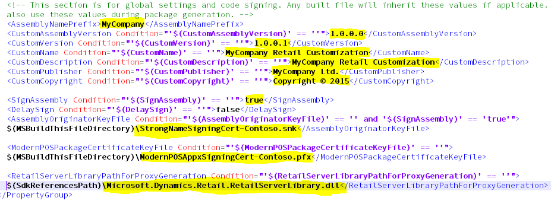
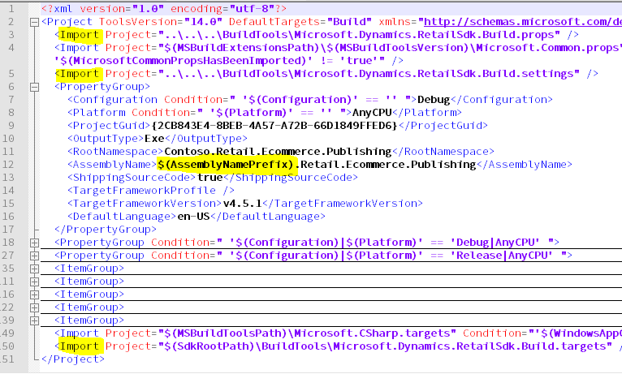
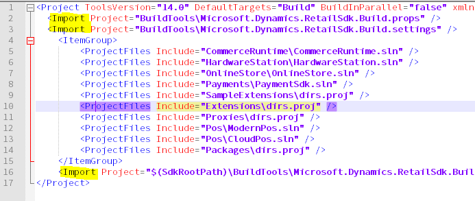
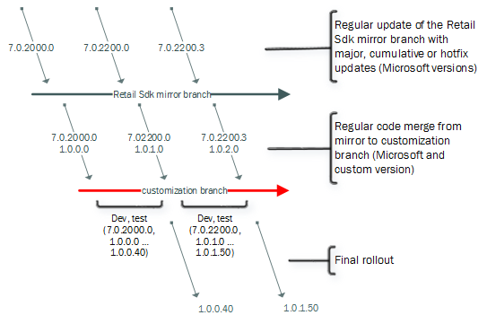

---
# required metadata

title: Retail software development kit (SDK) architecture
description: This topic provides general information about the Retail SDK. The Retail SDK includes code, code samples, templates, and tools that you can use to customize commerce functionality.
author: RobinARH
manager: AnnBe
ms.date: 01/29/2020
ms.topic: article
ms.prod: 
ms.service: dynamics-365-retail
ms.technology: 

# optional metadata

# ms.search.form: 
# ROBOTS: 
audience: Developer
# ms.devlang: 
ms.reviewer: rhaertle
ms.search.scope: Operations, Retail
# ms.tgt_pltfrm: 
ms.custom: 17771
ms.assetid: c54d34a5-32e2-4d0d-a1c2-4a9940d95ade
ms.search.region: Global
# ms.search.industry: 
ms.author: sijoshi
ms.search.validFrom: 2016-02-28
ms.dyn365.ops.version: AX 10.0.11, Retail July 2017 update

---

# Retail software development kit (SDK) architecture and overview

[!include [banner](../../includes/banner.md)]

This topic provides overview of the Retail SDK. The Dynamics 365 Commerce platform provides a rich commerce SDK for developers to customize and add new features to the product. The multi-tier architecture of the commerce platform provides simplified options to customize and extend different layers (Client, business logic and Data layer) independently. The Retail SDK includes libraries, NuGet packages, POS application, code samples, templates, and tools that can be used to create extensions apps and features for Dynamics 365 Commerce or modify existing functionalities.

## Retail SDK Overview

The Retail software development kit (SDK) includes code, code samples, templates, and tools that are required to extend or customize existing commerce functionality. The SDK supports rapid development, full MSBuild integration and package generation.

> [!NOTE]
> The Retail SDK supports TLS (Transport Layer Security) 1.2 standard, any customization build using the Retail SDK should follow TLS 1.2 standard.

### Download the Retail SDK

The Retail SDK is available in development environments provisioned using LCS or the VHDs downloadable from LCS, and in hotfix packages deployed to the LCS environment. For more information check [how to provision a env in LCS](../../../dev-itpro/dev-tools/access-instances.md) and [Apply a deployable/Hotfix package](../../../dev-itpro/deployment/apply-deployable-package-system.md)

To access the Retail SDK, login to the development VM and navigate to K:\RetailSDK folder. New version of the Retail SDK can be obtained by applying any Commerce binary hotfix from LCS to the development environment, after the hotfix deployment the new version of the hotfix can be found inside the K:\RetailSDK\Update\ folder. 

If the current version of the SDK contains some extensions then after upgrade config files and Extension projects needs to merged from the previous version of the SDK to the new version of the SDK, this steps is required only if your previous version of SDK includes extensions and its needs to be migrated to the new version. Refer [Upgrade the Retail channel extension to the latest Retail SDK](../../../dev-itpro/RetailSDK-update.md) for detailed steps. Its recommend that SDK is integrated with any source control system such as Git or Azure repo.

### Full MSBuild integration

The Retail SDK is a build system. A simple MSBuild command from the root of the SDK builds everything. This behavior eliminates about how and where to build from, and guarantees consistency and reproducibility. Therefore, the Retail SDK can easily integrated with build pipeline like Azure DevOps pipeline for build.

[Set up Commerce SDK build pipeline](../../../dev-itpro/retail-sdk/SDK-build-pipeline.md)

### Prerequisites

- To **develop** or **build** extensions using the Retail SDK you must have the following components:

    - Microsoft Visual Studio 2017 Community, Professional, or Enterprise edition (VM) with the following workloads:
        - .NET Desktop development
        - Universal Windows Platform development
        - ASP.NET and web development
        - Azure development
        - Node.js development
        - .NET Core cross-platform development
        - Mobile development with .NET (required for hybrid app development)

## Runtimes:

   + [sdk-2.1.202-windows-x64-installer](https://dotnet.microsoft.com/download/dotnet-core/thank-you/sdk-2.1.202-windows-x64-installer)
   + [sdk-2.1.513-windows-x64-installer](https://dotnet.microsoft.com/download/dotnet-core/thank-you/sdk-2.1.513-windows-x64-installer)
   + [runtime-2.0.9-windows-x64-installer](https://dotnet.microsoft.com/download/dotnet-core/thank-you/runtime-2.0.9-windows-x64-installer)
   + [runtime-2.1.17-windows-x64-installer](https://dotnet.microsoft.com/download/dotnet-core/thank-you/runtime-2.1.17-windows-x64-installer)
   + Install Typescript version 2.2.2. In Visual Studio, go to **Tools > Get Tools and Features**. Select the **Individual components** tab and select the **TypeScript 2.2 SDK from SDKs, libraries, and frameworks** section and install it. VS 2017 has Typescript 3.1 as default, please include 2.2.2 also because the POS app is built based on Typescript 2.2.2.

## Build the Retail SDK

Before starting the development with Retail SDK first do the full msbuild from the root of the SDK folder to restore all the packages.

Open the Developer command prompt for Visual Studio 2017 or the MSBuild 15.0 command prompt and navigate to the Retail SDK folder in developer command prompt and do msbuild by typing the command **msbuild /t:rebuild** from the root of the SDK folder (the dirs.proj file in the root of the SDK (**RetailSDK\\dirs.proj** or **RetailSDK\\Code\\dirs.proj**) contains all the necessary details to build  the full SDK.

## Retail SDK components deep dive

Retail SDK contains the below folders to help with the extension developments:

The folder structure and description below are based on the Retail SDK version 10.0.13:

<table>
<thead>
<tr>
<th>Folder/file</th>
<th>Description</th>
</tr>
</thead>
<tbody>
<tr>
<td>Assets</td>
<td>Contains scripts and configuration files required for packaging. Only the these (HardwareStation.Extension.config, RetailProxy.MPOSOffline.ext.config, CommerceRuntime.Ext.config and CommerceRuntime.MPOSOffline.Ext.config)  configuration files can be edited to include extension binaries details for packaging.
    <ul>
<li><strong>manifest.json</strong> – SDK binary version.</li>
    </td>
</tr>
<tr>
<td>BuildTools</td>
<td>Scripts, sample cert and Customization.settings file (Packaging metadata) files. Don’t modify any files in this folder except the Customization.settings.
</td>
</tr>
<tr>
<td>Database</td>
<td>Contains shared database scripts. Extensions must copy the extension scripts to Database\Upgrade\Custom folder.</td>
</tr>
<tr>
<td>Documents</td>
<td>Contains instructions to execute some of the samples.</td>
</tr>
<tr>
<td>OnlineStore</td>
<td>E2E sample e-Commerce storefront solution built using the Retail proxy..</td>
</tr>
 <tr>
<td>Packages</td>
<td>The out Retail deployable package generated after the SDK build for packaging will be copied here (Packages\RetailDeployablePackage). Retail deployable package is deployed to different environments(test, sandbox and Production using LCS)</td>
</tr>
    <td>PaymentExternals</td>
<td>Extension payment assemblies must be copied. The following three subfolders hold various payment files:
<ul>
<li><strong>IPaymentProcessor Assemblies</strong> – This folder contains the assembly that implements the IPaymentProcessor interface and its dependent assemblies.</li>
<li><strong>Payment Web Files</strong> – This folder contains the callback HTML, JavaScript, or CSS files that are required in order to enable the payment accepting page. Payment connector developers will provide these web files if their payment accepting page requires them.</li>
<li><strong>IPaymentDevice Assemblies</strong> – This folder contains the assembly that implements the IPaymentDevice interface and payment request handlers, and the interface's dependent assemblies. These assemblies are used in Retail Hardware station and Retail Modern Point of Sale (Modern POS) to communicate with payment terminal devices.

Additionally, all extensions that are related to payment connectors should be put in this folder before you create the deployment packages.
</li>
</ul>
</td>
</tr>
<tr>
<td>Payments</td>
<td>Sample Payment Connector project for e-Commerce.</td>
</tr>
<tr>
<td>pkgs</td>
<td>All the NuGet packages (reference libraries) required for building the extension projects and tools for packaging and retail proxy generation.</td>
</tr>
<tr>
<td>POS</td>
<td>Contains the POS app and extension project :
<ul>
<li><strong>App</strong> – Modern POS–specific views and other items</li>
<li><strong>Contracts</strong> – Public contracts for POS extensions, extension can consume only these contracts for POS extension.</li>
<li><strong>Extensions</strong> – Sample Extension projects and POS.Extension project for extension to consume.</li>
<li><strong>Folder SharedApp</strong> – Shared POS views between CPOS and MPOS</li>
<li><strong>Folder Web</strong> – Cloud POS–specific views and other items</li>
<li><strong>CloudPos.sln</strong> - Cloud POS solution file.</li>
<li><strong>ModernPos.sln</strong>- Modern POS solution file.</li></li>
</ul></td>
</tr>
<tr>
<td>References</td>
<td>The single place where all binaries live. The location is used to resolve any project's binary references. The list of files includes external non-Commerce binaries and also Microsoft Commerce binaries. Additionally, this directory serves as the global drop location for any binaries that are built from the Retail SDK.</td>
</tr>
<tr>
<td>SampleExtensions</td>
<td>Contains the sample projects and templates for extensions:
<ul>
<li><strong>CommerceRuntime</strong> – Sample extension projects for business logic extensions (CRT triggers, handlers and new service extension</li>
<li><strong>HardwareStation</strong> – Sample Hardware station extension projects</li>
<li><strong>HybridApp</strong> – Android and iOS shell apps for POS. Extension can build these apps and deploy it to Android and iOS platform</li>
<li><strong>OnlineStore</strong> – Sample online storefront app</li>
<li><strong>RetailProxy</strong> – Sample C# proxy project for POS offline. C# proxy is deprecated starting 10.0.11, the retail server extension libraries can be directly used in offline no need for sperate proxy libraries.</li>
<li><strong>RetailServer</strong> - Sample Retail server extension projects.</li>
<li><strong>SampleExtensionsTest</strong> - Sample project for creating extension test project.</li>
<li><strong>ShoppingApp</strong> – Sample mobile app for end Customers in Android and iOS (Retailer shopping app).</li>
<li><strong>TypeScriptProxy</strong> – Sample Proxy projects for how to generate Typescript for POS.</li>
</ul></td>
</tr>
<tr>
<td>dirs.proj</td>
<td>Proj file that directs the build order.</td>
</tr>
<tr>
<td>Microsoft-version.txt</td>
<td>A file that includes the Microsoft application version of the Retail SDK.</td>
</tr>
</tbody>
</table>

### Extension components in Retail SDK

The below tables provide information on which components in SDK must be customized for different scenarios, only the sample projects inside the Retail SDK\SampleExtensions can be modified for extension purpose, no other files or projects/scripts should be modified in the Retail SDK:

<table>
<thead>
<tr>
<th>Commerce component</th>
<th>Scenarios</th>
    <th>Commerce SDK reference</th>
<th>Technology</th>
    <th>Detailed documentation</th>
</tr>
</thead>
<tbody>
<tr>
    <td>Client (POS)</td>
    <td>Extend the POS for user experience changes, client logic, workflow and simple validations.</td>
    <td>\RetailSDK\POS 
        Open the ModernPos.Sln or CloudPos.sln. Add extension to the POS.Extension project, don't modify anything in the core POS app/web projects.
</td>
    <td>Typescript, HTML and CSS</td>
    <td>https://docs.microsoft.com/en-us/dynamics365/retail/dev-itpro/pos-run-samples?toc=/dynamics365/commerce/toc.json</td>
    </tr>
    <tr>
    <td>Commerce Runtime (CRT)</td>
    <td>Extend the commerce runtime to add or modify business logic. Ex: Calculating tax, Price, discount etc.</td>
    <td>\RetailSDK\SampleExtensions\CommerceRuntime
Open the CommerceRuntimeSamples.sln.
</td>
    <td>C#</td>
    <td>https://docs.microsoft.com/en-us/dynamics365/retail/dev-itpro/commerce-runtime-extensibility?toc=/dynamics365/commerce/toc.json

</td>
    </tr>
    <tr>
    <td>Retail Server (RS)</td>
    <td>Create new Retail server extension to expose new Commerce APIs to the client.</td>
    <td>\RetailSDK\SampleExtensions\RetailServer
Open any of the sample extensions inside the RetailServer folder.
</td>
    <td>OData, C#</td>
    <td>https://docs.microsoft.com/en-us/dynamics365/retail/dev-itpro/retail-server-extension?toc=/dynamics365/commerce/toc.json</td>
    </tr>
        <tr>
    <td>Typescript Proxy</td>
    <td>Typescript proxy is required if new RS extensions need to be consumed in POS or E-Commerce clients.</td>
    <td>\RetailSDK\SampleExtensions\RetailServer
Open any of the sample extensions inside the RetailServer folder.
</td>
    <td>OData, C#</td>
    <td>https://docs.microsoft.com/en-us/dynamics365/retail/dev-itpro/retail-server-extension?toc=/dynamics365/commerce/toc.json</td>
    </tr>
    <tr>
    <td>Hardware station</td>
    <td>Hardware station to add or modify logics related to peripherals.</td>
    <td>\RetailSDK\ \SampleExtensions\HardwareStation
Open the HardwareStationSamples.sln.
</td>
    <td>C#</td>
    <td>https://docs.microsoft.com/en-us/dynamics365/commerce/dev-itpro/hardware-device-extension</td>
    </tr>
    <tr>
    <td>Payment</td>
    <td>Integrate POS with new Payment connector.</td>
    <td>\RetailSDK\SampleExtensions\HardwareStation\Extension.PaymentSample
Open the HardwareStation.Extension.PaymentSample.sln.
</td>
    <td>C#</td>
    <td>https://docs.microsoft.com/en-us/dynamics365/retail/dev-itpro/end-to-end-payment-extension?toc=/dynamics365/commerce/toc.json</td>
    </tr>
    <tr>
    <td>Client (POS)</td>
    <td></td>
    <td></td>
    <td></td>
    <td></td>
    </tr>
</tbody>
</table>

### Best practice:

The C\# source code in the SDK uses the Contoso namespace. Therefore, it's easier to distinguish Microsoft types and extension types, if extension code referencing a type from the Microsoft binary, reference it by using Microsoft.Dynamics. to distinguish between Microsoft libraries vs the libraries from extension. The extension libraries must not begin with Microsoft.Dyanmics name.

### Deployment packages

After commerce extension development (Commerce runtime, Retail server, Database scripts, POS and Hardware station) the Retail SDK can be used to generate deployment packages which can be deployed to test, sandbox and production environments. For more information refer [Create deployable packages](../../../dev-itpro/retail-sdk/retail-sdk-packaging.md)

### Dependencies, build order, and full build

Recommend to build all the extensions and required OOB projects(full msbuild from the root of the SDK), no need to build the sample projects included in the Retail SDK, build your extension, POS and packaging projects. Edit the dirs.proj in the Retail SDK to remove unwanted sample projects, don’t remove the packaging and POS projects from the list. Also include the extension project in the dirs.proj file of the respective folder so that msbuild command ran from the root SDK folder builds all the extension and required OOB projects. Sequence the projects in the right order so the project and dependencies are built correctly. The dirs.proj in the Retail SDK root folder is sequenced in the right order to build all the required projects and then the packaging project.

### Normal configuration/code signing

For Modern POS create an app package signing certificate in order to build correctly or use Cloud POS. Follow the instructions at [Create a certificate for package signing](https://docs.microsoft.com/en-us/windows/msix/package/create-certificate-package-signing) to create a PFX file. Then copy the PFX file to the BuildTools folder, and update the BuildTools\\Customization.settings file with the correct name (ModernPOSPackageCertificateKeyFile). 

BuildTools\\Customization.settings holds most of the configuration values for the SDK. The highlighted items in the following illustration are the global values. These values control how build is managed for binaries, components, and packages are named, versioned, and code-signed. 

It's good practice to sign your assemblies with a strong name, even though this isn't required. To learn how to create your own key file if you don't already have one, see [https://msdn.microsoft.com/library/6f05ezxy(v=vs.110).aspx](https://msdn.microsoft.com/library/6f05ezxy(v=vs.110).aspx). 

The generated installer files for self-service components like MPOS, Hardware station, Store scale unit can be signed with [SignTool.exe](https://docs.microsoft.com/en-us/windows/win32/seccrypto/signtool).

Both the strong name key file and the app package signing certificate can be stored inside the BuildTools folder or in Azure key vault, for password protected or secured certificate use Azure Key vault.

### Customizing the build

#### Adding new projects

It's easy to add new projects to the Retail SDK's build system. You can either clone one of the many existing projects or start a new project. You just have to make some adjustments in a text editor, as shown in the following illustration. The relative path of the **Import** elements should be adjusted, and the **AssemblyName** element should use the predefined **AssemblyNamePrefix** property. These adjustments are required in order to get versioning, code signing, uniform assembly naming, automatic dropping to the References folder, and other tasks for free. 

#### Changing the build order or adding to the build

The whole directory tree of the Retail SDK is built with the help of MSBuild traversal files (dirs.proj files). The following illustration shows the main traversal file of the Retail SDK. Similar files might also exist in subdirectories. Notice that Visual Studio solution files (.sln files) are very similar to traversal files. Both "direct" the MSBuild engine to process other build scripts. 

 

After new code is added, most of it should be located in a new folder (for details, see "Best practices of code implementation"), and you must add it to the traversal structure by adding to one or multiple dirs.proj files. The Extensions folder appears highlighted on line 10 in the previous illustration. The quickest way to get started with a new dirs.proj file is to copy an existing file, correct the paths in the **Import** elements, and update the **ProjectFiles** elements in the **ItemGroup** element.

#### Build script customization

When you must implement new build steps, keep in mind that the existing scripts might be updated by a Retail SDK update later. Best practice is to minimize the editing of any file, or add new files instead. If you require new global MSBuild properties, BuildTools\\Microsoft.Dynamics.RetailSDK.Build.props is a good place to add them. Likewise, BuildTools\\Microsoft.Dynamics.RetailSDK.Build.targets can be used to add new build processing targets. If only one project requires special handling, it is better to explicitly make the change there. If you require new local MSBuild properties, add a new file that is named local.props in the same directory. Alternatively, add a local.targets file if you require local build processing targets.

### Developer productivity

CommerceRuntime and RetailServer extension DLLs must be copied into the bin folder of the locally installed RetailServer web application. A user can configure the Customization.setting file so that the DLLs are automatically copied into the bin folder of the local RetailServer web application whenever new versions of these files are built from the extension project. 

### Application lifecycle management

A good ALM solution provides version control, builds, automated builds, planning tools, tracking tools, dashboards, customization, and more. The Retail SDK is organized in such a way that it supports these tasks. 

### Branching and versioning

To work efficiently in a team, or even just to be able to go back and look at some changes that were done in the past, you must have good branching strategy and versioning discipline. The following illustration shows a simple branching strategy that might work well for most teams. The version numbers are fictitious, please refer the [Git braching guidance for more information](https://docs.microsoft.com/en-us/azure/devops/repos/git/git-branching-guidance?view=azure-devops) .

#### Retail SDK mirror branch

A very important point to emphasize is that the non-customized Retail SDK should be stored in your source control. You don't have to store every version, but the versions that your team wants to snap to should be added (these versions might be cumulative updates or hotfixes). Only a simple merge of all changes (additions, changes, and deletions) should be done. No other development work should occur in this branch. The Retail SDK has its own version. All Commerce binaries and packages that are included have the same version. The version can also be found in the root of the Retail SDK in a file that is named Microsoft-version.txt.

#### Customization branch

For development a new customization branch should be created. At the beginning of the initial branch-out, this branch will be an exact copy of the Retail SDK mirror branch. This is the branch for team's development. The version of the customization branch must be incremented at least every time that a build is created for testing, or it can even be incremented daily. The file version to increment is defined in Customization.setting file by using the **CustomVersion** property. If you update it and rebuild, all binaries, packages, manifest files are updated accordingly. 

Note that the **CustomAssemblyVersion** property should be updated only when the update isn't backward compatible and/or for major new releases. In other words, this update should very rarely. In the previous illustration, the current file version of the customization branch is 1.0.2.\* (based on Microsoft version 7.0.2200.3). The file version of the first rolled-out release was 1.0.0.40 (based on 7.0.2000.0). When a testing phase is completed, and the final packages are being deployed with that version, it's important that you increment the version (or create a source control label).
