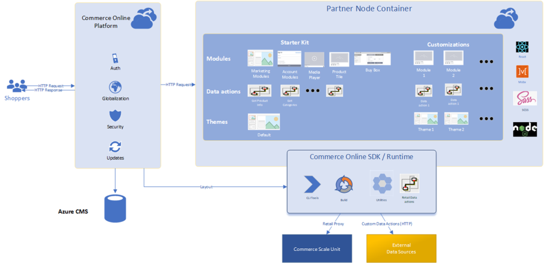

---
# required metadata

title: Architectural overview
description: This topic present an architectural overview of Dynamics 365 Commerce.
author: samjarawan
manager: annbe
ms.date: 10/01/2019
ms.topic: article
ms.prod: 
ms.service: dynamics-ax-retail
ms.technology: 

# optional metadata

# ms.search.form: 
audience: Application user
# ms.devlang: 
ms.reviewer: v-chgri
ms.search.scope: Retail, Core, Operations
# ms.tgt_pltfrm: 
ms.custom: 
ms.assetid: 
ms.search.region: Global
# ms.search.industry: 
ms.author: samjar
ms.search.validFrom: 2019-10-31
ms.dyn365.ops.version: Release 10.0.5

---
# Architectural overview

[!include [banner](../includes/preview-banner.md)]
[!include [banner](../includes/banner.md)]

This topic present an architectural overview of Dynamics 365 Commerce.

## Overview

The Dynamics 365 Commerce online extensibility software development kit (SDK) enables partners to easily extend their online website with additional business and UX logic using freely available open source technologies.

## Component-based architecture

The architecture of the platform leverages a reuse-based approach to defining, implementing, and composing loosely coupled independent components with an emphasis on separation of concerns.

## High level design

The extensibility design avoids dependency between the platform and application by running the application as a microservice built on Node.js using React as an underlying UX framework. All routing, CMS Integration, and security is handled by the platform running as a separate service.

## Request flow

The following list represents a typical architecural flow when a customer requests a page from an online store that uses the Dynamics 365 Commerce platform.

* The platform gets a request and performs authentication, routing, and locale detection.
* The platform generates a hydrated page object which contains page configuration and data from external services using data actions.
* Data actions allow for batching, aggregation, and chaining of multiple service calls, including de-duping.
* The platform provides a set of core data actions providing connections to Commerce services (catalog, ratings, etc.).
* Once the hydrated page object is created, the platform calls the React application running on a node express server.
* The React node application parses the view model, executes the React views server side, and generates HTML.
* The React application is composed of core SDK modules, starter kit modules, and custom modules.
* The platform sends back the HTML with the appropriate cookies, headers, etc.
* The React script initializes the components, takes over client-side execution on the browser, and renders the modules.
* The node app supports tool pages and other developer productivity tools provided by the platform.

## Partner application

The compiled partner package contains both the SDK and a starter kit. The SDK is not extensible, but starter kit modules can be cloned and completely customized. Partner customizations (modules, data actions, and themes) can be packaged with a command-line interface (CLI) command and uploaded using Microsoft Lifecycle Services (LCS) to incorporate customizations to a partner's e-Commerce site.
