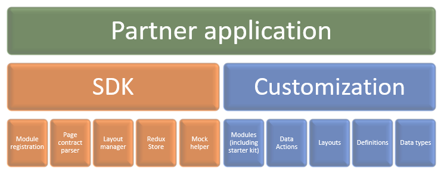

---
# required metadata

title: Architectural Overview
description: Microsoft Dynamics 365 Commerce e-Commerce Extensibility SDK allows partners to easily extend their e-Commerce web site with additional business and UX logic using freely available Open Source technologies.
author: SamJarawan
manager: annbe
ms.date: 08/30/2019
ms.topic: article
ms.prod: 
ms.service: Dynamics365Operations
ms.technology: 

# optional metadata

# ms.search.form: 
audience: Developer
# ms.devlang: 
ms.reviewer: josaw
ms.search.scope: Retail, Core, Operations
# ms.tgt_pltfrm: 
ms.custom: 
ms.assetid: 
ms.search.region: Global
# ms.search.industry: 
ms.author: SamJar
ms.search.validFrom: 2019-08-30
ms.dyn365.ops.version: 

---
# Architectural overview

Microsoft Dynamics 365 Commerce Online Extensibility SDK allows partners to easily extend their online web site with additional business and UX logic using freely available Open Source technologies.

## Component-based architecture
The architecture of the platform leverages a reuse-based approach to defining, implementing, and composing loosely coupled independent components with emphasis on separation of concerns.

## High level design
The extensibility design avoids dependency between the platform and application by running the application as a micro service built on Node.js using React as an underlying UX framework. All routing, CMS Integration, and security is handled by the platform running as a separate service.

## Request flow
The below list represents a typical architecural flow when a customer requests a page on an online store through the Dynamics 365 Commerce platform.

* The platform gets a request, performs authentication, routing, and locale detection.
* The platform generates a hydrated page object which contains page configuration and data from external services using data actions.
* Data actions allow for batching, aggregation, and chaining of multiple service calls, including de-duping.
* The platform provides a set of core data actions providing connections to Dynamics 365 Commerce services (catalog, ratings, etc.).
* Once the hydrated page object is created, the platform calls the react application running on node express server.
* The react node application parses the view model and executes the react views on server side and generates HTML.
* The react application is composed of core SDK modules, Starter Kit modules, and custom modules.
* The Platform sends back the HTML with the right cookies, headers, etc.
* React script initializes the components and takes over client-side exectuion on the browser and renders the modules.
* The node app supports tool pages and other developer productivity tools provided by the platform.

## Partner application

The compiled partner package contains both the SDK and a "Starter Kit".  The SDK is not extensible, but Starter Kit modules can be cloned and completely customized. Partner customizations (modules, data actions, and themes) can be packaged with a CLI command and uploaded via Lifecycle Services (LCS) to incorporate onto the partners e-Commerce site.
