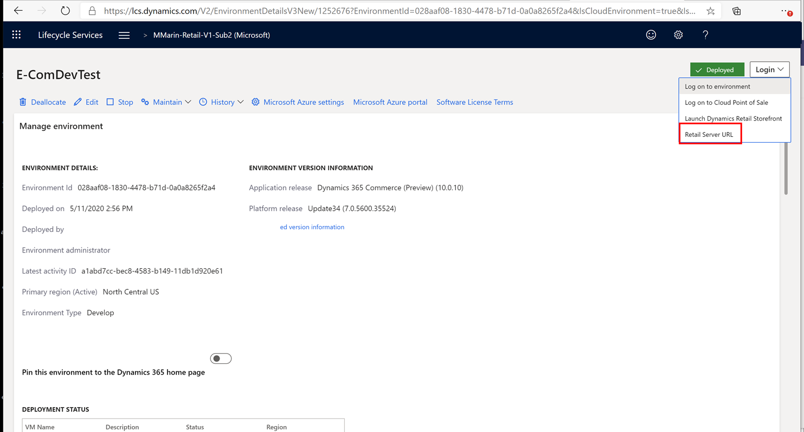

---
# required metadata

title: Debug against a Tier 1 Commerce development environmnent
description: This topic describes how to set up an e-Commerce online development environment to debug against a tier 1 Commerce development environment.
author: samjarawan
manager: annbe
ms.date: 04/23/2020
ms.topic: article
ms.prod: 
ms.service: dynamics-365-commerce
ms.technology: 

# optional metadata

# ms.search.form: 
audience: Developer
# ms.devlang: 
ms.reviewer: v-chgri
ms.search.scope: Retail, Core, Operations
# ms.tgt_pltfrm: 
ms.custom: 
ms.assetid: 
ms.search.region: Global
# ms.search.industry: 
ms.author: samjar
ms.search.validFrom: 2019-10-31
ms.dyn365.ops.version: Release 10.0.5

---
# Debug against a tier 1 Commerce development environmnent

[!include [banner](../includes/banner.md)]

This topic describes how to set up an e-Commerce online development environment to debug against a tier 1 Commerce development environment.

## Overview

Dynanics 365 Commerce tier 1 environments are generally deployed for Commerce Runtime (CRT) and Point-of-sale (POS) extension development.  These environments are stand alone and do not include e-Commerce components due to the SAAS nature of the e-Commerce architecture.

There may be scenarios where you want to test calling extensions on a tier 1 environment to allow extension debugging from e-Commerce components.  This document will cover the details needed to set this up.

## Install Online SDK

The Dynamics 365 Commerce SDK can be installed on any environment including the tier 1 VM itself.  Follow the instruction to [Setup a development environment](setup-dev-environment).

## Configure the .env file

To hit the tier 1 environment from the local node server on the e-Commerce development environment, set the **MsDyn365Commerce_BASEURL** in the .env file to the tier 1 Retail server URL.  Details for setting the .env file can be found here: [Configure a development environment (.env) file](configure-env-file.md).

To get the Retail server URL open the LCS web page and select the project and tier 1 environment.  Next, select the "Login" button at the top right and select "Retail Server URL" as shown below.



Clicking on the above Retail Server URL should open a new tab with a URL similar to the following example “https://e-comdevtestf1d01de665c744a7devret.cloud.retail.dynamics.com/Commerce”

Copy this URL except for the last part “Commerce” into the .env file **MsDyn365Commerce_BASEURL** property.  The remainder properties should be configured to a desired online channel configured on the environment. 

```
…
MSDyn365Commerce_BASEURL=https://e-comdevtestf1d01de665c744a7devret.cloud.retail.dynamics.com/
MSDyn365Commerce_CHANNELID=68719478279
MSDyn365Commerce_CATALOGID=0
MSDyn365Commerce_OUN=128
…
```

Make sure to restart the Node.js server with “yarn start” to pick up these new values.  As you build modules and debug data actions, calls will now be made directly to the tier 1 Retail Server.

If you have the “MSDyn365_HOST” set to your e-Commerce site, you can also navigate to https://localhost:4000 to view your online website rendered on the local Node.js server.  All Data Action Retail Server calls will be routed to the Tier 1 environment as specified in the .env file.
