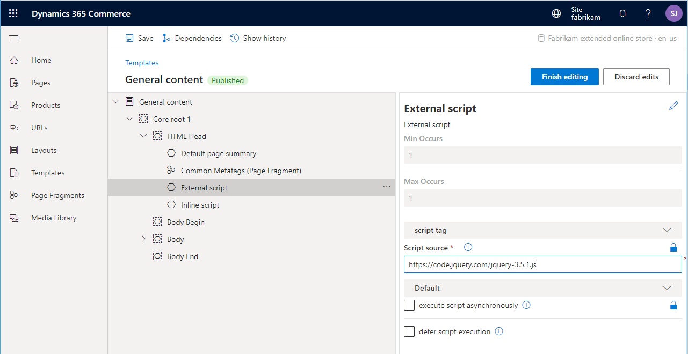

---
# required metadata

title: Script Injectors
description: This topic covers details on how script can be added to your e-Commerce page using the Starter Kit modules and how to extend them. This may include 3rd party analtyics integration or other service scripts. 
author: SamJarawan
manager: annbe
ms.date: 08/30/2019
ms.topic: article
ms.prod: 
ms.service: Dynamics365Operations
ms.technology: 

# optional metadata

# ms.search.form: 
audience: Developer
# ms.devlang: 
ms.reviewer: josaw
ms.search.scope: Retail, Core, Operations
# ms.tgt_pltfrm: 
ms.custom: 
ms.assetid: 
ms.search.region: Global
# ms.search.industry: 
ms.author: SamJar
ms.search.validFrom: 2019-08-30
ms.dyn365.ops.version: 

---
# Script Injectors
This topic covers details on how script can be added to your online page using Starter Kit modules and how to extend them. Examples include adding script for 3rd party analtyics integration or other service scripts.

The Dynamics 365 Commerce online Starter Kit provides several pre-built **script injector** modules that can be added to a master page to inject inline or external script into the HTML head, body begin or body end parts of a page as required.

Below is a screen shot of a script injector module being configured on a master page.



## Custom script injector modules
There may be scenarios where you need to inject script into your site or site pages and the built in script injector modules are not as flexible as needed, for example you may need additional configuration fields exposed to the authoring tools. In this scennario the Starter Kit script injectors can be extended into new modules. This new script injector module(s) can then be placed directly on a page, in a shared template or in a master template.

## Create a custom script injector
To get started use the following command to create a new module. This is an example: 

```
C:\repos\MySite>yarn msdyn365 add-module myAnalytics
```

The myAnalytics.definition.json file can then reference a Starter Kit script injector base definition file:

```json
{
    "$ref": "@msdyn365-commerce-modules/core-components/dist/lib/modules/script-injector/script-injector.definition.json",
    "friendlyName": "My Analytics",
    "name": "my-analytics"
}
```

If you open the script injector base definition file, you can see the pre-configured attributes and configuration fields:

```json
{
  "$type": "scriptModule",
  "friendlyName": "External Script",
  "name": "script-injector",
  "description": "External script tag to be rendered on the page",
  "categories": [
    "script-injector"
  ],
  "tags": [
    "script",
    "sdk-modules"
  ],
  "attributes": {
    "private": true,
    "allowInBodyBegin": true,
    "allowInBodyEnd": true,
    "allowInHead": true
  },
  "module": {
    "view": "./script-injector"
  },
  "config": {
    "scriptSource": {
      "friendlyName": "Script tags",
      "description": "script source or inline script",
      "type": "string",
      "group": "script tag"
    },
    "async": {
      "friendlyName": "execute script asynchronously",
      "description": "specifies that the script is executed asynchronously",
      "type": "boolean",
      "default": false
    },
    "defer": {
      "friendlyName": "defer script execution",
      "description": "Specifies that the script is executed when the page has finished parsing",
      "type": "boolean",
      "default": false
    },
    "loadPoint": {
      "friendlyName": "script load point",
      "description": "load point in the html document where script tag should be loaded",
      "type": "string",
      "enum": {
        "headStart": "headStart",
        "headEnd": "headEnd",
        "bodyStart": "bodyStart",
        "bodyEnd": "bodyEnd"
      }
    }
  }
}
```
The myAnalytics.tsx can now be modified as needed which could include adding additional config fields.

Once the script injector module is deployed to a Dynamics 365 Commerce environment, thew new extended script injector module will show up in the authoring tools.
