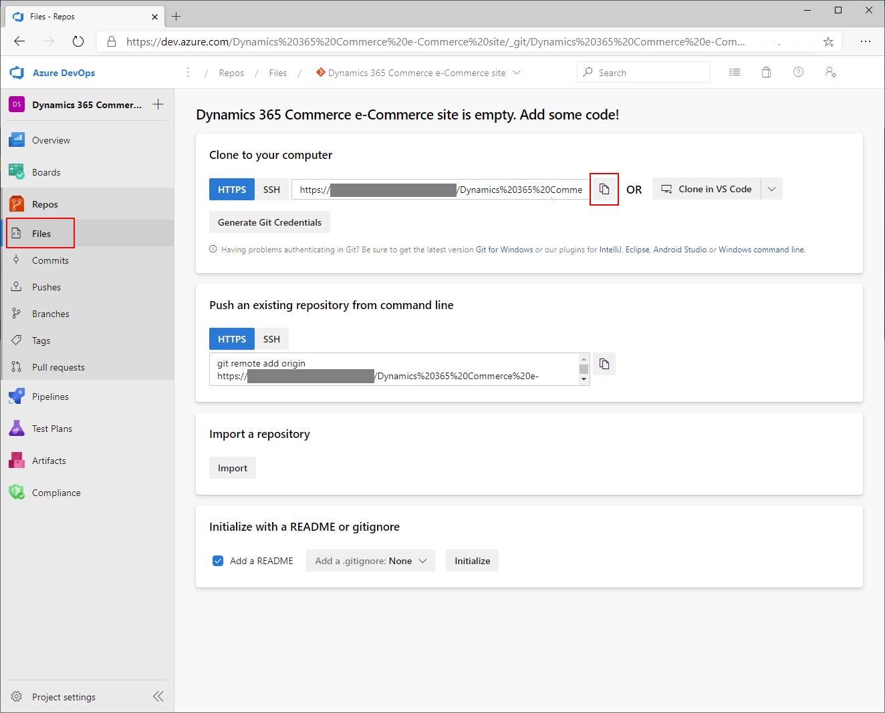
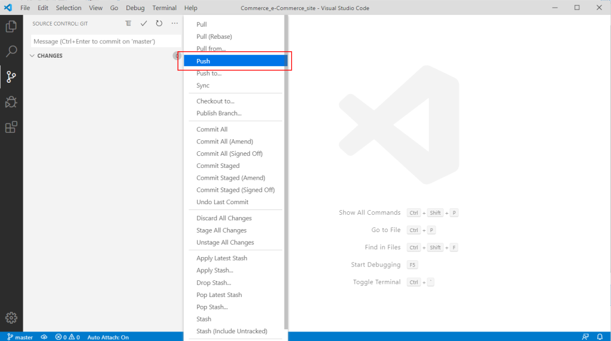
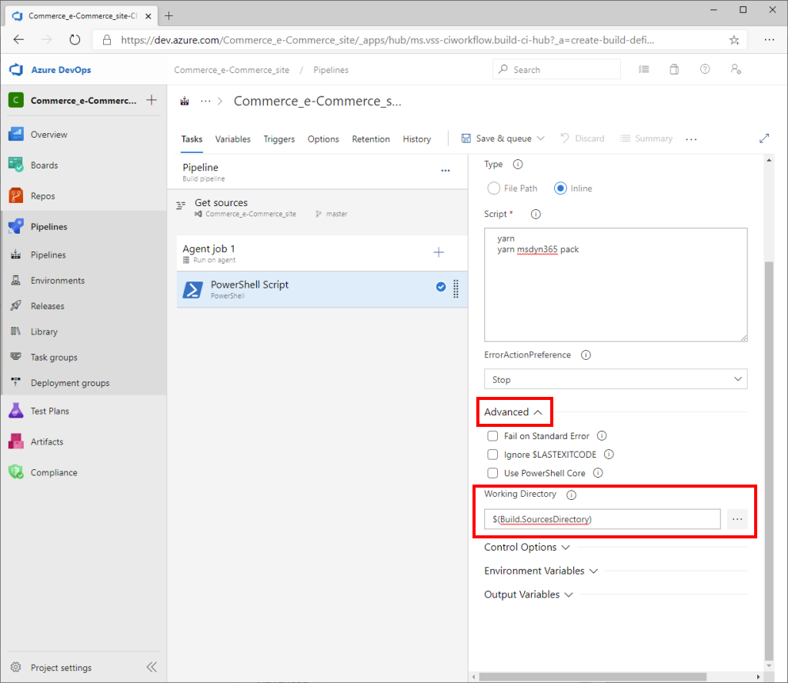
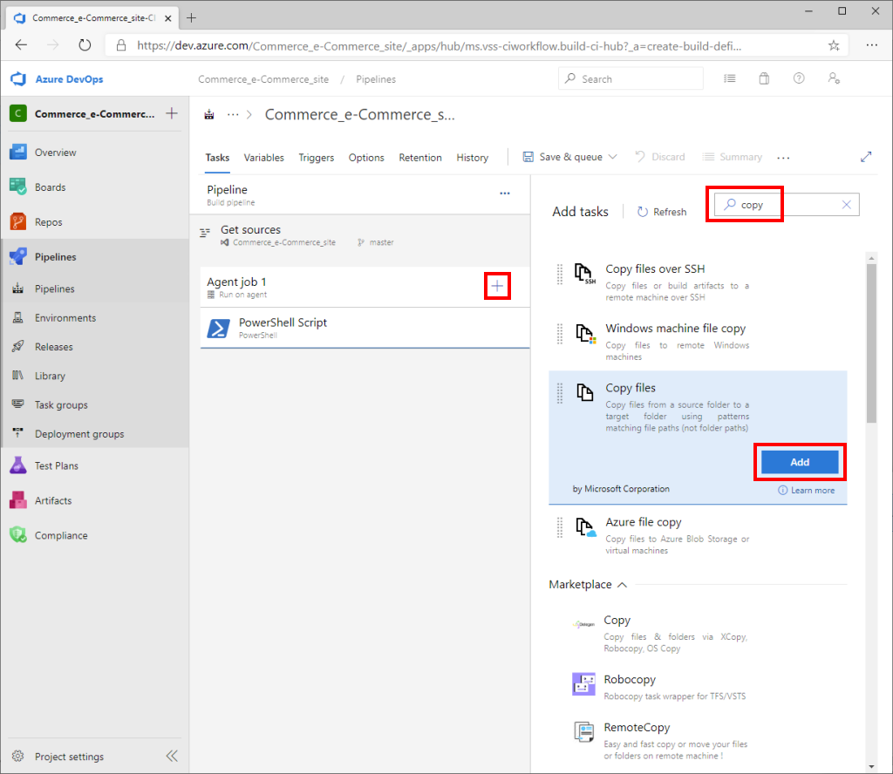
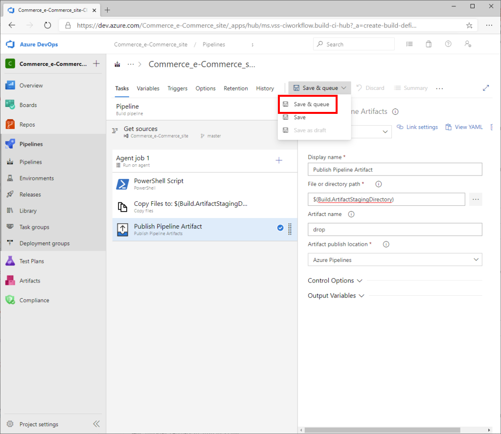
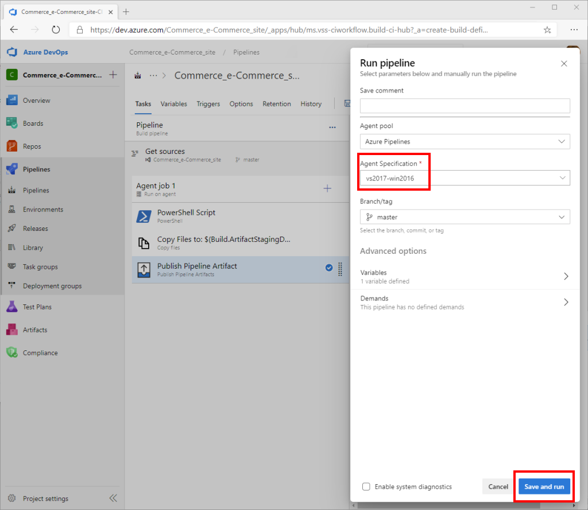
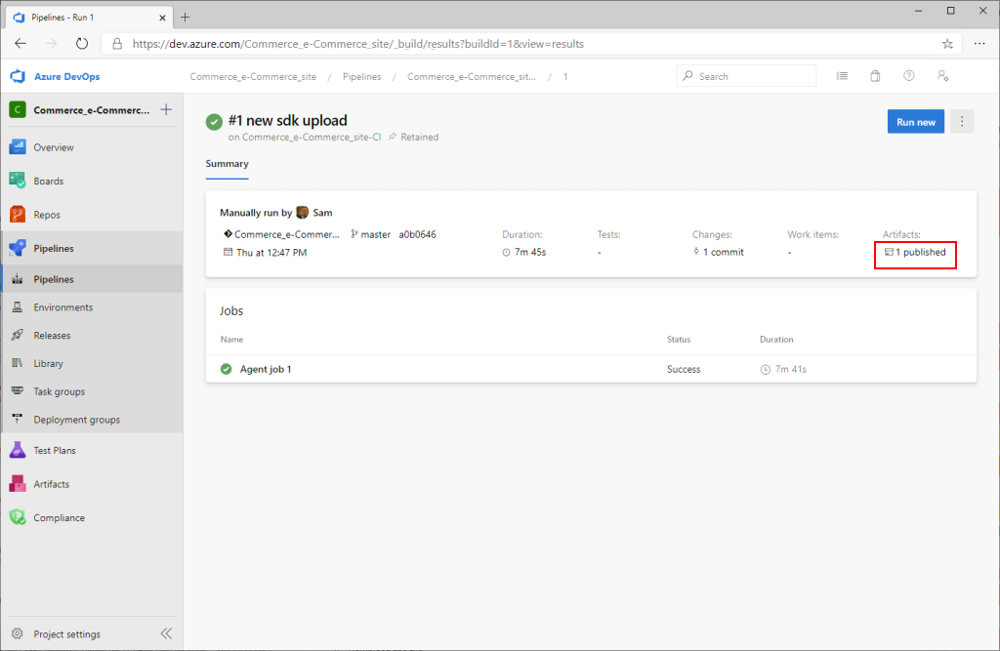
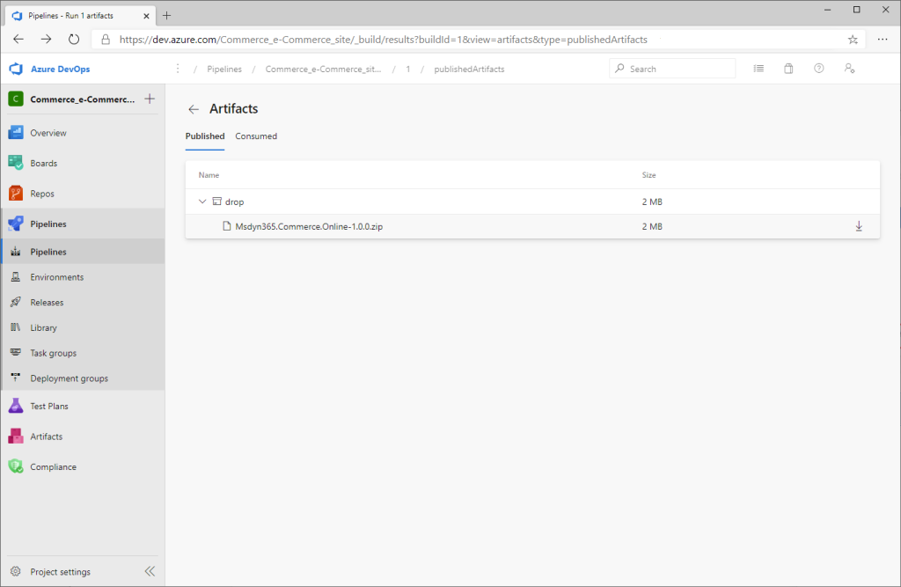

---
# required metadata

title: Set up Azure DevOps code sharing and build pipeline
description: This topic describes how to set up code sharing with Azure DevOps and create a build pipeline for your Microsoft Dynamics 365 Commerce online extensibility code. 
author: samjarawan
manager: annbe
ms.date: 03/05/2020
ms.topic: article
ms.prod: 
ms.service: dynamics-365-commerce
ms.technology: 

# optional metadata

# ms.search.form: 
audience: Developer
# ms.devlang: 
ms.reviewer: v-chgri
ms.search.scope: Retail, Core, Operations
# ms.tgt_pltfrm: 
ms.custom: 
ms.assetid: 
ms.search.region: Global
# ms.search.industry: 
ms.author: samjar
ms.search.validFrom: 2019-10-31
ms.dyn365.ops.version: Release 10.0.5

---
# Set up Azure DevOps code sharing and build pipeline

[!include [banner](../includes/banner.md)]

This topic describes how to set up code sharing with Azure DevOps and create a build pipeline for your Microsoft Dynamics 365 Commerce online extensibility code. 

## Overview

Leveraging [Azure DevOps](https://docs.microsoft.com/azure/devops/user-guide/what-is-azure-devops?view=azure-devops) will allow your team to plan work, collaborate on code development, and automate the building of your Dynamics 365 Commerce e-Commerce deployment packages.

This topic will guide you through the steps needed to:
* Create a GitHub repository (repo) for the Dynamics 365 Commerce online software development kit (SDK).
* Create and configure a build pipeline to generate a Dynamics 365 Commerce online deployable package.

##  Create an Azure DevOps Github repo

You can create an Azure DevOps GitHub repo project from a new or existing Azure DevOps service subscription. For more information, see [Azure DevOps Service](https://azure.microsoft.com/pricing/details/devops/azure-devops-services/). To get started with a free trial account, see the [Get started with Azure DevOps](https://docs.microsoft.com/azure/devops/user-guide/sign-up-invite-teammates?view=azure-devops) quickstart guide.

To create an Azure DevOps Github repo, follow these steps.

1. Once the Azure DevOps service is set up for your organization, create a new Azure DevOps project.

    

1. Provide a project name and description. Select private or enterprise visibility so that it's accessible to your organization and developers.

    

1. We'll be using Git, a free and open source distributed version control system, to clone our SDK code. Go to https://git-scm.com/downloads to download and install the latest build. You should be able to accept all the default install values.

1. Install Visual Studio Code. Visual Studio Code is a lightweight source code editor that runs on your desktop and is available for Windows, macOS, and Linux. It comes with built in support for JavaScript, TypeScript, and Node.js. Go to https://code.visualstudio.com to download the latest stable build. Once downloaded, launch the installer and accept the user license agreement. You should be able accept all the default install values.

1. Clone the Microsoft Dynamics 365 Commerce Online SDK. The SDK will give you everything you need to extend your e-Commerce site including the ability to create new modules, data actions, and themes. The SDK configuration package is available through the following GitHub repository: https://github.com/microsoft/Msdyn365.Commerce.Online.

    There are two ways to get the SDK configuration packages to your development machine: you can either download it directly from the GitHub repo, or you can clone the repo. 

    To clone your repo, follow these steps.
        
    1. Launch a command prompt with administrator privileges and create a directory to hold your e-Commerce site code (for example, "c:\repos").  
    1. From the new directory, enter **git clone <YOUR_GIT_REPO>**, where <YOUR_GIT_REPO> is your Git repo. Since you're only pulling from the git repository once, you can remove the .git folder, which is a hidden directory under the root.

    ```console
    md c:\repos
    cd c:\repos
    git clone https://github.com/microsoft/Msdyn365.Commerce.Online.git
    cd Msdyn365.Commerce.Online
    ```

1. Clone the Azure DevOps GitHub project repo:
    1. Under the **Repos** on the left navigation pane, select **Files**.
    1. Select the copy symbol to copy the URL.

        

    1. Launch a command prompt with administrator privileges and create a directory to hold your e-Commerce site code (for example, "c:\repos"). 
    1. From the new directory, enter **git clone <AZURE_DEVOPS_GIT_REPO>**, where <AZURE_DEVOPS_GIT_REPO> is the Azure DevOps GitHub project repo. A new, empty folder with the name of the Azure DevOps project will be created.

    ```console
    cd c:\repos
    git clone https://xxxxxx.dev.azure.com/<DevOpsProjectName>/_git/<DevOpsProjectName>
    ```

1. Copy all of the contents of "C:\repos\Msdyn365.Commerce.Online" to "C:\repos/\<DevOpsProjectName>". Do not copy the hidden .git folder.

1. With Visual Studio Code, open the folder "c:\repos\<DevOpsProjectName>". When you select the source control tab on the left, Visual Studio Code will show the new changes to be committed.
1. To commit all of the changes to Git, enter a description in the text box at the top of the **SOURCE CONTROL: GIT** pane, and then select the "Commit" checkmark symbol above it. When prompted when to stage all you changes and commit them directly, select **Yes**.

    

1. Select the ellipsis symbol ("...") to the right of the checkmark symbol, and in the flyout that appears select **Push** to push the changes to the repo.  

    

In Azure DevOps, you should now see the new files.


## Create and configure a new build pipeline in Azure DevOps

To create and configure a new build pipeline in Azure DevOps, follow these steps.

1. Under **Pipelines** in the left navigation pane, select **Pipelines**, and then select **Create Pipeline** in the main window.

    

1. Select **Use the classic editor**.

    

1. Select your Azure DevOps GitHub repo project, and then select **Continue**.

    

1. Under **Select a template**, select **Empty job**.

    

1. Next to **Agent job**, select **+** to add a new agent job.

    

1. In the **Add tasks** pane on the right, search for "PowerShell", and then in the **PowerShell** task, select **Add**.

    

1. In the main window, select **PowerShell Script**.

1. In the right pane under **Type**, select **Inline**, and then copy the script below into the **Script** box.

    ```console
    yarn
    yarn msdyn365 pack
    ```
  
    

1. In the right pane, select **Advanced** to expand the section and then enter "$(Build.SourcesDirectory)" in the **Working Directory** box. 

    

1. In the main window next to **Agent job**, select the plus symbol ("+") to add a new agent job.

1. In the **Add tasks** pane, search for "copy", and then in the **Copy files** task, select **Add**.

    

1. In the main window, select the **Copy files** task, then in the **Copy files** pane, do the following:
    1. Under **Source Folder**, enter **$(Build.SourcesDirectory)**. 
    1. Under **Contents**, enter **\*.zip**. 
    1. Under **Target Folder**, enter **$(Build.ArtifactStagingDirectory)**.

    

1. In the main window next to **Agent job**, select the plus symbol ("+") to add a new agent job.

1. In the **Add tasks** pane, search for "publish", and then in the **Publish Pipeline Artifacts** task, select **Add**.

    

1. In the main window, select the **Publish Pipeline Artifacts** task. Then in the **Publish Pipeline Artifacts** pane, do the following:
    1. Under **File or directory path**, enter **$(Build.ArtifactStagingDirectory)**.
    1. Under **Artifact name**, enter **drop**.

    

1. From the top menu, select **Save & queue**.

    

1. In the **Run pipeline** pane, ensure that the value for **Agent Specification** is set to **vs2017-win2016**, and then select **Save and run**.

    

    Tools that you commonly use to build, test, and run JavaScript apps - like npm, Node, Yarn, and Gulp - are pre-installed on Microsoft-hosted agents in Azure Pipelines. For the exact version of Node.js and npm that is preinstalled, refer to Microsoft-hosted agents. To install a specific version of these tools on Microsoft-hosted agents, add the Node Tool Installer task to the beginning of your process. "VS2017-win2016" comes with yarn pre-installed.

1. Monitor the agent job logs for job completion.

    

1. After the job is completed, under **Pipelines** in the left navigation pane, select **Pipelines**. Then select the **Runs** tab, and under **All pipeline runs** select the run to download the deployable package.

    

1. Under **Summary \> Artifacts**, select **1 published**.

    

1. Select the **drop** folder to expand it and see the zip file that was created as part of the run. Select the download symbol to download the file.

    
    
## Additional resources

[System requirements for a Dynamics 365 Commerce online extensibility development environment](system-requirements.md)

[Set up a development environment](setup-dev-environment.md)

[Configure a development environment (.env) file](configure-env-file.md)
