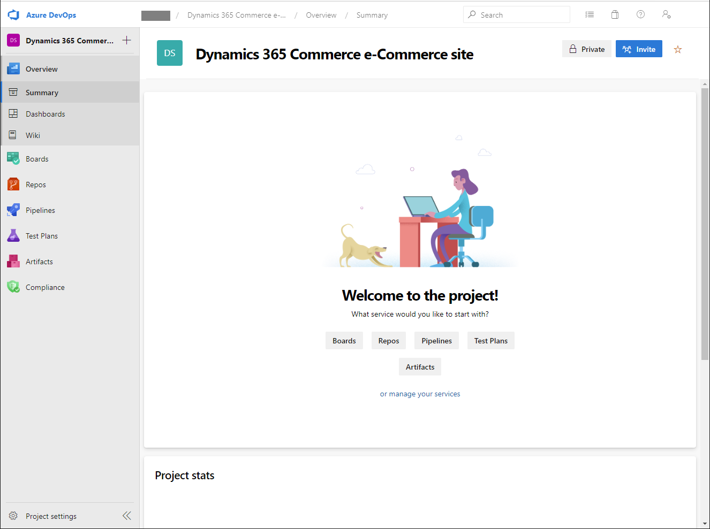

---
# required metadata

title: Setup Azure DevOps code sharing and build pipeline
description: This topic describes how to setup code sharing with Azure DevOps and a build pipeline for your Microsoft Dynamics 365 Commerce online extensibility code. 
author: samjarawan
manager: annbe
ms.date: 02/07/2020
ms.topic: article
ms.prod: 
ms.service: dynamics-365-commerce
ms.technology: 

# optional metadata

# ms.search.form: 
audience: Developer
# ms.devlang: 
ms.reviewer: v-chgri
ms.search.scope: Retail, Core, Operations
# ms.tgt_pltfrm: 
ms.custom: 
ms.assetid: 
ms.search.region: Global
# ms.search.industry: 
ms.author: samjar
ms.search.validFrom: 2019-10-31
ms.dyn365.ops.version: Release 10.0.5

---
# Setup Azure DevOps code sharing and build pipeline

[!include [banner](../includes/banner.md)]

This topic describes how to setup code sharing with Azure DevOps and a build pipeline for your Microsoft Dynamics 365 Commerce online extensibility code. 

## Overview
Leveraging [Azure DevOps](https://docs.microsoft.com/en-us/azure/devops/user-guide/what-is-azure-devops?view=azure-devops) will allow your team to plan work, collaborate on code development, and automate the building of your Dynamics 365 Commerce e-Commerce deployment packages.

In this article we will guide you through the steps needed to:
* Create a GitHub repo for Dynamics 365 Commerce online SDK
* Configure a build pipeline to generate a Dynamics 365 Commerce online deployable package


##  Create an Azure DevOps Repo
1. You can create an Azure DevOps GitHub repo project from you existing Azure DevOps service subscription or a new Azure DevOps subscription.  

For more detail see [Azure DevOps Service](https://azure.microsoft.com/en-us/pricing/details/devops/azure-devops-services/). To get started with a free trial account see the [Get started with Azure DevOps](https://docs.microsoft.com/en-us/azure/devops/user-guide/sign-up-invite-teammates?view=azure-devops quickstart guide.

1. Once the Azure DevOps service is set up for your organization, create a new Azure DevOps project.


1. Provide a project name and description.  Select private or enterprise visibility so that it's locked to your organization and developers.



1. Install Git. Git is a free and open source distributed version control system.  We’ll be using git to clone our SDK code. Navigate to https://git-scm.com/downloads followed by downloading and installing the latest build.  You should be able to accept all the default install values.

1. Install Visual Studio Code. Visual Studio Code is a lightweight source code editor which runs on your desktop and is available for Windows, macOS and Linux.  It comes with built in support for JavaScript, TypeScript and Node.js.
Navigate to https://code.visualstudio.com and download the latest stable build. Once downloaded launch the installer and you should be able to leave all values at their defaults during the install and accept the user license agreement.

1. Clone the Microsoft Dynamics 365 Commerce Online SDK/Starter kit. The SDK will give you everything you need to extend your e-Commerce site including the ability to create new modules, data actions and themes. 

The SDK configuration package is available through the following GitHub repository: https://github.com/microsoft/Msdyn365.Commerce.Online  

There are two ways to get the SDK configuration packages to your development machine.  

You can either directly download it from the GitHub repo or clone the repo. To clone, start off by launching a Command Prompt with Administrator privileges and create a directory to hold your e-Commerce site code, we’ll use “c:\repos” below. 

From the new directory perform a “git clone YOUR_GIT_REPO”. 

```console
md c:\repos
cd c:\repos
git clone https://github.com/microsoft/Msdyn365.Commerce.Online.git
cd Msdyn365.Commerce.Online
```

Since you’re only pulling from the git repository once, you can remove .git folder to unlink, which is a hidden directory under the root.

1. We'll now clone the Azure Dev Ops GitHub project repo. Select the "Files" tab under the **Repos** section on the left tab bar.  Select the "copy" icon to copy the URL.


To clone, start off by launching a Command Prompt with Administrator privileges and go to the directory to hold your Azure DevOps repo code, we’ll use “c:\repos” below. 

From the new directory perform a “git clone YOUR_GIT_REPO”. 
```console
cd c:\repos
git clone https://xxxxxx.dev.azure.com/<DevOpsProjectName>/_git/< DevOpsProjectName>
```

A new folder with name of the Azure DevOps project will be created with no contents.

1. Copy all the contents of “C:\repos\Msdyn365.Commerce.Online” to “C:\repos\<DevOpsProjectName>”
Open Visual studio Code. Open folder “c:\repos\<DevOpsProjectName>”  (Note: Do not copy the hidden .git folder over)
1. Open Visual studio Code. Open folder “c:\repos\<DevOpsProjectName>”.  Visual studio code will show the new changes to be committed when you select the source control tab on the left hand side.  Commit all changes to Git.


