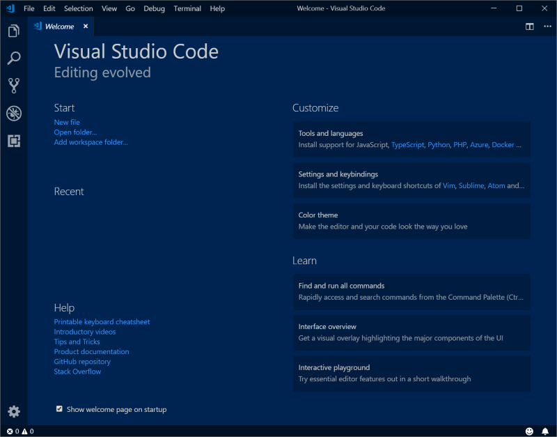

---
# required metadata

title: Set up a development environment
description: This topic describes how to set up a development environment for Dynamics 365 Commerce.
author: samjarawan
manager: annbe
ms.date: 10/01/2019
ms.topic: article
ms.prod: 
ms.service: dynamics-ax-retail
ms.technology: 

# optional metadata

# ms.search.form: 
audience: Application user
# ms.devlang: 
ms.reviewer: v-chgri
ms.search.scope: Retail, Core, Operations
# ms.tgt_pltfrm: 
ms.custom: 
ms.assetid: 
ms.search.region: Global
# ms.search.industry: 
ms.author: samjar
ms.search.validFrom: 2019-10-31
ms.dyn365.ops.version: Release 10.0.5

---
# Set up a development environment

[!include [banner](../includes/preview-banner.md)]
[!include [banner](../includes/banner.md)]

This topic describes how to set up a development environment for Dynamics 365 Commerce.

## Overview

To set up a development environment for Dynamics 365 Commerce Online extensibility development, you must install three free tools: Microsoft Visual Studio Code, Node.js, and Yarn. You must also install the Dynamics 365 Commerce Online software development kit (SDK). You can install these tools in any order.

## Install Visual Studio Code

We recommend that you use a source code editor such as Visual Studio Code. Visual Studio Code is a lightweight source code editor that runs on your Windows desktop. It has built-in support for JavaScript, TypeScript, and Node.js.

Go to the [Visual Studio Code site](https://code.visualstudio.com), and download and install the latest build. After installation is completed, Visual Studio Code is opens automatically and should look like the following screenshot.



## Install Node.js

Node.js is a JavaScript runtime that is built on [Chrome's V8 JavaScript Engine](https://v8.dev/).

Go to the [Node.js site](https://nodejs.org), and download and install the latest build (Long Term Support \[LTS\]).

If you rely on other versions of Node.js for other projects, we recommend that you use [Node Version Manager (nvm)](https://github.com/creationix/nvm) to help guarantee that each version runs in its own isolated environment.

## Install Yarn

Yarn is a dependency management tool that will help guarantee that you have all the latest packages for your e-Commerce extensibility needs.

Go to the [Yarn site](https://yarnpkg.com), and download and install the latest stable build.

## Install the Online SDK and Store Starter Kit

The Online SDK provides everything that you require to extend your Online channel. It even lets you create new modules, data actions, and themes.

The SDK configuration package is available through the [Project.Rushmore GitHub repository](https://github.com/Microsoft/Project.Rushmore). Either download or clone the repo to a local folder on your development machine.

[!NOTE]
The whole SDK and Store Starter Kit (SSK) won't be downloaded and installed until you run the **yarn** command. For more information, see the [Download SDK dependencies](#download-sdk-dependencies) section later in this topic.

If you cloned the repo, you can remove the .git folder (the hidden directory under the root). You will use Yarn to pull down updated dependencies.

We recommend that you use a source code repository to manage your configuration changes. Many options are available, such as [Git](https://git-scm.com/downloads).

## Download SDK dependencies

To download the SDK dependency packages, follow these steps.

1. At a command prompt, go to the root folder of the e-Commerce SDK (**c:\\repos\\MyEcommerceSite** in the following example).
2. To get all the latest dependency packages that are required, run the **yarn** command.

    > [!IMPORTANT]
    > This step should be done after you've completed any update to the packages.json file.

    ```
    c:\repos\MyEcommerceSite>yarn
    ```

    This command can take several minutes to run.

## Run the app

To run the app, follow these steps.

1. To open the app, run the **yarn start** command.

    ```
    c:\repos\MyEcommerceSite>yarn start
    ```

    This command will take up to a minute to run. When it's completed, you will see output that indicates that the server has been started. This output will also show the allocated port number (**4000**, by default).

2. To test that the app is running correctly, open the following URLs in a web browser:

    * `https://localhost:4000/version`
    * `https://localhost:4000/_sdk/allmodules`

3. To close the app, at the command prompt, select **Ctrl+C** two times.

## Create a new module

To add a new module that is named *campaignBanner*, run the **yarn msdyn365 add-module MODULE_NAME** command. Here is an example.

```
c:\repos\MyEcommerceSite>yarn msdyn365 add-module campaignBanner
```

This command can take up to a minute. It adds a new module under \\src\\modules\\campaignBanner.

## Clone an existing core module

Several of the available core modules can be clones, such as the alert, banner, and hero modules.

For example, to modify the hero module, run the **yarn msdyn365 clone STARTER_KIT_MODULE_NAME NEW_MODULE_NAME** command to pull down the source code.

```
c:\repos\MyEcommerceSite>yarn msdyn365 clone hero heroExtended
```

You can find the hero module under \\src\\modules\\heroExtended.

## Preview modules

To preview the rendering of a specific module (for example, campaignBanner) in a local web browser, do the following.

1. At a command prompt, open the app by running the **yarn start** command.

    ```
    c:\repos\MyEcommerceSite>yarn start
    ```

1. Open the following URLs in a web browser. Notice the module name in the **"type=MODULE\_NAME"** query string parameter.

    * `https://localhost:4000/modules?type=campaignBanner`
    * `https://localhost:4000/modules?type=hero`
    * `https://localhost:4000/modules?type=banner`
