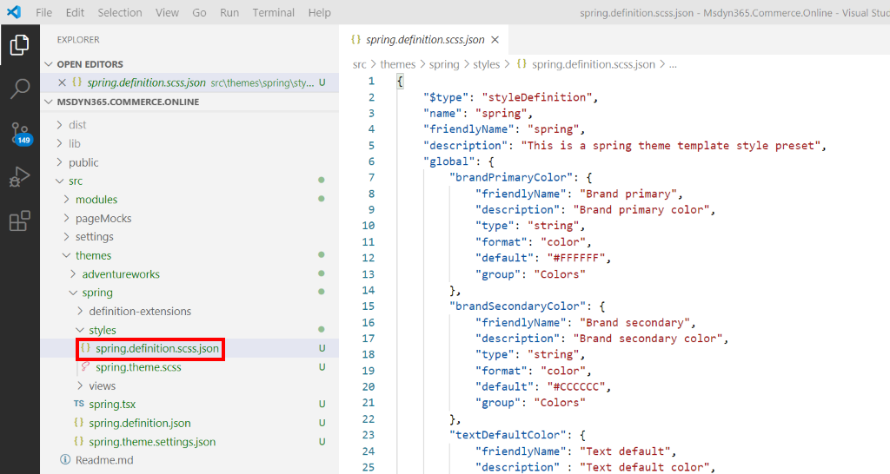

---
# required metadata

title: Style presets
description: This topic describes how to add authorable style variables to a custom theme which are exposed inside the site builder tool.
author: samjarawan
manager: annbe
ms.date: 05/28/2020
ms.topic: article
ms.prod: 
ms.service: dynamics-365-commerce
ms.technology: 

# optional metadata

# ms.search.form: 
audience: Developer
# ms.devlang: 
ms.reviewer: v-chgri
ms.search.scope: Retail, Core, Operations
# ms.tgt_pltfrm: 
ms.custom: 
ms.assetid: 
ms.search.region: Global
# ms.search.industry: 
ms.author: samjar
ms.search.validFrom: 2019-10-31
ms.dyn365.ops.version: Release 10.0.5
---

# Configure theme settings

[!include [banner](../includes/banner.md)]

This topic describes how to add authorable style variables to a custom theme which are exposed inside the site builder tool.

## Overview

A style preset is a stored set of all authorable style values across a site's theme. It can be used to immediately change the look of a site from site builder. Style presets let Commerce site builder authors quickly change, preview, and activate a set of style values across their site, without having to use Cascading Style Sheets (CSS) or deploy themes. Font styles, button styles, and site colors are typical examples of style variables that can be managed through style presets.


For more details on how the features works from the site builder tool see the [Work with style presets](../style-presets.md) documentation.

## Style preset definition files
Each theme contains a style presets definition file, which provides the metadata for the site builder tool including the friendly name and description.  This file then includes the global and module specific styles that will be exposed to the authoring tool to be customized as desired. 

When using the CLI command 'add-theme' to create a theme, the style preset definition file is automatically created and can be found under the theme "styles" directory.  The file name uses the pattern THEME_NAME.definition.scss.json file.

The below is an example theme style definition file created as part of the 'add-theme' [CLI command](cli-command-reference.md).




Each styles defined under the global and modules section should also be defined in the theme.scss file.  

In the below, example notice SCSS variables have been defined for **brandPrimaryColor** with a default color of **#FFFFFF**.  When the above style preset is turned on the color value is replaced with the default defined in the style preset definition file above which happens to be the same color in this example, but a site builder user can choose to override this property with any color they desire.  Modules that use this global SCSS variable will then automatically pick up the color change when the user applies the setting from within the site builder tool.


## Style preset definition schema

* "**$type**" - The definition file type.  This must be "styleDefinition".
* "**name**" – The name of the theme. This property must match the theme name found in the theme definition file.
* "**friendlyName**" – The friendly name of the style preset. This name is shown in the site builder tool when configuring style presets. The minimum length is three characters.
* "**description**" – The description of the style preset. The description provides a friendly string that is shown in the site builder tool when configuring the style presets.
* "**global**" – The global section is used to add style presets that are globally scoped across the theme. CSS property names are used as children of this node to define styles for the CSS style.
* "**module**" – The module section is used to add style presets that are scoped only to specific modules.  Module names are used as children of this node to define module specific style presets.

### Style schema
The below schema is used for each style property defined in the global and module style section.
* "**friendlyName**" – The friendly name of the individual style preset property. This name is shown in the site builder tool when configuring style presets. The minimum length is three characters.
* "**description**" – The description of the style preset property. The description provides a friendly string that is shown in the site builder tool when configuring the style presets.
* "**type**" – The property type used as metadata for the site builder tool. The only supported values is "string".
* "**format**" – The format field provides extra metadata to the site builder tool to bring up specific UX entry experiences.  This field is optional and currently only supports "color" which will be used to pop up the color picker within the site builder tool.
* "**default**" – The default CSS style value set for this property.
* "**group**" – The group property is used in the site builder to group together similar properties.
                    
## Style preset instances


## Localizing style preset names and descriptions
Property names and descriptions for the style preset, instance presets and property names and description can be localized in a similar manner to module config properties as found here [Localize a module](localize-module.md) document using the "themes" node within the global.json file.

The below is an example global.json file which sets various localized style preset properties:

```json
{
    "settings" : {...},
    "modules" : {...},
    "themes" : {
        "spring": {
            "friendlyName": {
                "value": "Spring",
                "_value.comment": "Spring theme name"
            },
            "description": {
                "value": "This is the spring theme.",
                "_value.comment": "Spring theme description"
            },
            "styles": {
                "definition": {
                    "description": {
                        "value": "This is the Spring theme style preset",
                        "_value.comment": ""
                    },
                    "global": {
                        "brandPrimaryColor": {
                              "friendlyName": {
                                  "value": "Primary brand color",
                                  "_value.comment": ""
                              },
                              "description": {
                                  "value": "The primary brand color used across the site.",
                                  "_value.comment": ""
                              },
                              "group": {
                                  "value": "Colors",
                                  "_value.comment": ""
                              }
                          }
                    },
                    "modules"
                        "header": {
                            "categoryColor" : {
                                "friendlyName": {
                                    "value": "Header background",
                                    "_value.comment": ""
                                },
                                "description": {
                                    "value": "This is the background color for the module",
                                    "_value.comment": ""
                                },
                                "group": {
                                    "value": "Color",
                                    "_value.comment": ""
                                }
                            }                            
                        }
                    }
                },
                "presets":  {
                    "dark-theme": {
                        "description": {
                            "value": "This is the dark theme style preset",
                            "_value.comment": ""
                        }
                    },
                    "light-theme": {
                        "description": {
                            "value": "This is the dark theme style preset",
                            "_value.comment": ""
                        }
                    }
                }
            }
        }
    }
}
