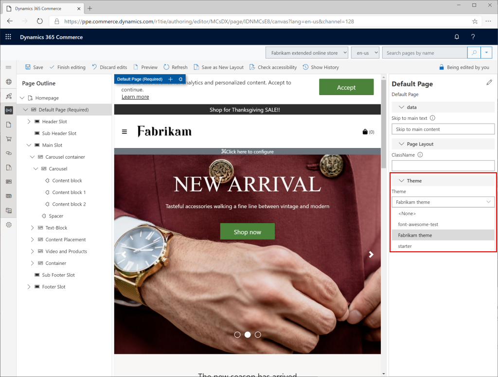

---
# required metadata

title: Theming overview
description: This topic presents an overiew of online site theming in Dynamics 365 Commerce.
author: samjarawan
manager: annbe
ms.date: 10/01/2019
ms.topic: article
ms.prod: 
ms.service: dynamics-ax-retail
ms.technology: 

# optional metadata

# ms.search.form: 
audience: Application user
# ms.devlang: 
ms.reviewer: v-chgri
ms.search.scope: Retail, Core, Operations
# ms.tgt_pltfrm: 
ms.custom: 
ms.assetid: 
ms.search.region: Global
# ms.search.industry: 
ms.author: samjar
ms.search.validFrom: 2019-10-31
ms.dyn365.ops.version: Release 10.0.5

---
# Theming overview

[!include [banner](../includes/preview-banner.md)]
[!include [banner](../includes/banner.md)]

This topic presents an overiew of online site theming in Dynamics 365 Commerce.

# Overview

Dynamics 365 Commerce allows you to apply a Sassy CSS (SCSS) theme to your entire online site, individual templates, or individual pages. For example, you may have a default theme set for the whole online site and have campaign theme which is only applied to a subset of pages on the site.

Once a theme is created and uploaded to your production site, authoring tools can be used to set the theme on the site within a template, layout, or single page. When an online page is rendered, the appropriate theme will be applied, giving all the modules on that page a consistent look and feel.

The following screenshot shows how a theme is selected for a page in Commerce. Note that the page container (named "Default page") is selected, and the page **Theme** setting drop-down list box appears in the right-hand properties pane.



A theme can similarly be set on the master page, so that all pages that inherit from the master will apply the theme. Note that if the "locked" property is disabled, individual pages can override the theme.

## Best practices

* There is no limit to the number of **.scss** files your theme may contain.
* Your theme entry point may import other **.scss** files using relative paths.
* Starter kit modules are built using Bootstrap 4 classes, so the recommended SCSS framework to include in any theme is either Bootstrap 4 or Bootstrap 4 RTL.
* To leverage starter kit modules built with Font Awesome glyphicons, font-awesome should be included in the SCSS.
* You can optionally import the **react-ts-strap-default-theme** which addresses accessibility issues with Bootstrap 4.

## Consume SCSS files distributed using node package manager (NPM)

Some dependencies such as Bootstrap and FontAwesome are distributed using NPM packages, and if they are used in your SCSS file they must also be referenced in your SDK **packages.json** file. To do so, edit the **packages.json** in the root folder of the SDK to add the dependency references, as in the following example that adds Bootstrap.

```
"dependencies": {
     …
     "bootstrap": "^4.3.1",
     …
}
```
## Recommended structure for a custom theme

The following list shows the recommended structure for any custom theme. 

Import or define the following:

* Fonts and glyph icons
* Mixins and functions
  * Bootstrap: dependencies, excluding components and utilities
  * Shared components: dependencies, excluding components and utilities
  * Custom theme mixins and functions
* Theme variables
  * Custom theme variables
  * Bootstrap: theme variable defaults (fallbacks)
* Components and modules SCSS
  * Shared components: components
  * Custom components and modules
* Utilities
  * Bootstrap, shared component, and custom utilities

## Hooks for theming modules

Modules allow targeting by any theme by defining a class name matching the module name. This class name should be the first class name applied to the outermost element rendered by the React component. Developers may allow for more granular theme options by providing additional class names on elements or features of a module that may be targetable by custom themes.

## Create a custom theme

1. Create a new theme directory in your SDK **/src/themes/** folder, such as `/src/themes/spring/`.
1. From within the new directory, create a new SCSS entry point file for the theme using the name pattern **THEME_NAME.theme.scs**. The theme will then be registered and show up in the authoring tools with the THEME_NAME provided in the file name, for example `/src/themes/spring/spring.theme.scss`.
1. Once the theme is completed, the configurations can be packaged up and uploaded to your site. New themes will then automatically appear within the authoring tools.
