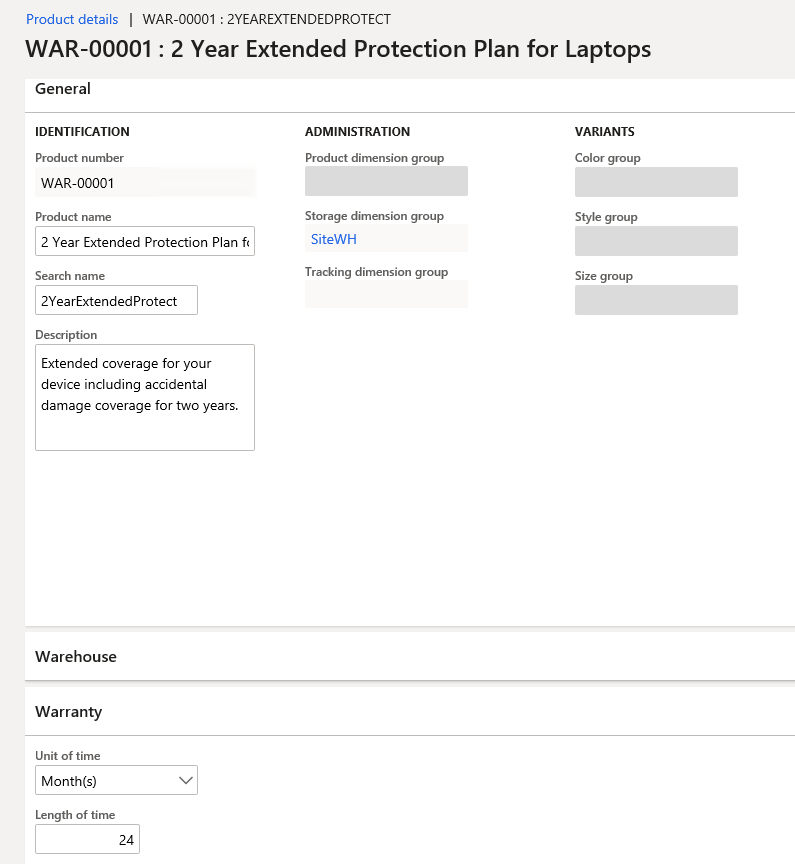
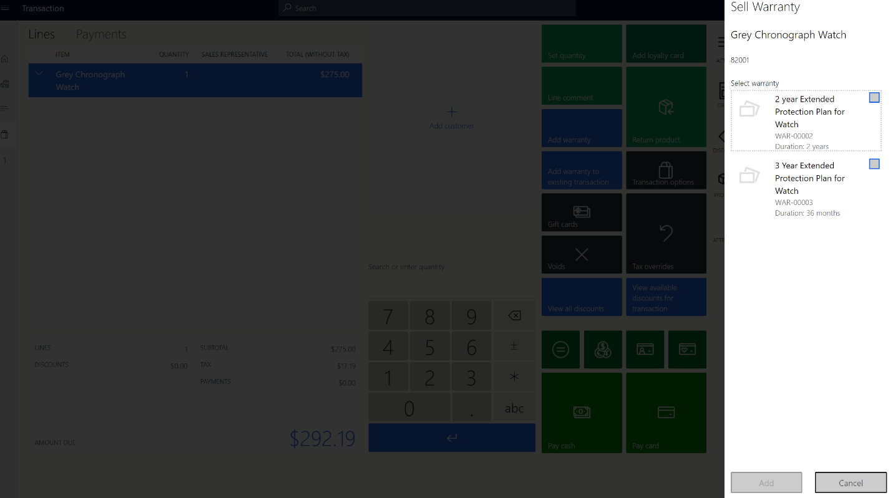
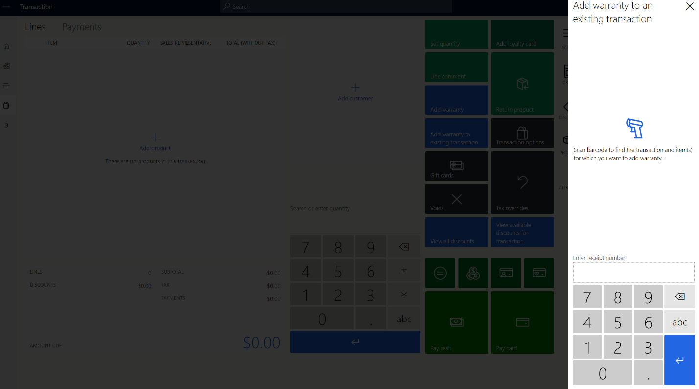

---
# required metadata

title: Extended warranty 
description: This topic covers extended warranties and describes how to create and configure them in Microsoft Dynamics 365 Commerce.
author:  sijoshi
manager: annbe
ms.date: 06/08/2020
ms.topic: article
ms.prod: 
ms.service: dynamics-365-commerce
ms.technology: 

# optional metadata

# ms.search.form: 
# ROBOTS: 
audience: Application User
# ms.devlang: 
ms.reviewer: v-chgri
ms.search.scope: Retail, Core, Operations
# ms.tgt_pltfrm: 
ms.custom: 
ms.assetid: 
ms.search.region: Global
ms.search.industry: 
ms.author: sijoshi
ms.search.validFrom: 2019-10-31
ms.dyn365.ops.version: 
---

# Extended Warranty

## Overview

Customers are opting for extended support and services when they buy products, especially for consumer products that sell at a premium price point like phones, computers, cards, etc. Extended warranties can be sold in the retail channel during the initial purchase or for a limited time period after the initial purchase. For a retailer, providing an extended warranty can help build customer loyalty. With the extended warranty purchase, customers know where to go for service and support in case of issues and can gain the confidence that their issues will be handled well.

## Warranty item set up

We are providing the functionality to set up a warranty item type and set attributes for the item including the association between a product and warranty item, price of the warranty, warranty duration, and more. Once the warranty item is set up and released to the organizational unit, a retailer will then be able to sell warranties through Modern POS, online, and across other retail channels.

## Warranty item sell

Extended warranties are sold in a retail channel during the initial purchase or for a limited timeframe after the initial purchase. In point of sale (POS), a sales associate will be prompted to consider an extended warranty when a related product is added to cart. This provides an upsell or cross-sell opportunity to the sales associate as part of the sales flow. A customer can also come back later and buy an extended warranty for the product. In this case, sales associates can look up the original transaction and sell the customer the
related extended warranty.

## Warranty policy

Once the extended warranty is sold, a warranty policy entity will be created. The warranty policy number can be shared to the customer to give them a reference for the extended warranty purchased. The warranty policy will include the start date, end date, terms and conditions, serial number of the item, and more for the warranty sold.

## Terminology

| TERM / ABBREVIATION          | DESCRIPTION                                                                                             |
|------------------------------|-----------------------------------------------------------------------------------------------------------------------------------------------------------------------------------------------------------------------------------------------------------------------------------------------------------------------------------------------------------------------------------------------------------------------------------------------------------------------------------------------------------------------------------------------------------------------------------------------------------------------------------------------------------------------------------------------------------------------------------------------------------------------------------------------------------------------------------------------------------------------------------------------------------------------------------|
| Extended Warranty / Warranty | An **extended warranty** refers to service agreement or a service contract which gives a prolonged **warranty** to consumers. ... The **extended warranty** provides a seller to provide the additional service of replacing or repairing goods that fail within the **extended** period.                                                                                         
| Manufacturer warranty        | A manufacturer's warranty (often called limited warranty) is the warranty you receive when you purchase a product. Some features of a manufacturer's warranty are: 1. The warranty cost is included in the cost of the product. You don't have to pay any additional amount for a manufacturer's warranty. 2. Depending on the product category, a manufacturer's warranty generally lasts for 30 days, 6 months or 1 year. (For most consumer electronics, the warranty lasts for 1 year). 3. This warranty covers any defects caused by mechanical or electrical failures. The coverage is limited, and it doesn't include any accidental damage to your products. If you would like to protect your product from everyday damages, you should invest in an extended warranty, which lasts for 2-10 years depending on the product category, has wider coverage and covers everyday mishaps such as drops, spills, stains, etc. |
| Warranty Item                | Extended warranty item sold for the warrantable item E.g. 2-year Accidental Protection Plan for Laptops 
| Warrantable Item             | Serialized Item for which warranty is being sold. E.g. Laptop is a warrantable item for which 2 year and 3 year extended warranty is sold                                                                                                                                                                                                                    
## Warranty items

### Create a warranty item

Warranty is a service provided to the customer. Warranty Product is modeled as a Product of type Service and ServiceType = Warranty.

1. Go to: **Products and categories \> Products**

1. Click **New** to create a new Warranty Product

1. Set **Product type** = **Service, Product subtype** = **Product, Product
    service type** = **Service**

1. Set **Product name**, **Product number**, **Retail category** and click
    **Ok**

1. In **Warranty** Fasttab set **Unit of time** and **Length of time**

| **Property Name** | **Values**                                          | **Description**                                                                                                                    |
|-------------------|-----------------------------------------------------|------------------------------------------------------------------------------------------------------------------------------------|
| Unit of time      | Day(s), Week(s), Month(s), Year(s)                  | This will be the Interval specifying how long the warranty is valid for.                                                           |
| Length of time    | Positive Integer value specifying warranty duration | The duration of the warranty E.g. For a warranty of duration 2 years the values are: Unit of time = ’Year(s)’ Length of time = ”2” |

1. Click **Save** to save the Warranty Product

1. Release the Warranty Product to the company to sell the Warranty Product
    (see link for steps on how to Release a product to a company)

1. On Released product form. Enter **Price range base**, **Lower limit**,
    **Upper Limit**

1. **Assort** the Warranty product to the channel where it needs to be sold.
    (add link on how to assort products)

| **Property Name**           | **Values**                                          | **Description**                                                                                                                                                                                                                                                                                                                                                                                                                                                                                                                                                                                                                                                                                                    |
|-----------------------------|-----------------------------------------------------|--------------------------------------------------------------------------------------------------------------------------------------------------------------------------------------------------------------------------------------------------------------------------------------------------------------------------------------------------------------------------------------------------------------------------------------------------------------------------------------------------------------------------------------------------------------------------------------------------------------------------------------------------------------------------------------------------------------------|
| Warrantable Price Range     | None, Base price, Selling price                     | None – Price range “Lower Limit’ and ‘Upper Limit’ is not applicable Base Price A particular Warranty will be applicable if the Base price (Price without discounts) of the Warrantable Item falls between ’Upper’ and ’Lower’ limit specified here Based on price of Warrantable item Selling price Reserved for future use                                                                                                                                                                                                                                                                                                                                                                                       |
| Lower limit and Upper limit | Price limit of Warrantable item in Company currency | The upper and lower price limit can be based on base price (MSRP) of the product This attribute will define how the current warranty product is applicable to warranty product If set as base price – Prompt Only warranties where base price of Warrantble product falls within Lower Limit’ and ’Upper Limit’ values of the warranty item E.g. Laptop has base price = \$999 2 Warranties: Warranty1 with LowerPriceLimit = \$500 and UpperPriceLimit = \$1000 and PriceTier = MSRP Warranty2 with LowerPriceLimit = \$1001 and UpperPriceLimit = \$ 2000 and PriceTier = Base price In this case, Warranty1 will be prompted when Laptop with value \$999 is added to cart in POS or online or AX sales order  |

## Warranty groups

Warranty Groups form enables to group Warranty products with the Warrantable products. It is basically a relationship between Warrantable and Warranty products. This setting is then used by POS to determine which Warranty products should be prompted when Warrantable product is added to cart.

### Set up a warranty group

1. Go to **Retail and Commerce \> Products and categories \>Warranty \>
    Warranty groups**

1. Click on **New** to create a new warranty group

1. Enter name and description for the new group.

1. Under **Warranty products** fast tab, click on **Add line** to add a
    Warranty product

1. Specify the **Display order.** Display order needs to be a number. POS will
    respect this setting by showing the Warranty products in ascending order in
    the warranty prompt.

1. Under **Warrantable products** fast tab, click on **Add line** to add
    Warrantable products (products for which you want to sell warranty)

1. Select a **Category** to specify the Warrantable products category if the
    Warranty product is applicable for the entire category

1. Select a specific **Product** to specify a Warrantable product for which the
    warranty is applicable

1. Under **Applicable channels** fast tab, click on **Add line** to add channel
    where you want to sell Warranty.

1. Click **Save** to save the configuration

1. Click on **Publish** to publish the Warranty Group.

1. Run **1040** job to sync the data to channel

## Warranty settings

Warranty settings form allows to set Warranty Feature settings

### Configure channel-specific settings

Channel specific settings allow to set configuration to enable prompting of Warranty item when Warrantable item is added to cart in Point of sale.

1. Go to: **Products and categories \> Warranty \> Warranty settings\>Channel
    Specific**

1. Set **Enable/Disable “**Prompt for warranty" for your channel

-   **Enable** – Warranty item will be prompted when Warrantable item is added
    to cart.

-   **Disable** – Warranty item will not be prompted when Warrantable item is
    added to cart.

1. Run **1070** job to sync the data to the channel.

### Number sequences

Warranty policy number sequence is set here

1. Go to: **Products and categories \> Warranty \> Warranty settings\>Number
    sequences**

1. Set the **Number sequence code** (Add link on how to create number sequence
    code)

**Selling Warranty in Point of Sale**

Two new POS operations are added to sell warranty item during sell workflow.

**Add Warranty -** POS operation **Add Warranty** will trigger prompt to show applicable warranties for the Warrantable item

**Add Warranty to existing transaction –** POS operation **Add Warranty to existing transaction** will allow selling warranty for Warrantable item sold earlier. Original transaction can be found by entering the receipt number of the original transaction with warrantable items.

**Process warranty transactions**

For warranty added in cash and carry transactions, user needs to go through statement posting so that those transactions are posted in HQ, then go to Retail and Commerce \> Products and categories \> Warranty \> Process warranty transactions. This will process warranty transactions and create warranty policy.

## Warranty policies

Once the extended warranty is sold, a warranty policy entity will be created.
The warranty policy number can be shared to the customer to give them a
reference for the extended warranty purchased. The warranty policy will include
the start date, end date, terms and conditions, serial number of the item, and
more for the warranty sold.

Warranty Policy details

*PolicyNumber - string (20)*

*WarrantiedItemId - string (20)*

*WarrantiedInventoryLotId - string (20)*

*WarrantiedSerialNumber - string (20)*

*WarrantiedFulfilledDate - Date*

*WarrantyItemId - string (20)*

*WarrantyInventoryLotId - string (20)*

*WarrantySalesDate - Date*

*WarrantyEffectiveDate - Date*

*WarrantyExpirationDate - Date*

*CustAccount - string (20)*

*Status - enum (Created / Voided / Effective / Expired)*

*Notes - string (255)*

## Frequently asked questions (FAQs)

**Why don’t I see warranty prompted in POS?**

Check if the warranty product is assorted to the channel. Check if the warranty group is configured to include the channel in question (need to access the warranty group form in Retail and Commerce, not the one in Product information management).

**When clicking Add warranty to existing transaction and entering receipt number (for a customer order), I don’t see any lines.**

Run P-Job to upload the receipts to HQ, which is required for the receipt to be found.

**Why is Warranty feature only applicable for serialized items?**

Warranty is a service provided for a product. In Dynamics 365 a product can be uniquely identified with a serial number. Hence warranty feature is only applicable for a serialized item.
