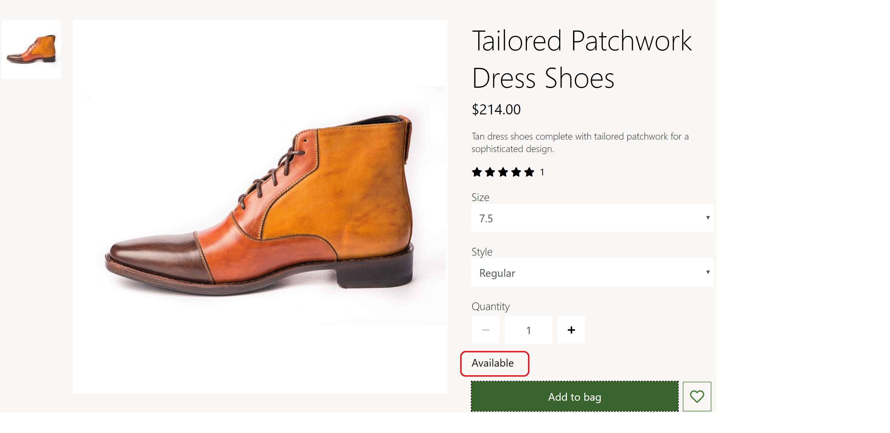
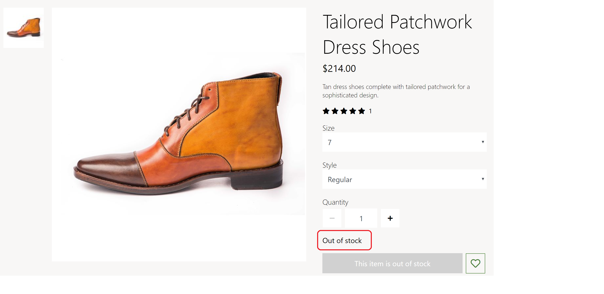
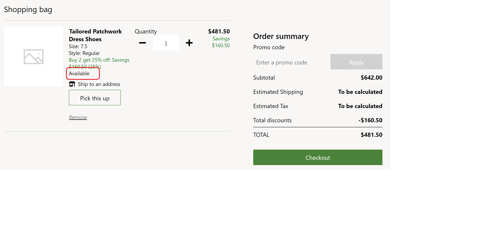

---
# required metadata

title: Inventory settings on ecommerce
description: This topic covers how inventory settings work on ecommerce
author:  anupamar-ms
manager: annbe
ms.date: 04/24/2020
ms.topic: article
ms.prod: 
ms.service: dynamics-365-commerce
ms.technology: 

# optional metadata

# ms.search.form: 
# ROBOTS: 
audience: Application User
# ms.devlang: 
ms.reviewer: v-chgri
ms.search.scope: Retail, Core, Operations
# ms.tgt_pltfrm: 
ms.custom: 
ms.assetid: 
ms.search.region: Global
ms.search.industry: 
ms.author: anupamar
ms.search.validFrom: 2019-10-31
ms.dyn365.ops.version: 
---

# Inventory settings on ecommerce

[!include [banner](includes/banner.md)]

This topic covers Inventory settings and describes how these settings can be applied across ecommerce

## Overview
Inventory settings for e-commerce are defined in Site builder under Sites Settings\Extensions within a  group called "Inventory Management". Inventory settings allow the site to decide if inventory should be checked before items are added to cart and also define inventory related merchandising such as "In Stock" "Only few left" etc. When a product is out of stock these settings ensure the product cannot be purchased.

Microsoft Dynamics 365 Commerce provides on-hand availability for products. For details on how estimated on-hand availability is calculated refer to [Calculate inventory availability for retail channels](calculated-inventory-retail-channels.md).

Inventory thresholds and ranges can be defined in Microsoft Dynamics 365 Commerce for a product or category. These ranges help define inventory settings that are in-stock vs. low-stock etc. For details, refer to [TBD](tbd)

## Site settings on ecommerce 

**Enable inventory check on app** - This setting turns on inventory check on ecommerce. When this setting in on, BuyBox, Cart, Pick up in store modules will check for inventory and allow the item to be added to cart only if inventory is available.

**Inventory level based on** -   The inventory APIs return the product inventory information. In Dynamics 365 Commerce, inventory threshold and ranges can be defined for each product/category. This information is returned for both **Total Available** and **Physical Available** inventory. Its upto the retailer to decide if Total Available or Physical Available should be used for determing the inventory count and the corresponding ranges for in-stock, out-of-stock etc. 

Alternatively, there is a legacy ecommerce setting called **Inventory out of stock threshold**. When this setting is used inventory count is determined from Total Available but thresholds are defined by the Inventory out of stock threshold setting in Site builder.  Its a single threshold for all products across the site. If inventory is below threshold its considered out of stock otherwise its in-stock. Overall it is limited in capabilities and not recommended to use if you are using 10.0.12+.

**Inventory ranges to display** - With the inventory ranges a retailer may still choose to decide which type of messages are shown on the BuyBox, Cart, etc. It has settings to show **All**, **Low and out of stock**, **Out of stock**. When All is selected, all inventory ranges from In-stock(AVAIL) to out of stock (OOS) will be shown on Buybox, Cart, Wishlist, Cart icon etc. When Low and out of stock is chosen, all ranges excpet In Stock(AVAIL) will be displayed. When Out of stock is selcted, only out of stock messages (OOS) will be displayed. THis gives the retailer the flexibility to decide which messages to display across the site.

**Out of stock threashold**  - As mentioned earlier, this is a legacy setting. For this setting to take effect, you have to choose "Out of stock threshold" property in the "Inventory level based on" setting.

## Modules that use the inventory setting on ecommerce
Buy box, Cart, Wishlist, Store selector, Cart icon modules rely on the inventory settings. These modules display inventory ranges and/or error messages when a product cannot be added to cart due to lack of inventory. 

Example of PDP showing In stock message

Example of PDP showing Out of stock message

Example of Cart showing In stock message

## Additional resources

[Starter kit overview](starter-kit-overview.md)

[Cart](add-cart-module.md)

[Buy box](add-buy-box.md)

[Wishlist](account-management.md)

[Store selectpr](add-store-selector.md)
