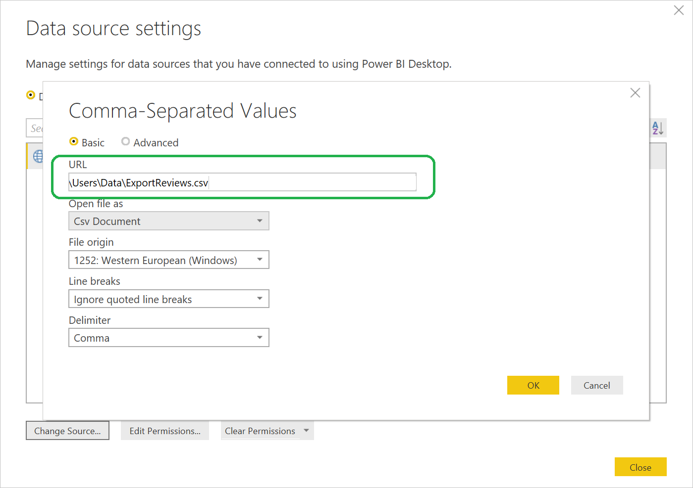

---
# required metadata

title: Manage ratings and reviews 
description: This topic explains how to manage ratings and reviews by using the Microsoft Dynamics 365 Commerce ratings and reviews moderation tool.
author:  gvrmohanreddy 
manager: annbe
ms.date: 10/01/2019
ms.topic: article
ms.prod: 
ms.service: dynamics-ax-retail
ms.technology: 

# optional metadata

# ms.search.form: 
# ROBOTS: 
audience: Application User
# ms.devlang: 
ms.reviewer: v-chgri
ms.search.scope: Operations, Retail, Core
# ms.tgt_pltfrm: 
ms.custom: 
ms.assetid: 
ms.search.region: Global
ms.search.industry: 
ms.author: gmohanv
ms.search.validFrom: 2019-10-01
ms.dyn365.ops.version: Release 10.0.5
---

# Manage ratings and reviews

[!include [banner](includes/preview-banner.md)]
[!include [banner](includes/banner.md)]

This topic explains how to manage ratings and reviews by using the Microsoft Dynamics 365 Commerce ratings and reviews moderation tool.

## Overview

Dynamics 365 Commerce uses Microsoft Azure Cognitive Service to automatically moderate review text by redacting profane words. In addition, moderators can use the ratings and reviews moderation tool for the following manual tasks:

- Moderate reviews by responding to them or removing them.
- Delete a customer's reviews at the customer's request.
- Bulk-import ratings and reviews data for all products into a Microsoft Power BI template, so that trends for ratings and reviews can be analyzed.

## Read a review 

1. Go to **Home \> Reviews \> Moderation**.
1. Use the search field in the upper right of the page to filter the reviews that are shown by product ID, product name, or review text.

Additional filters let you limit the reviews by period, rating, channel, or concern status (taken down, responded, or reported).

 

## Respond to a review 

Sometimes, customers who purchased a product express their satisfaction or dissatisfaction, or they don't understand how to use the product. As a moderator, you can post a response to a review. This response appears together with the review on the site. 

To respond to a review, follow these steps.

1. Go to **Home \> Reviews \> Moderation**.
1. Find and select the review that requires a response.
1. In the properties pane on the right, select **Add a response**.
1. Enter the response text and the name that should be shown for the responder. The default responder name is **Moderator**.
1. When you've finished, select **Post response**.

 

## Take down a review 

Sometimes, there is a business justification for moderators to take down customer reviews. 

To take down a review, follow these steps.

1. Go to **Home \> Reviews \> Moderation**.
1. Find and select the review that must be taken down.
1. In the properties pane on the right, select a takedown reason, and then select **Take down**.
	
## Delete a customer's reviews at the customer's request 

Sometimes, customers want their ratings and reviews data to be permanently deleted from an e-Commerce website. A moderator who receives a removal request from a customer can remove the customer's data by using the review deletion feature. To find and delete a customer's data, the moderator requires the email address that the customer used to sign in and provide reviews. 

To find and delete customer data, follow these steps.

1. Go to **Home \> Reviews \> Delete**.
1. In the **Search for users by email address** field, enter the customer's email address, and then select **Search**.
1. If the customer has any review activity (for example, review submissions, votes about the helpfulness of another customer's reviews, or comments about another customer's review), the results are shown. For each item, there is a **Delete** button.
1. For each item that must be deleted, select **Delete**. When you're prompted for confirmation, select **Yes**. 
	
 

> [!NOTE]
> - It can take up to seven days for data to be completely removed from the system. Moderators should notify customers about this delay.
> - If customers have changed their name in their account settings, multiple items might appear in the search results. In this case, to completely delete the customer's data, the moderator must select **Delete** for each item. 

## Download ratings and reviews data

The ratings and reviews moderation tool lets moderators import ratings and reviews data in bulk, so that they can analyze trends. A Power BI template that includes basic metrics is available. Moderators can use this template to connect bulk-imported data and view a dashboard. They don't have to create a custom dashboard. Moderators can also customize the Power BI template to meet their specific needs. 

To download ratings and reviews data, follow these steps.

1. Go to **Home \> Reviews \> Reporting**.
1. Select **Download reviews data** to download ratings and reviews data in bulk in comma-separated values (CSV) format.

## View ratings and reviews trends

Moderators can download the Power BI template so that they can view trends in a dashboard.

To view ratings and reviews trends, follow these steps.

1. Go to **Home \> Reviews \> Reporting**.
1. Select **PowerBI template** to download the template.

     

1. Open the downloaded template by using the Power BI app. Close the **Access to web content** dialog box that appears, and then close the "Refresh" error message that appears.
1. Go to **Home**, select **Edit queries**, and then select **Data source settings**.
1. In the **Data source settings** dialog box, select **Change Source**.
1. In the **URL** field, enter the path of the reviews data that you downloaded in the previous procedure (for example, **c:\\reviews\\ReviewsData.csv**).

     

1. Select **OK**, and then select **Apply changes**. It will take one to two minutes to apply your changes to the data source.
1. Select **Trends sheet** to view ratings and reviews trends.

     
