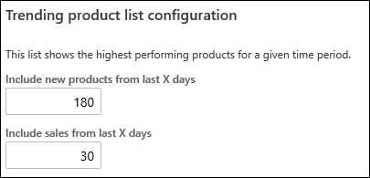
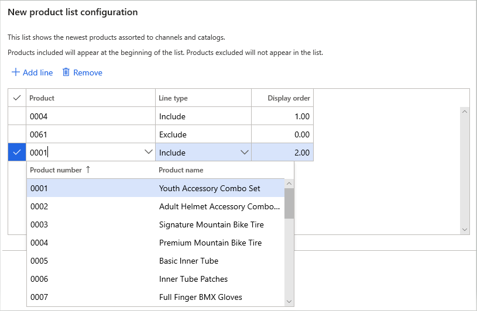
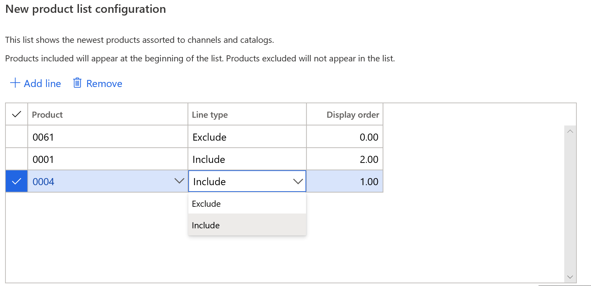
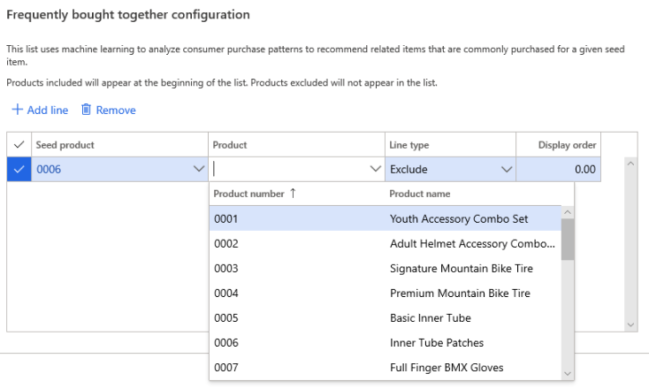
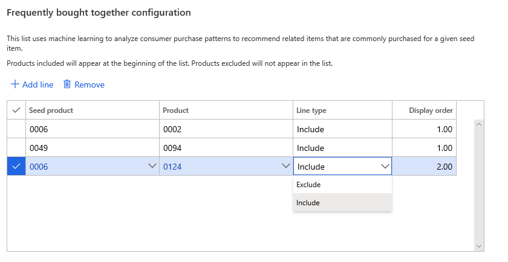

---
# required metadata

title: Manage AI-ML-based product recommendation results
description: This topic explains how to tailor product recommendation results based on artificial intelligence-machine learning (AI-ML) to your business. 
author: bebeale
manager: AnnBe
ms.date: 10/1/2019
ms.topic: article
ms.prod: 
ms.service: dynamics-365-commerce
ms.technology: 

# optional metadata

ms.search.form: 
# ROBOTS: 
audience: Application User
# ms.devlang: 
ms.reviewer: josaw
ms.search.scope: Retail, Core, Operations
# ms.tgt_pltfrm: 
ms.custom: 
ms.assetid: 
ms.search.region: global
ms.search.industry: Retail
ms.author: bebeale
ms.search.validFrom: 2019-10-31
ms.dyn365.ops.version: 

---

# Manage AI-ML-based product recommendation results

[!include [banner](includes/preview-banner.md)]
[!include [banner](includes/banner.md)]

This topic explains how to tailor product recommendation results based on artificial intelligence-machine learning (AI-ML) to your business. 

After enabling product recommendations, the default settings will take effect; these parameters will work for may work for many needs. It is best to plan to spend some time evaluating whether the results fit the selling motion of products. We suggest evaluating results for a few days before changing parameters as needed before testing again. 

## Understanding recommendation list parameters

Before changing the parameters, learn about how they will affect the results below.

### Trending product list

The **Trending** product list has two parameters that can be changed:

1. **Include new products from last X days** - Products that have been added within the specified number of days before the current date can be used to select product candidates. The default value in the picture suggests that products as old has 180 days can be used in the trending product list.
1. **Include sales from last X days** - Sales transactions that have occurred within the specified number of days before the current date can be used to order the products. The default value above suggests that all purchases made of a product in the last 30 days would be used to determine the placement of the product in the trending product list. 

### Best selling product list

Depending on your business, Best selling can bring different results than trending, even though they both use transaction data to order products. Because best selling has no cut off based on assortment date, Best selling can still highlight very popular, older products that might have been dropped from the trending list. 

The **Best selling** product list has one parameter that can be changed:

1. **Include sales from last X days** - Sales transactions that have occurred within the specified number of days before the current date can be used to order the products. The default value above suggests that all purchases made of a product in the last 30 days would be used to determine the placement of the product in the Best selling product list. 

## Manually add or remove products from recommendation lists

### For New, Trending, or Best selling

1.	Go to **Retail** > **Product recommendations** > **Recommendation parameters**.
1.	In the list of retail shared parameters, select **Recommendation lists**.
1.	Select the list add or remove products from.
1.	To add products to the table, select **Add line.** 
1.	Under the Product column, search for a product by **Name** or **Product number.**

1.	Under the Line type column, select one of two options:
    -	**Include** – forces a product to the front of the list
    -	**Exclude** – removes a product from appearing in the list

1.	Changing the **Display order** will change the order that products marked **include** will appear in the list.
    - If two products have the same **display order** value, then the final order of those two results may differ from the back office.
1.	To remove products from the table: select the line to remove and select **Remove**.

### For People also like or Frequently bought together lists

In the context of **Frequently bought together** or **People also like** lists, machine learning is used to analyze consumer purchase patterns to recommend related products commonly purchased together for a unique seed product. 
 
A **seed product** is the product you want to generate results for. In the context of manually adjusting recommendation lists, you are adding or removing results for this product. 

Follow these steps to manually add or remove results for a seed product:
1.	Select the **Seed product**. 
1.	Under the **Product** column, search for a product by **Name** or **Product number.**

1. Under the **Line type** column, select one of two options:
    - **Include** – forces a product to the front of the list
    - **Exclude** – removes a product from appearing in the list     

1.	To remove products from the table: select the line to remove and select Remove.

## Additional resources

[Product recommendations overview](product-recommendations.md)

[Enable product recommendations](enable-product-recommendations.md)

[Add product recommendation lists to pages](add-reco-list-to-page.md)
