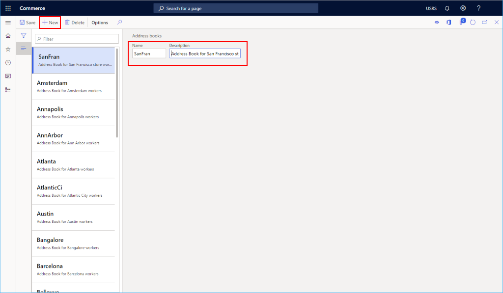

---
# required metadata

title: Create new address book
description: 
author: samjarawan
manager: annbe
ms.date: 01/20/2020
ms.topic: article
ms.prod: 
ms.service: dynamics-365-commerce
ms.technology: 

# optional metadata

# ms.search.form: 
audience: Application User
# ms.devlang: 
ms.reviewer: v-chgri
ms.search.scope: Retail, Core, Operations
# ms.tgt_pltfrm: 
ms.custom: 
ms.assetid: 
ms.search.region: Global
# ms.search.industry: 
ms.author: samjar
ms.search.validFrom: 2020-01-20
ms.dyn365.ops.version: Release 10.0.8

---
# Create new address book

[!include [banner](../includes/preview-banner.md)]
[!include [banner](../includes/banner.md)]

This topic presents an overview of creating address books for Microsoft Dynamics 365 Commerce.

## Overview

Address books are used in Microsoft 365 Commerce for various reasons including storing customer lists and employee lists for a channel.  Address book can be used for single channel use or shared between channels.  The below steps are used to create an address book.

## Create a new address book
The following procedure explains how to create a legal entity from within Commerce Headquarters app.

1. Go to **Navigation pane** > **Modules** > **Channel setup** > **Address books**.
1. From the action bar, click **New**.

The following image shows the creation of an employee address book for a retail store.

## Additional resources

[Info codes and info code groups](../retail/info-codes-retail.md?toc=/dynamics365/commerce/toc.json)  		  

[Retail functionality profile](retail-functionality-profile.md)	  

[Screen layout overview](../retail/pos-screen-layouts.md?toc=/dynamics365/commerce/toc.json)		  

[Configure and install Retail hardware station](../retail/retail-hardware-station-configuration-installation.md?toc=/dynamics365/commerce/toc.json)  
