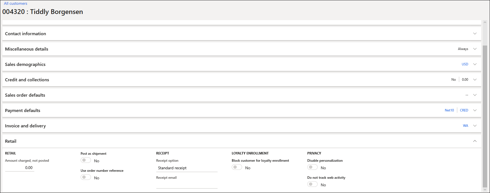

---
# required metadata

title: Opt-out of personalized recommendations
description: This topic explains how Retailers can allow shoppers to opt-out of receiving personalized recommendations. 
author: bebeale
manager: AnnBe
ms.date: 11/21/2019
ms.topic: article
ms.prod: 
ms.service: dynamics-365-commerce
ms.technology: 

# optional metadata

ms.search.form: 
# ROBOTS: 
audience: Application User
# ms.devlang: 
ms.reviewer: josaw
ms.search.scope: 
# ms.tgt_pltfrm: 
ms.custom: 
ms.assetid: 
ms.search.region: global
ms.search.industry: Retail, eCommerce
ms.author: bebeale
ms.search.validFrom: 2019-10-31
ms.dyn365.ops.version: 10.0.5

---

# Opt-out of personalized recommendations

[!include [banner](includes/preview-banner.md)]
[!include [banner](includes/banner.md)]

During account creation, new users are automatically opted-in to receiving personalized recommendations.
We are providing the ability to allow users to opt out of receiving personalized recommendations and restrict 
the processing of their personal data. This means that authenticated users who opt-out of receiving personalized recommendations 
will stop seeing personalized lists immediately. Additionally, all personal data collected for personalization will be removed
from personalized recommendations models. For more information about personalized product recommendations, see [enable personalized recommendations](personalized-recommendations.md).
 
Retailers have 3 ways to incorporate an opt-out experience:

#### On behalf of the user

From within **Account Management** in the back office, Retailers have the ability to opt-out on behalf of the user.
 
1.	From the back office homepage, search for **all customers**.
1.	Search for a customer, and select the **Retail Tab**.

3.	Under **Privacy** settings, turn **disable personalization** to **Yes**.

4. **Save**, and close the form.

#### Module opt-out experience

Retailers can allow authenticated users to opt-out of personalized recommendations by themselves.
This is accomplished by adding the user opt-out module to their account profile pages.

#### Custom extensions

Retailers wanting to create their own extensions to 
manage the opt-out experience for their users will need to utilize existing [Retail Server APIs](e-commerce-extensibility/call-retail-server-apis.md) and [extensibility documentation](e-commerce-extensibility/overview.md).

## How does a Retailer obtain a digital copy of personalized recommendations data on behlaf of an authenticated user?

It is possible that a C2 will want to obtain a digital copy of their personal data and see and exported view of
their recommendations results. Once asked, the Retailer will need to create a customized extension that will call 
the Retail Server API and query for the full results from the “Picks For You” list based on the provided Customer Id.
The results can be exported and shared with the C2 user in CSV format.

Below are some suggestions on how a retailer can accomplish this task:
1.	Retailers will need to create a custom extension in order to pull personal recommendations data on behalf of the user. Steps on how to create modules, clone existing modules, call Retail Server APIs, and how to call data actions are all covered in the [Exentibility Overview](e-commerce-extensibility/overview.md)
1.	In this custom extension, the Retailer will need to make a core data action call into “get-recommendations” and pass the required information based on the requirements of the list. In the case of “Picks for you” they will need to pass the proper list name and Customer Id.
     1. One way a Retailer might create this custom extension is to [clone](e-commerce-extensibility/clone-starter-module.md) the existing [product collection module](product-collection-module-overview.md) which is used to return recommendations results today. By cloning this existing module, a Retailer can modify existing code, and add a new button to export the recommendations results via CSV. 
     1. For a full view of the Retail Server API library, see: [Retail Server Customer and Consumer APIs](retail/dev-itpro/retail-server-customer-consumer-api.md).  
3.	Once created, the Retailer will be able to expose a CSV of all Recommendations results based on the unique Customer Id belonging to an authenticated user.
4.	Retailers can then share the exported CSV containing the full personalized list of recommended products with the authenticated user.

## Additional resources

[Product recommendations overview](product-recommendations.md)

[Enable product recommendations](enable-product-recommendations.md)

[Enable personalized recommendations](personalized-recommendations.md)

[Add product recommendation lists to pages](add-reco-list-to-page.md)

[Add recommendations panel to POS devices](https://docs.microsoft.com/en-us/dynamics365/unified-operations/retail/add-recommendations-control-pos-screen)

[Product collection module overview](product-collection-module-overview.md)

