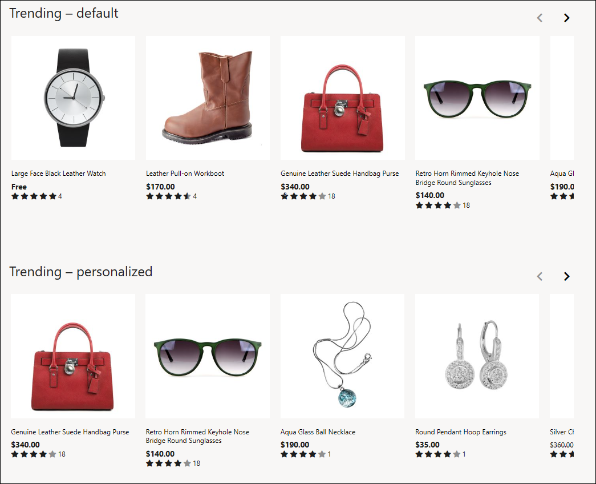

---
# required metadata

title: Enable Personalized Recommendations
description: This topic explains how Retailers can enable personalized product recommendations for their eCommerce and POS experiences. 
author: bebeale
manager: AnnBe
ms.date: 11/21/2019
ms.topic: article
ms.prod: 
ms.service: dynamics-365-commerce
ms.technology: 

# optional metadata

ms.search.form: 
# ROBOTS: 
audience: Application User
# ms.devlang: 
ms.reviewer: josaw
ms.search.scope: 
# ms.tgt_pltfrm: 
ms.custom: 
ms.assetid: 
ms.search.region: global
ms.search.industry: Retail, eCommerce
ms.author: bebeale
ms.search.validFrom: 2019-10-31
ms.dyn365.ops.version: 10.0.5

---

# Enable personalized recommendations

[!include [banner](includes/preview-banner.md)]
[!include [banner](includes/banner.md)]

This section discusses how to enable personalized recommendations from the back office, and how retailers can utilize personalized recommendations as part of their online and POS experiences. 
For more information about product recommendation lists, see [Product recommendations overview](product-recommendations.md).

## Personalization pre-check

Before enabling, please note that product recommendations are only supported for F&O customers who have migrated their storage to using ADLS (Azure Data Lake Storage). In order to receive personalized recommendations, Retailers must first [enable product recommendations](enable-product-recommendations.md). 

[!NOTE] Enabling product recommendations will also enable personalization. Disabling personalized recommendations will not disable the other types of product recommendations.

## Turn on personalization

To turn on product recommendations, follow these steps.

1. Go to **Retail** &gt; **Product recommendations** &gt; **Recommendation parameters**.
1. In the list of retail shared parameters, select **Recommendation Lists**.
1. Set the **Enable personalization** option to **Yes**.

> [!NOTE]
> This procedure starts the process of generating personalized product recommendation lists. Up to one day might be required before the lists are available and can be seen at the point of sale (POS) or in Dynamics 365 for Commerce.

## About personalized recommendations
In addition to the existing machine generated lists, the Recommendations Service also supports the ability to personalize the product discovery experience across both POS and Online.

After enabling personalization in the back office, retailers will be able to show shoppers personalized "picks for you" lists in eCommerce or as “recommended products” in POS on customer detail pages. Additionally, retailers can "apply personalization" on existing product recommendations lists and provide GDPR privacy opt-out experiences for their authenticated users. Disabling personalization will render these features defunct. 

### Picks for you

This AI-ML list allows an authenticated user can see a personalized list of suggested products called “picks for you” based on their omni-channel purchase history. Personalized recommendations will dynamically update overtime as more purchases are made. Plus, this list respects category filtering which allows retailers to show top picks based on navigational hierarchies. 

#### Picks for you on POS
Retailers can enhance their Clienteling experience by personalizing existing customer details pages by adding the contextual "Recommended for customer" list.

In order for **picks for you** to appear on any page, there are some requirements. 
1.	Users must be signed-in. Anonymous users will not see personalized recommendations.
1.	Users will need at least one purchase on their account.
1.	Users must also be opted-in to receiving personalized recommendations. 

### Apply personalization

Retailers can “apply personalization” to existing recommendation lists (New, Trending, Best Selling, People also like, and Frequently bought together), which will remove items from the list that a signed-in user has previously purchased. For both anonymous and opted-out users, default versions of the existing lists will be shown; this removes the need for Retailers to manually maintain separate page experiences. 
 
When "apply personalization" is enabled, a signed-in user who purchases the black watch and the brown work-boots from Trending will be able to see new products. See below for an example:

## Additional resources

[Product recommendations overview](product-recommendations.md)

[Enable product recommendations](enable-product-recommendations.md)

[GDPR and product recommendations](personalization-gdpr.md)

[Add product recommendation lists to pages](add-reco-list-to-page.md)

[Add recommendations panel to POS devices](add-recommendations-control-pos-screen.md)

[Product collection module overview](product-collection-module-overview.md)

