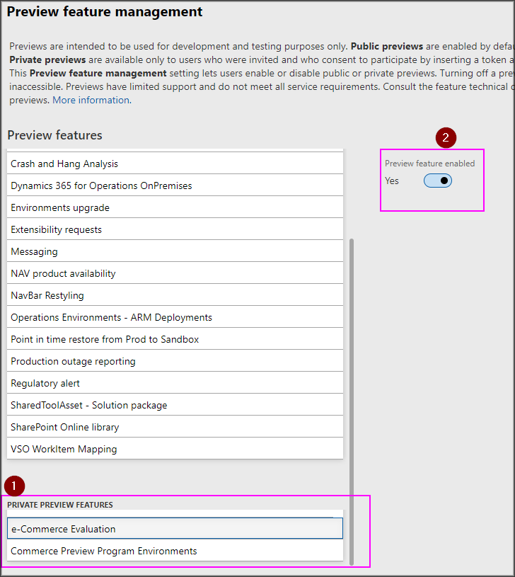
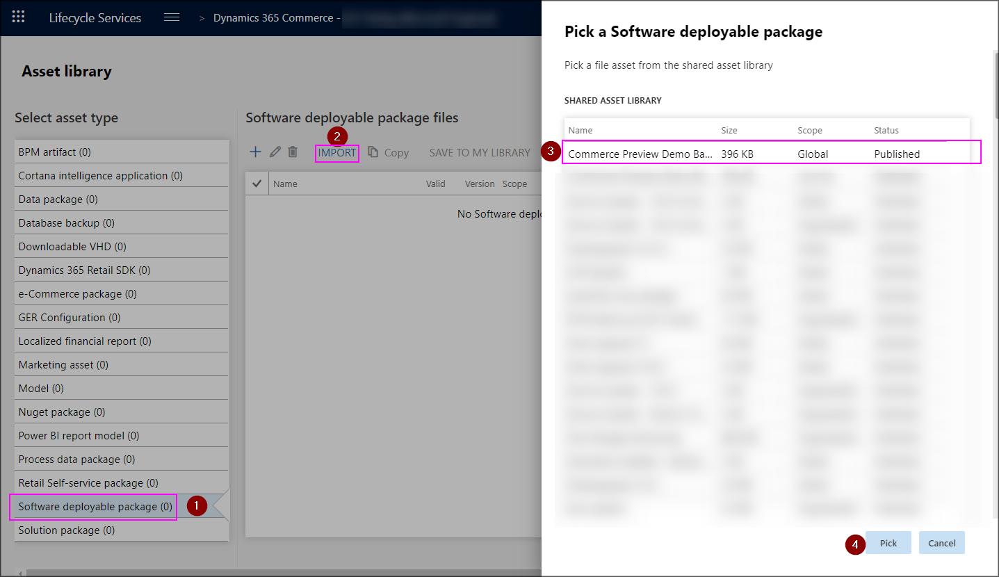
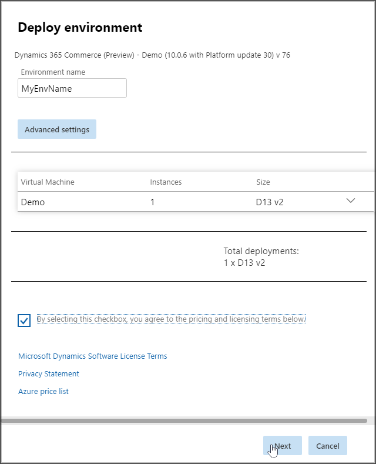

---
# required metadata

title: Provision a Commerce preview environment
description: This topic provides step-by-step instructions for provisioning your Microsoft Dynamics 365 Commerce preview environment.
author: psimolin
manager: annbe
ms.date: 12/02/2019
ms.topic: article
ms.prod: 
ms.service: dynamics-365-commerce
ms.technology: 

# optional metadata

# ms.search.form: 
# ROBOTS: 
audience: Application User
# ms.devlang: 
ms.reviewer: v-chgri
ms.search.scope: Retail, Core, Operations
# ms.tgt_pltfrm: 
ms.custom: 
ms.assetid: 
ms.search.region: Global
ms.search.industry: 
ms.author: psimolin
ms.search.validFrom: 2019-10-31
ms.dyn365.ops.version: 
---

# Provision a Commerce preview environment

[!include [banner](includes/preview-banner.md)]
[!include [banner](includes/banner.md)]

This topic provides step-by-step instructions for provisioning your Microsoft Dynamics 365 Commerce preview environment.

Before you begin, we recommend that you at least skim through the documentation to get an idea of what the process entails and what the guide contains.

> [!NOTE]
> If you have not yet been granted access to the Microsoft Dynamics 365 Commerce preview, you can request preview access from the [Commerce website](https://aka.ms/Dynamics365CommerceWebsite).

## Overview

To provision your Commerce preview environment successfully, the project needs to be created with a specific product name and type. The environment and Retail Cloud Scale Unit (RCSU) also have some specific parameters you need to use to start the e-Commerce provisioning later. The instructions in this guide contain all the required steps you need to take and parameters you need to use.

After successful provisioning, there are a few post-provisioning steps you will need to take to prepare your Commerce preview environment. Some steps are optional, depending on which aspects of the system you wish to evaluate. Should you later change your mind, you can always run the optional steps at that time.

For information on configuring your Commerce preview environment, see [Configure a Commerce preview environment](cpe-post-provisioning.md).

For information on configuring optional features of your Commerce preview environment, see [Configure Commerce preview environment optional features](cpe-optional-features.md).

If you have any questions about the provisioning steps or encounter any issues, please let us know on the [Microsoft Dynamics 365 Commerce Preview Yammer group](https://aka.ms/Dynamics365CommercePreviewYammer). 

## Prerequisites

The following are prerequisites for provisioning your Dynamics 365 Preview environment.

- You have access to the **Lifecycle Services portal (LCS)**.
- You have been **accepted into the Dynamics 365 Commerce Preview program**.
- You have the required permissions to create a project for **Prospective presales** or **Migrate, create solutions, and learn**.
- You are a member of the **Environment manager** or **Project owner** role in the project where you will be provisioning the environment.
- You have administrator access to your Azure subscription, or contact with a subscription administrator who can perform the two steps that require administrator permissions on your behalf.
- You have your **AAD Tenant Id** available.
- You have created a **AAD security group** to be used as **e-Commerce system admins group** and you have its ID available.
- You have created a **AAD security group** to be used as **Ratings and Reviews moderator group** and you have its ID available (can be the same security group as the system administrator group above).

## Provision your Commerce preview environment

These instructions cover the provisioning of a Microsoft Dynamics 365 Commerce preview environment. After successfully completing these steps, you will have a preview environment that is ready to be configured. All the activities described here take place in the Microsoft Lifecycle Services (LCS) portal.

> [!NOTE]
> Preview access is tied to the LCS account and organization you specified in your preview application. You must use that same account for provisioning. If you have to use a different LCS account or tenant for the preview environment, you will need to provide us with those details. Please visit the [Microsoft Dynamics 365 Commerce Preview Yammer group](https://aka.ms/Dynamics365CommercePreviewYammer) for assistance. If you are having issues accessing the Yammer group, you can also reach us via email at **Dynamics365Commerce@microsoft.com**. This email address is not actively monitored so expect a delay in response.

### Grant access to e-Commerce applications

> [!NOTE]
> **The person logging in needs to be an AAD tenant administrator in possession of the AAD tenant ID**. Without successfully completing this step, the rest of the provisioning steps will fail.

To authorize e-Commerce applications to access your Azure subscription, follow these steps.

1. To authorize e-Commerce applications to access your Azure subscription, first assemble a URL in the following format:

`https://login.windows.net/{AAD_TENANT_ID}/oauth2/authorize?client_id=fbcbf727-cd18-4422-a723-f8274075331a&response_type=code&redirect_uri=https://sb.manage.commerce.dynamics.com/_commerce/Consent&response_mode=query&prompt=admin_consent&state=12345`

1. Copy and paste the URL into your browser or text editor and replace **\{AAD_TENANT_ID\}** with your **AAD tenant ID**, and then navigate to the URL. 
1. In the Microsoft AAD login dialog box, sign in and confirm that you wish to grant "Dynamics 365 Commerce (Preview)" access to your subscription. You will then be redirected to a page that confirms whether or not the operation was successful.

### Confirm that preview features are available and enabled in LCS

To confirm that preview features are available and enabled in LCS, follow these steps.

1. Sign in to the [LCS portal](https://lcs.dynamics.com) with the same LCS account you used to request access to the preview.
1. On the LCS front page, scroll all the way to the right and click the **Preview feature management** tile, as shown in the following image.

    

1. Scroll down to **PRIVATE PREVIEW FEATURES** and confirm that the following features are available and enabled, as shown in the following image:
	- **e-Commerce Evaluation**
	- **Commerce Preview Program Environments**
	
	
    
	
1. If you are unable to see these features in the list, please reach out to us with your work email, LCS account, and tenant details. ///Please see **Additional resources** below for information on how to contact us.///

### Create a new project

To create a new project in LCS, follow these steps.

1. On the LCS front page, click **+** to create a new project.
1. If you are a partner, select **Migrate, create solutions, and learn** from the pane on the right.
1. If you are a customer, select **Prospective presales** from the pane on the right.
1. Enter a name, description, and industry.
1. For **Product name**, select **Dynamics 365 Retail**.
1. For **Product version**, select **Dynamics 365 Retail**.
1. For **Methodology**, select **Dynamics Retail implementation methodology**.
1. You may import roles and users from an existing project if that is desired.
1. Click **Create**.
1. You are sent to the project view.

### Add Azure Connector

To add the Azure Connector to your LCS project, follow these steps.

1. If you are a partner, click **Project settings** from the tools tiles to the far right.
1. If you are a customer, choose **Project settings** from the top menu.
1. Select **Azure connectors**.
1. Click **+ Add** to add Azure Connector.
1. Enter a name.
1. Enter your **Azure Subscription ID**.
1. Enable **Configure to use Azure Resource Manager (ARM)**.
1. Verify that **Azure subscription AAD Tenant Domain (or ID)** is correct. Consult your Azure subscription administrator, if necessary.
1. Click **Next**.
1. Follow the instructions on the screen to grant the required application(s) access to your subscription. Consult your Azure subscription administrator, if necessary:
	1. Sign in to the [Azure portal](https://portal.azure.com/).
	1. After confirming that you have the correct directory selected, click **Subscriptions** from the menu on the left.
	1. Locate the correct subscription from the list and select it. Use search if required.
	1. Select **Access control (IAM)** from the menu.
	1. Click **Add** under **Add a role assignment** on the right side. The **Add role assignment** pane opens.
	1. For **Role**, select **Contributor**.
	1. For **Assign access to**, leave as **Azure AD user, group, or service principal**.
	1. Under **Select**, enter **b96b7e94-b82e-4e71-99a0-cf7fb188acea**.
	1. Select **Dynamics Deployment Services [wsfed-enabled]** from the list.
	1. Click **Save**.
1. Click **Next**.
1. Follow the instructions on the screen to grant the required application(s) access to your subscription. Consult your Azure subscription administrator, if necessary.
1. Click **Next**.
1. For **Azure region**, choose either **East US**, **East US 2**, **West US** or **West US 2**.
1. Click **Connect**. Your Azure Connector should appear in the list.

### Import Commerce Preview Demo Base Extension

To import the **Commerce Preview Demo Base Extension** to your project, follow these steps.

1. Navigate to your project front page by clicking the project name on the top.
1. If you are a partner, click **Asset library** from the tools tiles on the far right.
1. If you are a customer, select **Asset library** from the top menu.
1. Select **Software deployable package** from the list on the left.
1. Click **IMPORT** from the action pane.
1. Select **Commerce Preview Demo Base Extension** from the list of assets under **SHARED ASSET LIBRARY**.
1. Click **Pick**.
1. You will be returned to the Asset library and you should see the extension in the list.

The following image highlights the actions to be taken on the LCS Asset library page. 

### Deploy the environment

To deploy the environment, follow these steps.

> [!NOTE]
> It is possible that steps 6, 7, and/or 8 below will not be shown, as the screens with a single option are skipped. When you are in the **Environment parameters** view, please confirm that you have the text "Dynamics 365 Commerce (Preview) - Demo (10.0.6 with Platform update 30)" directly above the **Environment name** field. See the screenshot below.*

1. From the top menu, select **Cloud-hosted environments**.
1. Click **+ Add** to add an environment.
1. For **Application version**, select **10.0.6**.
1. For **Platform version**, select **Platform Update 30**.
1. Click **Next**.
1. For environment topology, choose **DEMO**.
1. For environment topology, choose **Dynamics 365 Commerce (Preview) - Demo**.
1. If you configured a single Azure Connector earlier, that will be used for this environment. If you configured multiple Azure Connectors, you have the option to select which connector you would like to use: **East US**, **East US 2**, **West US** or **West US 2** (recommended for best end-to-end performance)
1. Enter an **Environment name**.
1. Adjust the VM size as you see fit. (We recommend VM SKU **D13 v2**.)
1. Leave **Advanced settings** as they are.
1. After reviewing the pricing and licensing terms on the screen, check the box to indicate agreement.
1. Click **Next**.
1. On the deployment confirmation screen, after verifying that the details are correct, click **Deploy**.
1. You will return to the **Cloud-hosted environments** view and your environment should appear in the list.
1. Your requested environment will show as queued and then deploying. It will take some time for all of the environment workflows to complete, so please check back after a few hours (approximately 6 – 9 hours).
1. Before proceeding, make sure that your environment status is **Deployed**.

### Initialize RCSU

To initialize RCSU, follow these steps.

1. While in the **Cloud-hosted environments** view, select your environment from the list.
1. From the environment view on the right side of the screen, click **Full details**. The environment details view will display.
1. Under **ENVIRONMENT FEATURES**, click **Manage**.
1. From **Retail** tab, click **Initialize**. The RCSU initialization parameters view will display.
1. For **REGION**, select **East US**, **East US 2**, **West US** or **West US 2**.
1. For **VERSION**, first select **Specify a version** from the drop down list, then specify **9.16.19262.5** in the text field that appears below. Make sure to specify the exact version listed here to avoid having to update RCSU later to the correct version.
1. Enable **Apply extension**.
1. From the list of extensions, choose **Commerce Preview Demo Base Extension**.
1. Click **Initialize**.
1. On the deployment confirmation screen, after verifying that the details are correct, click **Yes**.
1. You are returned to the **Retail management** view with the **Retail** tab activated. Your RCSU has been queued for provisioning.
1. Wait until your RCSU status is **SUCCESS** before proceeding (will take approximately 2 - 5 hours).

### Initialize e-Commerce

To initialize e-Commerce, follow these steps.

1. Switch to the **e-Commerce (Preview)** tab.
1. After reviewing the preview consent, click **Setup**.
1. Enter a name for **e-Commerce tenant name**. However, note that this will be visible in some of the URLs pointing to your e-Commerce instance.
1. For **Retail cloud scale unit name**, select your RCSU from the list (list should only have one option).
1. **e-Commerce geography** is automatically populated and cannot be changed.
1. Click **Next** to continue.
1. For **Supported host names**, enter any valid domain (e.g. www.fabrikam.com).
1. For **AAD security group for system admin**, enter the AAD security group ID that you wish to use as e-Commerce system administrator group.
1. For **AAD security group for ratings and review moderator**, enter the AAD security group ID that you wish to use for the Ratings and Reviews moderator group.
1. Leave the **B2C** values empty for the 7 fields that start with "B2C".
1. Leave **Enable ratings and review service** enabled.
1. Click **Initialize**.
1. You are returned to the **Retail management** view with the **e-Commerce (Preview)** tab activated. Your e-Commerce initialization has started.
1. Before proceeding, wait until your e-Commerce initialization status is **INITIALIZATION SUCCESSFUL**.
1. Under **LINKS** on the bottom right.
	* Make note of the link **e-Commerce site**. This is the link to the root of your e-commerce site.
	* Make note of the link **e-Commerce site management tool**. This is the link to the site management tool.
	
## Next steps

To continue the process of provisioning and configuring your Commerce preview environment, proceed to [Configure a Commerce preview environment](cpe-post-provisioning.md).

## Additional resources

[Commerce preview environment overview](cpe-overview.md)

[Configure a Commerce preview environment](cpe-post-provisioning.md)

[Configure Commerce preview environment optional features](cpe-optional-features.md)

[Commerce preview environment FAQ](cpe-faq.md)
