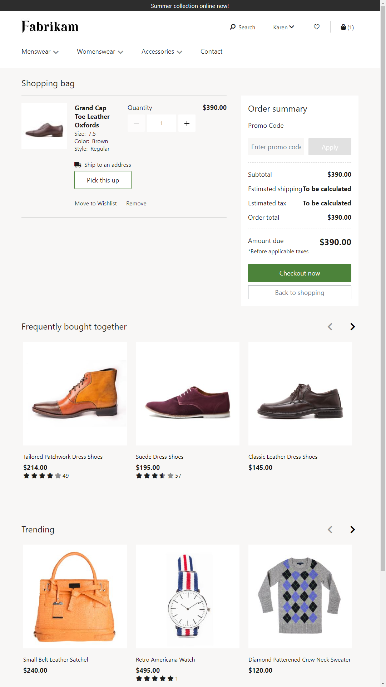
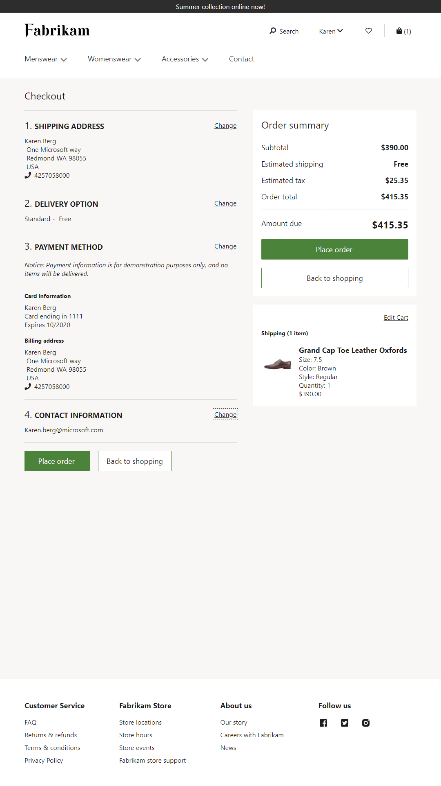

---
# required metadata

title: Quick tour of cart and checkout pages
description: This topic provides a quick tour of the cart and checkout pages in Dynamics 365 Commerce.
author: anupamar-ms
manager: annbe
ms.date: 10/01/2019
ms.topic: article
ms.prod: 
ms.service: dynamics-ax-retail
ms.technology: 

# optional metadata

ms.search.form:  
audience: Application User
# ms.devlang: 
ms.reviewer: v-chgri
ms.search.scope: Retail, Core, Operations
# ms.tgt_pltfrm: 
# ms.custom: 
ms.search.region: Global
ms.search.industry: 
ms.author: anupamar
ms.search.validFrom: 2019-10-31
ms.dyn365.ops.version: Release 10.0.5
---

# Quick tour of cart and checkout

[!include [banner](../includes/preview-banner.md)]
[!include [banner](../includes/banner.md)]

This topic provides a quick tour of the cart and checkout pages in Dynamics 365 Commerce.

## Overview

The cart page of an e-Commerce website displays any and all items that a customer has added to the cart. The cart page is built using uses the cart module, which is a container that hosts modules that are needed to showcase items in the cart. In addition, the cart module can employ modules to display the order summary and any promo codes applied to the customer order.

The checkout page of an e-Commerce website presents a step-by-step flow that a customer uses to enter all the relevant information to make a purchase. A checkout module can include modules that handle the shipping address, shipping methods, billing information, order summary, and other information that is related to a customer order.

## Cart page

The cart page serves as the shopping bag which includes all the items added to the cart. 

The following image show an example cart page built with the online starter kit and using the Fabrikam theme.

The main body of the cart page shows all the items added to the cart by the shopper. All applicable discounts including complex discounts will be showcased (for example, "Buy 3 items and get 10% off," "Buy a bottle and a backpack to get 10% off," etc.). The order summary module shows the amount due after discounts, shipping, taxes, etc. There is also a promo code module which also enables the user to apply or remove promo codes.

A customer can shop anonymously or as a signed-in user. If a customer is signed-in, items in their cart are preserved between sessions. This enables customers to continue their shopping journey from multiple devices.

From the cart, a shopper can proceed to checkout. Checkout can be initiated as a guest user or as a signed-in user. 

For details on authoring a cart page, see [Add a cart module to a page](add-cart-module.md).

## Checkout page

The checkout page is where your customers enter the information needed to place an order. 

The following image show an example checkout page built with the online starter kit.

The main body of the checkout page is where all order information is collected. This includes shipping address, delivery options, payment, etc. Checkout has a step-by-step flow as the workflow requires information to be entered in a certain order to be processed (for example, the shipping address must be entered before shipping costs can be calculated and payment can be authorized.)

A shipping address is required if items need to be shipped. The shipping address format can be configured in Dynamics 365 Retail for each locale (for example, if the country selected is United States, the shipping address will require street address, state, zip code, etc.). There is some basic input validation such as alphanumeric, maximum length, and number that is done for shipping address fields. The address itself is not verified for validity, but this can be done using customized third party services. 

The shipping address is applied to all items in the cart that have the ship option selected. It is not possible to ship individual cart items to separate addresses when using the starter kit checkout flow. If this capability is required, it can be accomplished through customization of the checkout modules. 

Once the shipping address is provided, shipping methods that are available from the Commerce online store will be shown. The shipping methods and the addresses they support can be configured in Retail.  

The next step in the checkout flow is payment. In e-Commerce, orders can be placed using multiple forms of payment such as credit card, gift card, and loyalty points. A combination of these payment methods can be used to place the order. Depending on which payment methods are used, additional information may be required. For example, a credit card payment requires a billing address. Credit card payments are processed using the Adyen Payment Connector. 

Loyalty points can be redeemed for an order during the checkout flow. To do so, the customer must be a loyalty program member with accrued points. The loyalty points module is only displayed if the user has an existing loyalty membership. For non-members and guest users, this module is hidden.

The online starter kit supports redeeming internal gift cards to place an order. The customer must be signed in to apply the internal gift card. For additional security, it is recommended to customize the flow using a personal identification number (PIN) on internal gift cards.

The checkout process can be completed as a guest user or a signed-in user. If the user is signed-in, account information such as saved shipping address and saved credit card details will automatically be retrieved. 

Checkout also shows a summary of the line items in the cart for the shopper to verify before making a purchase. The line items cannot be edited during the checkout flow. A link to the cart is provided for the user to go back and edit line items if needed.

Once shipping and billing information is provided, the order summary will reflect the amount due after loyalty, gift card, and other payments have been applied.

When an order is placed, a confirmation number is provided to the shopper. At the time the order is placed, the payment is authorized but not charged. When the order is fulfilled (either shipped or picked up), the payment will be charged. 

Once an order is created, an order confirmation email is sent to the customer to confirm that the order was created.

For details on authoring a checkout page, see [Add a checkout module to a page](add-checkout-module.md).
