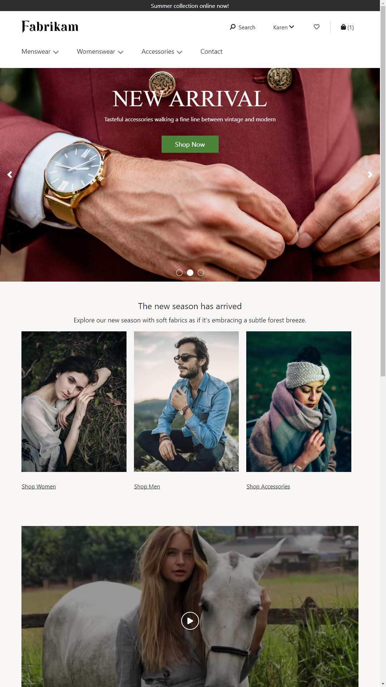
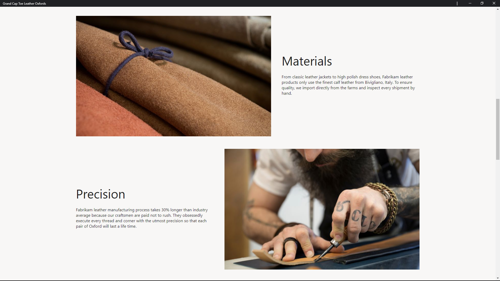
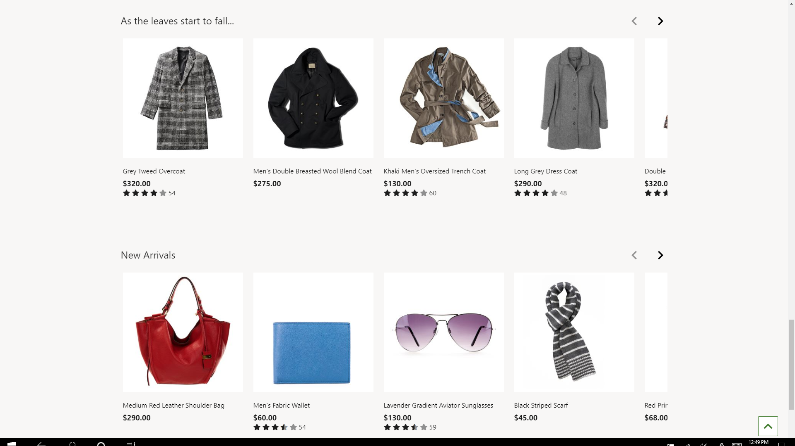

---
# required metadata

title: Quick tour of home page
description: This topic provides a quick tour of the home page in Dynamics 365 Commerce.
author: anupamar-ms
manager: annbe
ms.date: 10/01/2019
ms.topic: article
ms.prod: 
ms.service: dynamics-ax-retail
ms.technology: 

# optional metadata

ms.search.form:  
audience: Application User
# ms.devlang: 
ms.reviewer: v-chgri
ms.search.scope: Retail, Core, Operations
# ms.tgt_pltfrm: 
# ms.custom: 
ms.search.region: Global
ms.search.industry: 
ms.author: anupamar
ms.search.validFrom: 2019-10-31
ms.dyn365.ops.version: Release 10.0.5

---

# Quick tour of Home page

[!include [banner](../includes/preview-banner.md)]
[!include [banner](../includes/banner.md)]

This topic provides a quick tour of the home page in Dynamics 365 Commerce.

## Overview

The home page is the default page a shopper lands on when visiting an e-Commerce site. This page typically showcases products and promotions using a combination of marketing modules. The home page should be rich with images and text to keep the shopper engaged. 

The following image shows an example of a home page built with the online starter kit and Fabrikam theme.

The top of the page has a header which shows all the product categories and other pages that the retailer wants the customer to browse. On the bottom of the page is a footer with quick links to various topics that may interest customers. 

The main section of a home page highlights products, categories, or promotions. This can be done using various Commerce modules.

**Hero**: The top of the home page typically shows one or more "hero" images that highlight new products and promotions in the store. If there are multiple hero images, they are hosted within a carousel module for the user to browse. 

The following image shows an example of a home page where the first item on the page ("New Arrivals") is a hero.

**Feature**: A feature module is used for marketing products or promotions using a combination of image and text. A feature can be used independently or within a carousel module to showcase products and promotions. 

The following image shows an example of feature modules on a home page.

**Content Placement:** The content placement module is used to showcase multiple products or category of products using a mix of images and text in a multi-column view. In the home page screenshot above, the three column items which say "Shop Womens," "Shop Mens," and "Shop Accessories" are using a content placement module.  

**Video Player:** A video player module can be used to showcase video content on the home page. A video player shown in the home page example there is .

**Content Rich block**: Content rick block can be used in a single or multi-column view for text content on the home page screenshot above.

**Recommendations:** Product recommendations lists such as "New," "Trending," and "Best Selling" can be displayed on the home page. These lists showcase products based on shopping trends, and can be algorithmically generated or curated manually. They help customers quickly discover top products and then continue their shopping journey.

The following image shows an example of product recommendations on a home page.

> [!NOTE] 
> All of the modules above can be used on any site page but their placement on the home page is important because that is where customers first interact with your site.
