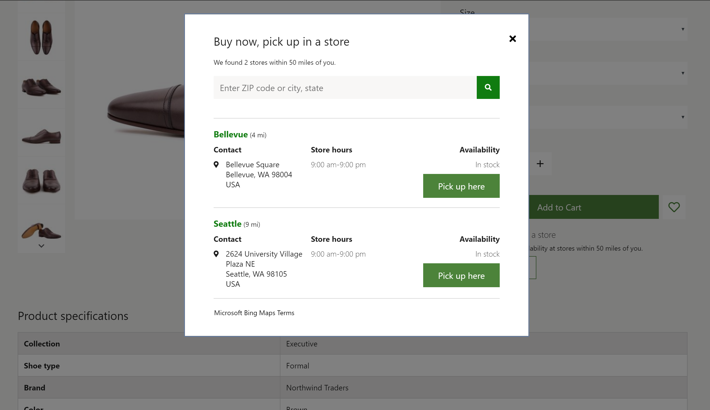

---

# required metadata

title: Store selector module
description: This topic covers the store selector module and describes how to add it to site pages in Microsoft Dynamics 365 Commerce.
author:  anupamar-ms
manager: annbe
ms.date: 03/19/2020
ms.topic: article
ms.prod:
ms.service: dynamics-365-commerce
ms.technology:

# optional metadata
# ms.search.form:
# ROBOTS:
audience: Application User
# ms.devlang:
ms.reviewer: v-chgri
ms.search.scope: Retail, Core, Operations
# ms.tgt\_pltfrm:
ms.custom:
ms.assetid:
ms.search.region: Global
ms.search.industry:
ms.author: anupamar
ms.search.validFrom: 2020-02-10
ms.dyn365.ops.version:

---

# Store selector module

[!include [banner](includes/banner.md)]

This topic covers the store selector module and describes how to add it to site pages in Microsoft Dynamics 365 Commerce.

## Overview

A store selector module is used to display stores available to "Buy a product online and pick up". In 10.0.13, the module has  additional capabilities that allow it showcase a "Find a Store" page.  In this topic, we will discuss how the module can be used in both modes.

The Store selector module allows the user to input a location (city, state, address etc) to search for stores nearaby. It then searches for stores within a defined search radius for stores that are available. When the module is launched initially, it uses the customer's browser location (if consent is provided) as the initial location to find stores.

## Store selector module usage in e-Commerce

- A store selector module can be used on a product details page (PDP) to find nearby stores and choose a store for pickup
- A store selector module can be used on a cart page to find nearby stores and choose a store for pickup
- A store selector module can be used on a stand-alone page that shows all available stores 

## Bing integration
The store selector module is integrated with the Bing Maps APIs for Geocoding and Autosuggest. A Bing Maps API key is required and must be added to the Commerce shared parameters page in Dynamics 365 Commerce. Geocoding application programming interface (API) is used to convert the  location to a latitude and longitude. The Autosuggest API integration is used to show search suggestions as the user types a location on the input box.

## Buy online pick-up in store
The Store selector supports a "Pick-up in store" mode. In this mode, it displays a list of stores where a product is available for pickup, as well as store hours and product inventory for each store in the pick-up mode. Here it requires the context of a product so it can render product availabilty and allow the user to add the product to cart with delivery mode set to pickup at the selected store. For more details on Inventory settings, refer to . 

The store selector module can be added to a buy box module on the product details page (PDP) to display stores where a product is available for pickup. It can also be added to a cart module. When added to a cart module, the store selector module displays pickup options for each cart line item. In addition, this module can be added to other pages or modules via extensions and customizations.

For the BOPIS scenario to work, products should be configured with the "Pickup" delivery mode. Otherwise, the module will not be shown on the respective pages. For details on how to configure the delivery mode, see [Set up modes of delivery](https://docs.microsoft.com/dynamicsax-2012/appuser-itpro/set-up-modes-of-delivery).

The following image shows an example of a store selector module used on a PDP.

## Find a store
The Store selector module supports a "Find a store" mode. In this mode, it displays stores that are available and does not require any product context. A "Store locations" page can be created using this module in this mode. 

The following image shows an example of a store selector module used on a PDP.

## Showing a map
The module can be used with the Map module to render the store locations visually on a map. For more details on this module, refer to [Maps module](add-maps-module.md)

## Store selector module properties

| Property name             | Value                 | Description |
|---------------------------|-----------------------|-------------|
| Heading| Text| Heading for the module|
| Mode| Find stores, Pick up in store| Find stores, displays stores available. Pick up in store, allows user to select a store for pickup|
| Style| Dialog, Inline| The module can rendered inline or shown in a dialog|
| Set as preferred store| True or False| When true, it allows the user to set a store as a preferred store for their shopping experience|
| Show all stores | True or False| When true, it shows an option for the shopper to view all stores ignoring the search radius|
| Search radius | Number | Defines the search radius for stores, in miles. If no value is specified, the default search radius of 50 miles is used.|
|Terms of Service | URL    |  The terms of service URL that is required for the Bing Maps service. |

## Add a store selector module to a page

A store selector module needs the context of a product, so it can only be used within buy box and cart modules. Store selector modules do not function outside these modules.

- For information on how to add a store selector module to a buy box module, see [Buy box module](add-buy-box.md). 
- For information on how to add a store selector module to a cart module, see [Cart module](add-cart-module.md)

## Additional resources

[Starter kit overview](starter-kit-overview.md)

[Buy box module](add-buy-box.md)

[Cart module](add-cart-module.md)

[Quick tour of PDP](quick-tour-pdp.md)

[Quick tour of Cart and checkout](quick-tour-cart-checkout.md)

[Set up modes of delivery](https://docs.microsoft.com/dynamicsax-2012/appuser-itpro/set-up-modes-of-delivery)

[Manage Bing Maps for your organization](dev-itpro/manage-bing-maps.md)
