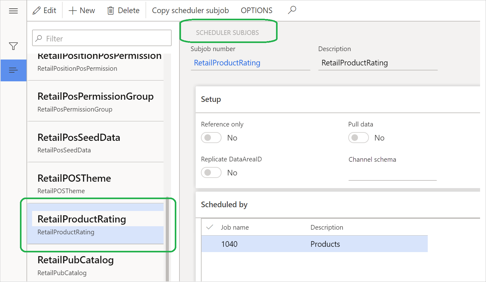
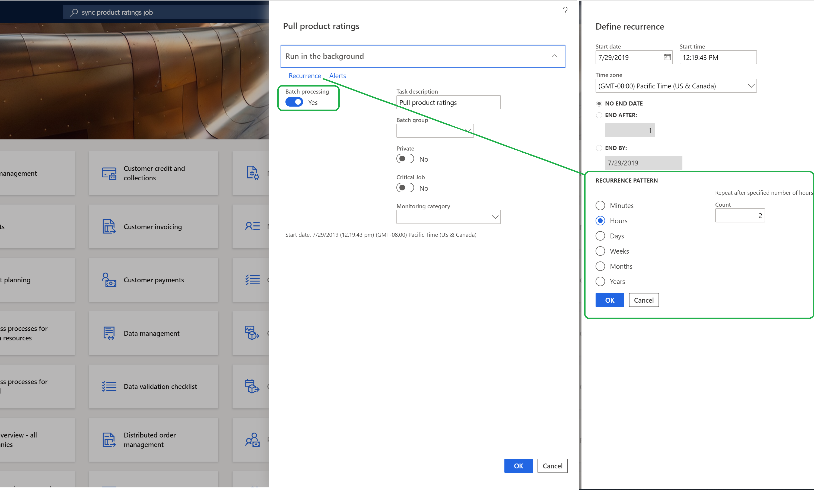
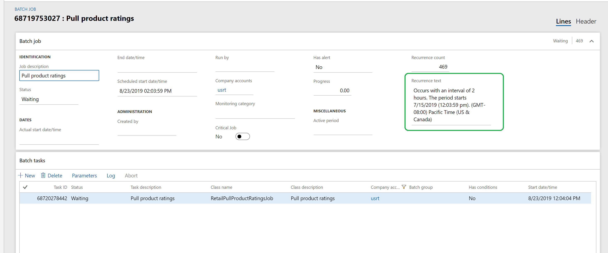
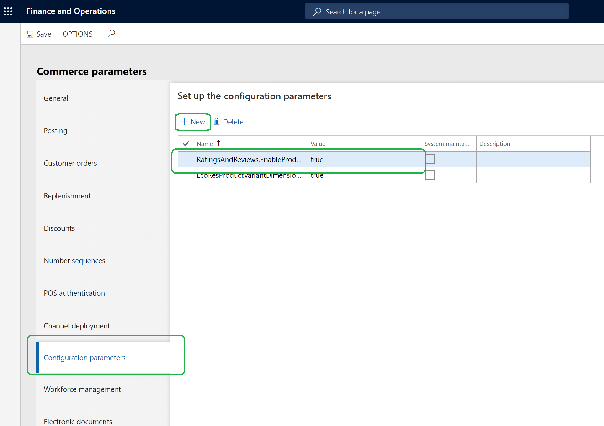
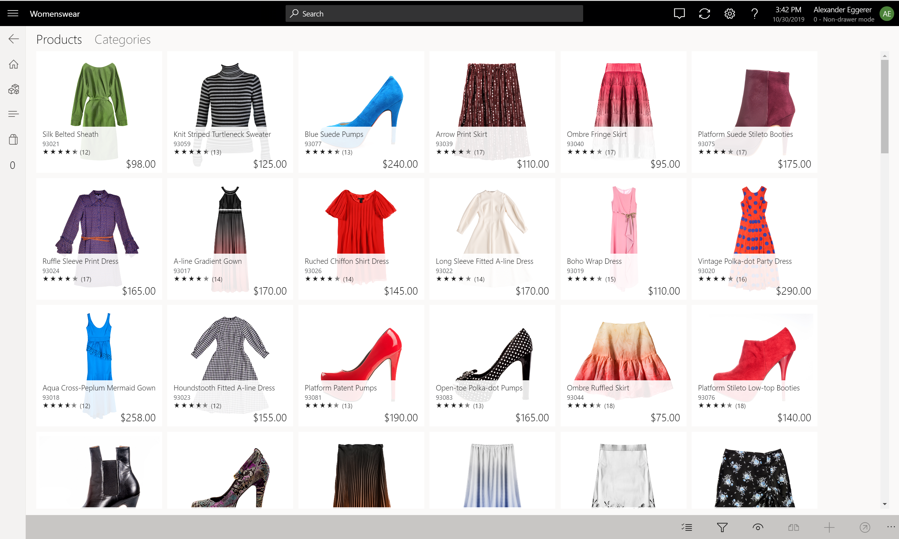
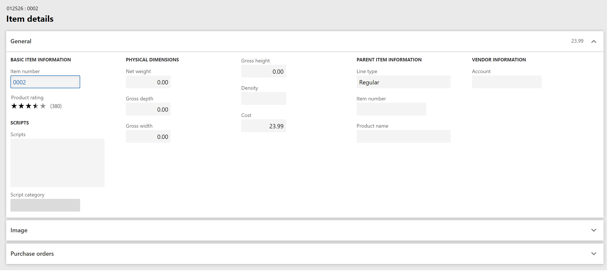

---
# required metadata

title: Sync product ratings
description: This topic describes how to sync product ratings in Microsoft Dynamics 365 Commerce.
author:  gvrmohanreddy 
manager: annbe
ms.date: 10/01/2019
ms.topic: article
ms.prod: 
ms.service: dynamics-365-commerce
ms.technology: 

# optional metadata

# ms.search.form: 
# ROBOTS: 
audience: Application User
# ms.devlang: 
ms.reviewer: v-chgri
ms.search.scope: Retail, Core, Operations
# ms.tgt_pltfrm: 
ms.custom: 
ms.assetid: 
ms.search.region: Global
ms.search.industry: 
ms.author: gmohanv
ms.search.validFrom: 2019-10-31
ms.dyn365.ops.version: Release 10.0.5
---

# Sync product ratings

[!include [banner](includes/banner.md)]

This topic describes how to sync product ratings in Microsoft Dynamics 365 Commerce.

## Overview

To consume product ratings in omnichannels, such as at the point of sale (POS) and in call centers, product ratings from the ratings and reviews service must be imported into the channel database. When product ratings are made available in omnichannels, they can help customers indirectly during their interactions with sales associates.

This topic describes following tasks:

1. Configure a Commerce batch job to import product ratings.
1. Verify that the batch job for product rating synchronization was successful.
1. Make product ratings available at the POS.

## Configure a batch job to import product ratings

> [!IMPORTANT]
> Before you start, make sure that version 10.0.6 or later of Retail is installed.

### Initialize the commerce scheduler

To initialize the commerce scheduler, follow these steps.

1. Go to **Retail and Commerce \> Headquarters setup \> Commerce scheduler \> Initialize commerce scheduler**. Alternatively, search for "Initialize commerce scheduler."
1. In the **Initialize commerce scheduler** dialog box, make sure that the **Delete existing configuration** option is set to **No**, and then select **OK**.

### Verify the RetailProductRating subjob

To verify that the **RetailProductRating** subjob exists, follow these steps.

1. Go to **Retail and Commerce \> Headquarters setup \> Commerce scheduler \> Scheduler subjobs**. Alternatively, search for "Scheduler subjobs."
1. In the subjob list, find or search for the **RetailProductRating** subjob.

The following illustration shows an example of the subjob details in Commerce.

> [!NOTE]
> If you don't find the **RetailProductRating** subjob, you might already have run the **Sync product ratings** job and the **1040 CDX** job before you initialized the scheduler. In this case, follow these steps to run the **Full data sync** job.
>
> 1. Go to **Retail and Commerce \> Headquarters setup \> Commerce scheduler \> Channel database**. Alternatively, search for "Channel database."
> 1. Select the channel database to sync.
> 1. On the Action Pane, select **Full data sync**.
> 1. In the **Select a distribution schedule** drop-down dialog box, select **1040 - products**, and then select **OK**.
> 1. Repeat the steps of the previous procedure to verify that the **RetailProductRating** subjob has been created.

### Import product ratings

To import product ratings into Commerce from the ratings and reviews service, follow these steps.

1. Go to **Retail and Commerce \> Headquarters setup \> Commerce scheduler \> Sync product ratings job**. Alternatively, search for "Sync product ratings job."
1. In the **Pull product ratings** dialog box, on the **Run in the background** FastTab, select **Recurrence**.
1. In the **Define recurrence** dialog box, set up a recurrence pattern. (The suggested value is two hours.) Don't schedule a recurrence that is less than one hour.
1. Select **OK**.
1. Set the **Batch process** option to **Yes**. This setting helps guarantee that you will be able to audit the logs and verify the status of batch job runs.
1. Select **OK** to schedule the batch job.

The following illustration shows an example of batch job configuration.

## Verify that the batch job for product rating synchronization was successful

To verify that the **Sync product ratings** batch job was successful, follow these steps.

1. Go to **Retail and Commerce \> System administrator \> Inquiries \> Batch jobs** or, if you're using a Commerce-only stock keeping unit (SKU), **Retail and Commerce \> Inquiries and reports \> Batch jobs** instead. Alternatively, search for "Batch jobs."
1. To view the details of the batch job, in the batch job list, in the **Job description** column, search for a description that contains "Pull product ratings."
1. Select the job ID to view the batch job details, such as the scheduled start date/time and the recurrence text.

The following illustration shows an example of the batch job details when the batch job is scheduled to run at two-hour intervals.

## Make product ratings available at the POS

The ratings and reviews solution in Dynamics 365 Commerce is an omnichannel solution. However, products ratings aren't shown at the POS by default. To help customers in stores see ratings and reviews when they are being helped by sales associates, you must turn on product ratings at the POS.

To turn on product ratings at the POS, follow these steps.

1. Go to **Retail and Commerce \>  setup \> Parameters \> Commerce parameters**. Alternatively, search for "Commerce parameters."
1. On the **Configuration parameters** tab, select **New**.
1. Enter a name such as **RatingsAndReviews.EnableProductRatingsForRetailStores**, and set the value to **true**.
1. Select **Save**.
1. Go to **Retail and Commerce \> Retail and Commerce IT \> Distribution schedule**. Alternatively, search for "Distribution schedule."
1. In the job list, select **1110** (**Global configuration**), and then select **Run now**.
1. After the job has successfully run, verify that products ratings are now shown at the POS.

The following illustration shows an example of the configuration of the parameters to turn on product ratings at the POS.

The following illustration shows an example of product ratings at the POS.

The following illustration shows an example of product ratings in call center channels.

## Additional resources

[Ratings and reviews overview](ratings-reviews-overview.md)

[Opt in to use ratings and reviews](opt-in-ratings-reviews.md)

[Manage ratings and reviews](manage-reviews.md)

[Configure ratings and reviews](configure-ratings-reviews.md)
