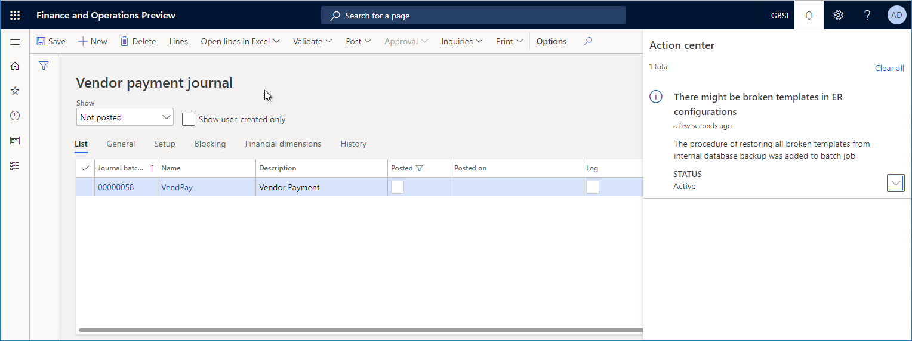

---
# required metadata

title: Backup storage of ER templates
description: This topic explains how to use the Electronic reporting (ER) backup storage for recovery of templates.
author: NickSelin
manager: AnnBe
ms.date: 08/19/2019
ms.topic: article
ms.prod: 
ms.service: dynamics-ax-platform
ms.technology: 

# optional metadata

ms.search.form: ERWorkspace, ERSolutionTable
# ROBOTS: 
audience: Application User, Developer, IT Pro
# ms.devlang: 
ms.reviewer: kfend
ms.search.scope: Operations
# ms.tgt_pltfrm: 
ms.custom: 27621
ms.assetid:
ms.search.region: Global
# ms.search.industry: 
ms.author: nselin
ms.search.validFrom: 2019-08-13
ms.dyn365.ops.version: 10.0.5

---

# Backup storage of ER templates

The [Electronic reporting (ER) framework](general-electronic-reporting.md) empowers business users to configure formats for outbound documents in accordance with the legal requirements of various countries/regions. Configured ER formats can generate outbound documents in different formats including Microsoft Excel workbooks, Microsoft Word documents, or PDF documents by using predefined templates. The templates are populated with data that is required in accordance with the configured dataflow for generated documents. Each configured format can be published as part of an ER solution. Each ER solution can be exported from one instance of Dynamic 365 for Finance and Operations and imported to another one.

The ER framework uses the [Document management framework](../../fin-and-ops/organization-administration/configure-document-management.md) to keep required templates for the current instance of Finance and Operations. Depending on the settings of ER framework, the Azure blob storage or SharePoint folder can be selected as the physical primary storage of templates. For more information, see [Configure the ER framework](electronic-reporting-er-configure-parameters.md). The **DocuValue** table keeps an individual record for each template. Each record contains the **AccessInformation** field which stores the path to a template file located in the configured storage.

When you manage your Finance and Operations instances, you may decide to migrate the current instance to another location. For example, you might migrate your production instance to a new sandbox environment. If you configured ER to store templates in the Azure blob storage. the **DocuValue** table in your new sandbox environment will refer to the production Azure blob storage. However, this isn't accessible from your sandbox environment because the migration process does not support the migration of artifacts in the Azure blob storage. If you try to run an ER format that uses a template to generate business documents, an exception will occur that will inform you about the missing template. You will also be guided to use the ER cleanup tool to delete and then re-import the ER format configuration that contains the template. Because you might have several ER format configurations, this could be time consuming.
The Backup template storage feature can help you make your templates always available to generate of business documents.

> [!NOTE]
> This feature can only be used when the Azure blob storage has been selected as the physical storage of ER templates.

This feature implies that every template of a new ER format configuration of the current environment is automatically saved in the backup storage of templates (the **ERDocuDatabaseStorage** database table):

- When you import a new template with an ER format configuration.
- When you complete the draft version of a new templates that contains the ER format configuration.

Backup copies of templates will migrate to a new instance of Finance and Operations as part of the application database.

When a template with an ER configuration is needed, for example to process vendor payments, and the required template is not found in the primary storage:

- The template is automatically taken from the backup storage (when available), restored to the primary storage, and used for the current execution.
- Every user assigned to the **Electronic reporting developer** or **System administrator** roles is informed through the Action center about this situation with missing templates.

Depending on the value in the parameter field, **Automatically run the procedure of restoring the broken templates in batch**, a message will open:

- When this parameter is **Off**, the message suggests that you start the batch process to automatically fix similar issues for other ER format configuration templates. The message contains a link to automatically start the batch process. 
- When this parameter is **On**, the message provides a notification that the missing templates issue has been discovered and a new batch process, **Restore broken templates from internal database backup** has been automatically scheduled. This batch process will automatically fix similar issues for other templates. 

The execution log of the completed batch process **Restore broken templates from internal database backup**, which automatically fixes broken templates, contains information about the templates that have been restored from the backup storage to the permanent location.

By default, the process of automatically creating backup copies of templates that reside in ER format configurations is turned on. If you want to stop making backup copies of templates, turn on the **Stop making backup copies of template** option in the **Electronic reporting parameters** page which you can open from the ER workspace.

If you upgraded your environment to the 10.0.5 release and want to migrate to a new environment that has runnable ER format configurations, select the **Fill in backup storage** option in the Electronic reporting parameters page before this migration. It will start the process of making backup copies of all available templates to store them in the ER backup storage of templates.

If you decided to stop making backup copies of templates by enabling the **Stop making backup copies of template** option and don’t want to keep previously collected backup copies of templates, select the **Clean backup storage** option on the **Electronic reporting parameters** page.

## Supported deployments
With the release of 10.0.5, the **Backup storage of ER templates** feature is available only in cloud deployments. 

## Additional resources

[Electronic reporting overview](general-electronic-reporting.md)

[Configure the Electronic reporting framework](electronic-reporting-er-configure-parameters.md)
