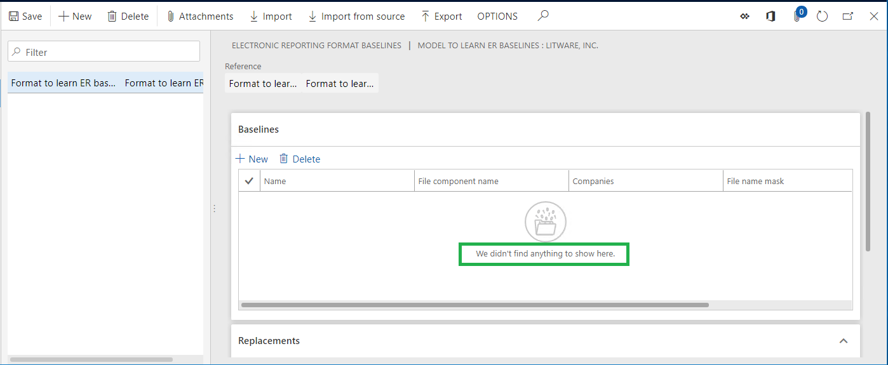
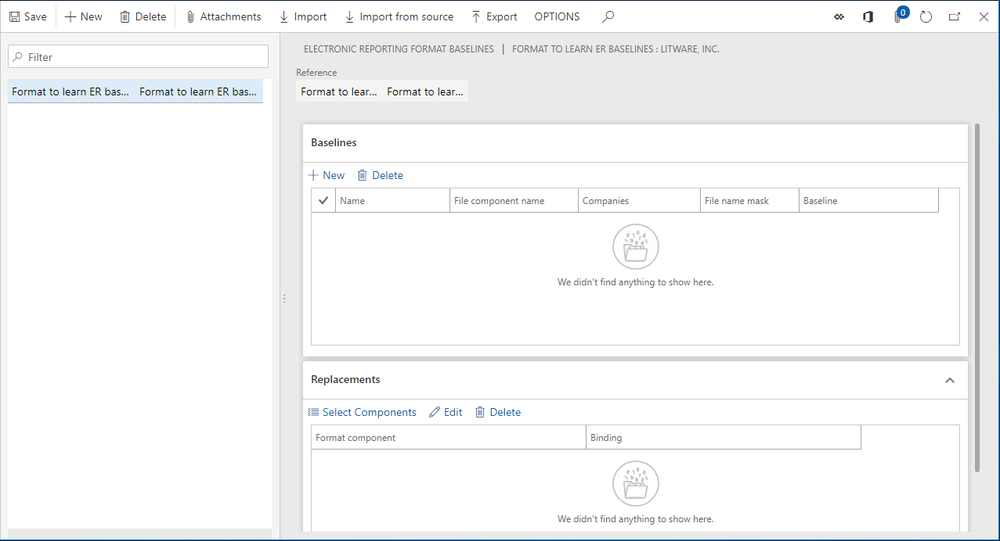
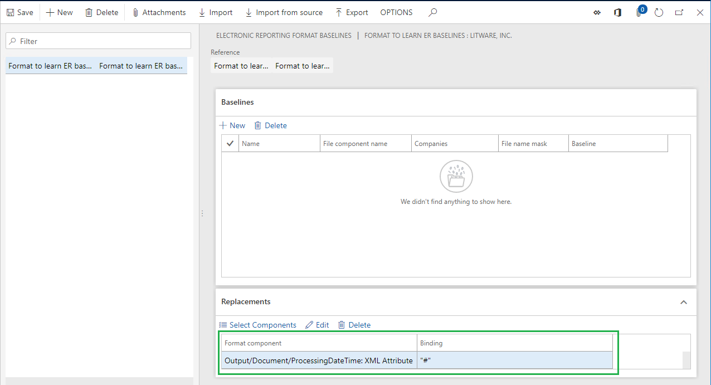
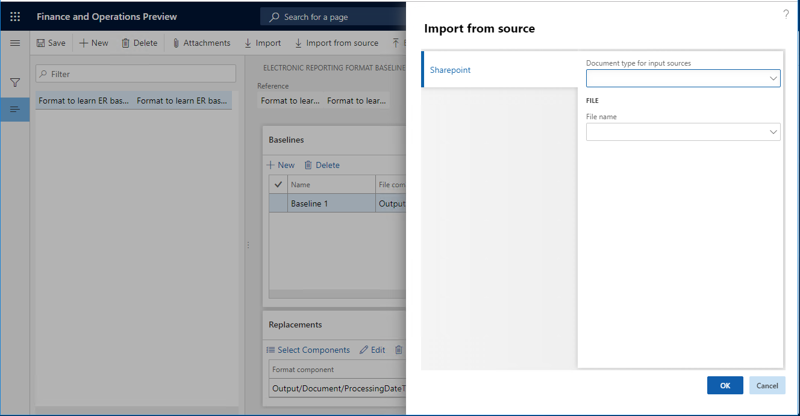

---
# required metadata

title: Improvements in tracing results of generated ER reports and comparing them with baseline values
description: This topic provides information about how the ER baseline feature has been improved with the release of 10.0.3.
author: NickSelin
manager: AnnBe
ms.date: 06/19/2019
ms.topic: article
ms.prod: 
ms.service: dynamics-ax-platform
ms.technology: 

# optional metadata

# ms.search.form: ERSolutionTable
# ROBOTS: 
audience: Application User, Developer, IT Pro
# ms.devlang: 
ms.reviewer: kfend
ms.search.scope: Core, Operations
# ms.tgt_pltfrm: 
ms.custom: 220314
ms.assetid: 2685df16-5ec8-4fd7-9495-c0f653e82567
ms.search.region: Global
# ms.search.industry: 
ms.author: nselin
ms.search.validFrom: 2018-04-01
ms.dyn365.ops.version: Release 8.0

---

# Improvements in tracing results of generated ER reports and comparing them with baseline values

[!include[banner](../includes/banner.md)]

This topic describes the first set of improvements that have been made to the Electronic reporting (ER) framework baseline feature. These improvements are available in Microsoft Dynamics 365 for Finance and Operations starting from the 10.0.3 version.

## Automate the setting of baseline rules

The [Trace generated report results and compare them with baseline values](er-trace-reports-compare-baseline.md) topic explains how to configure the Electronic reporting (ER) framework to collect information about ER format executions and evaluate the results of those executions. The example in this topic provides the set of steps that must be completed.

Some of the steps include:

- Execute an ER format to generate an outbound file and store it locally
- Add the locally stored file as an attachment of the baseline added for an ER format
- Configure the baseline rule for an added baseline that includes the following:

    - Specify an ER format element that is used to generate an outbound file
    - Select the attachment that refers to generated outbound file

> [!NOTE]
> These steps need to be performed manually even though the new ER capabilities allow them to be automated. To learn more about this feature, complete the example in this topic below.

## Example: Automate the setting of baseline rules

To complete the steps in this example, you must first complete the steps of the example in [Trace generated report results and compare them with baseline values](er-trace-reports-compare-baseline.md) up to the section, **Add a new baseline for a designed ER format** inclusively.

### Review added baseline
1. Go to **Organization administration** \> **Electronic reporting** \> **Configurations**.

The **Baselines** option is available on the Action Pane. This means that the ER user parameter **Run in debug mode** is turned on for the current company.

2. Select **Baselines**.

The baseline has been added for the selected **Format to learn ER baselines** format and the baseline rules have not been added for this baseline yet.

### Make a new baseline rule
1. Go to **Organization administration** \> **Electronic reporting** \> **Configurations**.
2. In the tree, expand **Model to learn ER baselines**.
3. In the tree, select **Model to learn ER baselines\Format to learn ER baselines**.
4. On the **Versions** FastTab, select **Run**.
5. In the **Enter ID** field, type **1**.
6. In the **Make baseline files** field select **Yes** and then select **OK**.

7. Select **Baselines**.

> [!NOTE]
> The generated outbound file has been automatically attached to the baseline of the executed ER format. The baseline rule has been automatically added to this baseline as well as containing the reference to the attached file.

8. In the **Name** field, type **Baseline 1**.
9. In the **File name mask** field, type **.xml** and then select **Save**.

### Run format

Now you are ready to complete the remaining steps in the example in [Trace generated report results and compare them with baseline values](er-trace-reports-compare-baseline.md) page continuing from the section **Run the designed ER format and review the log to analyze the results**.

> [!NOTE]
> When you delete the automatically added baseline rule on the **Baselines** FastTab, the referred attachment is not deleted automatically.

## Configure baseline as insensitive to constantly changing parts of ER output

When an ER format has been designed to contain information that is changed when the format is executed, the format must be required to use the ER baseline feature to compare with basline values. For example, it can be the processing date & time or the unique identifier of a generated document in different formats (GUID, etc.). The new ER capabilities allow you to configure your baseline rule to ignore such changeable elements of an ER format when the format is executed with the purpose of comparing baseline values with the results of its execution. To learn more about this feature, complete the following example.

## Example: Configure baseline as insensitive to constantly changing parts of ER output

To complete the steps in this example, you must first complete the steps of the example in [Trace generated report results and compare them with baseline values](er-trace-reports-compare-baseline.md).

### Modify a configured ER format

1. Go to **Organization administration** \> **Electronic reporting** \> **Configurations**.
2. In the tree, expand **Model to learn ER baselines**.
3. In the tree, select **Model to learn ER baselines\Format to learn ER baselines**.
4. Select **Designer**, and in the tree, select **Output\Document**.
5. Select **Add** to open the drop dialog.
6. In the tree, select **XML\Attribute**.
7. In the **Name** field, type **ProcessingDateTime** and then click **OK**.
8. Select the **Mapping** tab, and in the tree, select **Output\Document\ProcessingDateTime**.
9. Select **Edit formula**.
10. In the **Formula** field, enter the following expression: **DATETIMEFORMAT(NOW(), "O")**
11.	Select **Save** and then select **Test**.
12.	Select **Test** again to text the configured expression once more.

> [!NOTE]
> The **Test results** pane indicates that the configured expression returns a different date & time value whenever this expression is called.

13.	Close the **Formula designer** page and then click **Save**.

16.	Close the Electronic reporting Operations designer page.

### Remove an existing baseline rule

1. Go to **Organization administration** \> **Electronic reporting** \> **Configurations**, and on the **Configurations** page, select **Baselines**.
2. In the list of baselines, select the baseline configured for the **Format to learn ER baselines** format.
3. On the **Baselines** FastTab, select **Delete** to remove the earlier configured baseline rule.

### Define replacements for bindings of designed ER format

1. On the **Replacements** FastTab, select **Select components**.
2. In the format components tree, expand **Output**, expand **Output\Document**, and then check **Output\Document\ProcessingDateTime**.

3. Select **OK**.

> [!NOTE]
> The selected ER format component has been added to the list of components on the **Replacements** FastTab. These components will behave in a special way when the base ER format is executed in debug mode. The actual format’s binding of each of such component will be replaced by the binding that is shown in the **Binding** column. Select **Edit** to modify the default binding for a component in the grid of the **Replacements** FastTab.

### Make a new baseline rule

Complete the steps in the **Automate the setting of baseline rules example** section earlier in this topic. Because the outbound file has been generated by using baseline settings, forcing a replacement of real format bindings, the user is informed from an Infolog.

### Suppress warnings about the replacement of format bindings

You can suppress Infolog warnings about the replacement of format bindings by enabling specific ER parameters. This supression can be useful when format bingings are replaced in and unattended model by using the Regression Suite Automation Tool. In this case, the warning can be considered as a failure of the running test case.

1. On the Action Pane, select **Configurations** and then select **User parameters**.
2. In the **Suppress baseline warnings** field select **Yes**, and then select **OK**.

### Review generated baseline file

1. Go to **Organization administration** \> **Electronic reporting** \> **Configurations**.
2. Select **Baselines** and then select **Attachments**.

> [!NOTE]
> The generated file contains the processing date and time text **“#”** from the binding that has been configured in the added baseline rule, not from the format’s binding.

3. Close the **Attachments** page.

### Run the designed ER format and review the log to analyze the results

1. Go to **Organization administration** \> **Electronic reporting** \> **Configurations**.
2. In the tree, expand **Model to learn ER baselines**.
3. In the tree, select **Model to learn ER baselines\Format to learn ER baselines**.
4. On the **Versions** FastTab select **Run**.
5. In the **Enter ID** field, type **1** and then select **OK*.
6. Go to **Organization administration** \> **Electronic reporting** \> **Configuration debug logs**.

> [!NOTE]
> The execution log contains information about the results of the comparison of generated file with the configured baseline. The log indicates that they are equal despite the fact that the executed format contains the binding to populate to the outbound file a constantly changing date and time value.
> Despite the fact that the outbound file has been generated by using baseline settings which force the replacement of real format bindings, the Infolog does not contain warnings about that.

## Exchange settings of baselines

The new ER capabilities allow you to export baseline settings for the selected ER format from the current Finance and Operations environment and store them as XML files. Select **Export** on the **Electronic reporting Format baselines** page.

Exported baseline settings can be imported to another Finance and Operations environment. The environment must be imported as an ER format first and then it's baseline settings can be imported.

On the **Electronic reporting Format baselines** page, select **Import** if you want to import baseline settings from the locally stored XML file that is selected manually.

On the **Electronic reporting Format baselines** page, select **Import from source** to import baseline settings from the manually selected XML file stored on the SharePoint server based on the current Document management settings and the selected document type. The required document type to access the SharePoint folder must configured in advance.

> [!NOTE]
> The steps for entering the required document type and file name in the dialog page of a user importing baseline settings can be recorded by using the Task Recorder. It allows you to keep necessary baseline settings in SharePoint server and import them automatically by playing a task recording as part of execution of automated tests by using the Regression Suite Automation Tool.

## Additional resources

- [Trace generated report results and compare them with baseline values](er-trace-reports-compare-baseline.md)
- [Automate testing with electronic reporting](er-automate-testing.md)
- [Task recorder](../user-interface/task-recorder.md)
