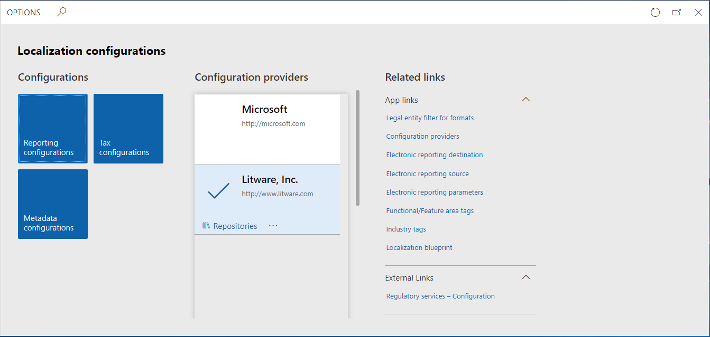
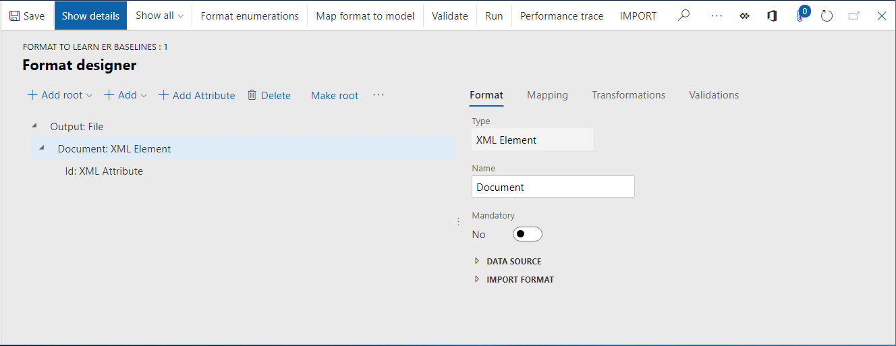
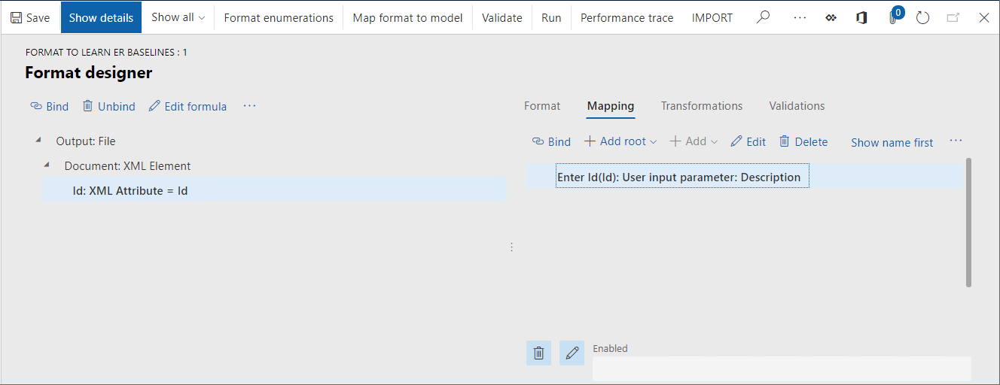
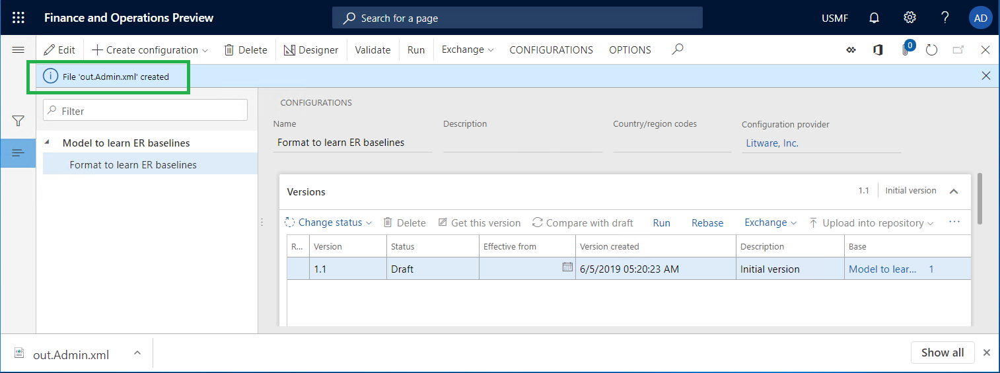
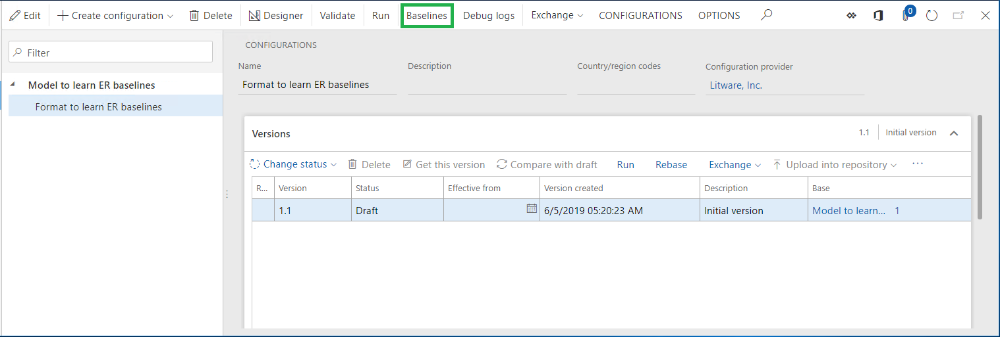
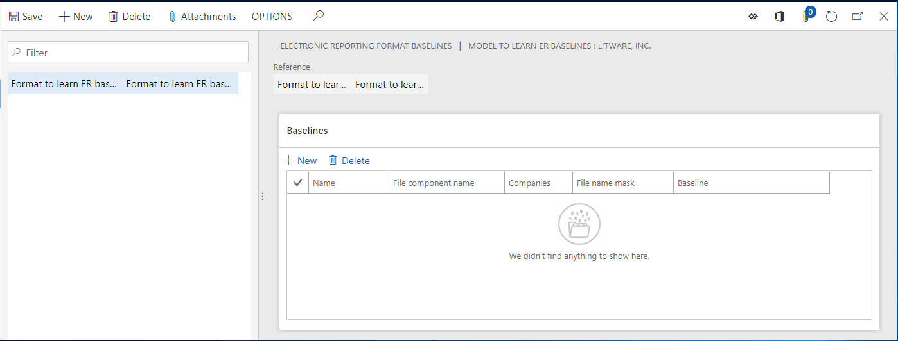
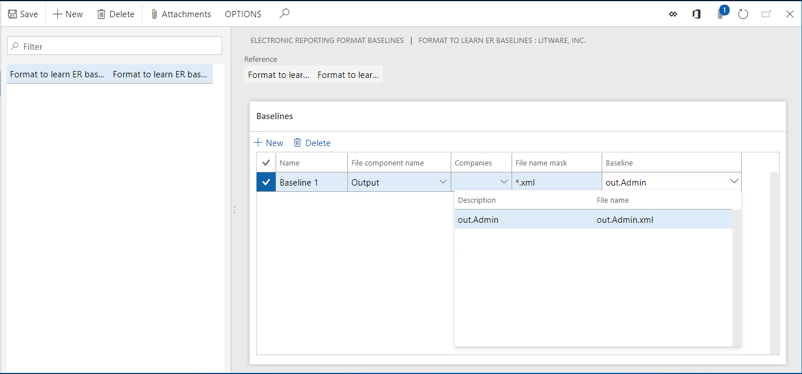

---
# required metadata

title: Trace generated report results and compare them with baseline values
description: This topic provides information about how you can compare the results of generated ER reports with baseline report values.
author: NickSelin
manager: AnnBe
ms.date: 06/17/2019
ms.topic: article
ms.prod: 
ms.service: dynamics-ax-platform
ms.technology: 

# optional metadata

# ms.search.form: ERSolutionTable
# ROBOTS: 
audience: Application User, Developer, IT Pro
# ms.devlang: 
ms.reviewer: kfend
ms.search.scope: Core, Operations
# ms.tgt_pltfrm: 
ms.custom: 220314
ms.assetid: 2685df16-5ec8-4fd7-9495-c0f653e82567
ms.search.region: Global
# ms.search.industry: 
ms.author: nselin
ms.search.validFrom: 2018-04-01
ms.dyn365.ops.version: Release 8.0

---

# Trace generated report results and compare them with baseline values

[!include[banner](../includes/banner.md)]

You can trace the results of Electronic reporting (ER) formats that generate outgoing electronic documents. When trace generation is turned on (ER user parameter **Run in debug mode**), a new trace record is generated in the ER format execution log every time that an ER report is run. The following details are stored in each trace that is generated:

- All warnings that were generated by validation rules
- All errors that were generated by validation rules
- All generated files that are stored as attachments of the trace record

You can store individual baseline application files for any ER format. Files are considered baseline files when they describe the expected results of reports that are run. If a baseline file is available for an ER format that was run while trace generation was turned on, the trace stores, in addition to the details that were mentioned earlier, the result of the comparison of the generated electronic document to the baseline file. In one click, you can also get the generated electronic document and its baseline file in a single zip file. You can then do detailed comparison by using an external tool such as Windiff.

You can evaluate the trace to analyze whether the electronic documents that are generated include the expected content. You can do this evaluation in a user acceptance testing (UAT) environment when the code base has been changed (for example, when you migrated to a new instance of the application, installed hotfix packages, or deployed code modifications). In this way, you can make sure that the evaluation doesn't affect the execution of ER reports that are used. For many ER reports, the evaluation can be done in unattended mode.

To learn more about this feature, play the **ER Generate reports and compare results (Part 1)** and **ER Generate reports and compare results (Part 2)** task guides, which are part of the **7.5.4.3 Test IT services/solutions (10679)** business process, and can be downloaded from the [Microsoft Download Center](https://go.microsoft.com/fwlink/?linkid=874684). These task guides walk you through the process of configuring the ER framework to use baseline files to evaluate generated electronic documents.

## Example: Trace generated report results and compare them with baseline values

This procedure explains how to configure the ER framework to collect information about ER format executions and then evaluate the results of those executions. As part of that evaluation, generated documents are compared with their baseline files. In this example, you will create the required ER configurations for the sample company, Litware, Inc. This procedure is intended for users who have the System administrator or Electronic reporting developer role assigned to them. These steps can be completed by using any data set.

To complete the steps in this example, you must first complete the steps in the topic, [Create a configuration provider and mark it as active](tasks/er-configuration-provider-mark-it-active-2016-11.md).

1. Go to **Organization administration** \> **Workspaces** \> **Electronic reporting**.
2. On the **Localization configurations** page, in the **Configuration providers** section, verify that the configuration provider for the Litware, Inc. sample company is listed, and that it's marked as **Active**. If you don't see this configuration provider, follow the steps in the topic, [Create a configuration provider and mark it as active](tasks/er-configuration-provider-mark-it-active-2016-11.md).

### Configure document management parameters
1. In Finance and Operations, go to **Organization administration** \>  **Document management** \> **Document types page** and create a new document type that will be used to store baseline files. In the **Class** field, enter **Attach file** and in the **Group** field, enter **File**.

> [!NOTE]
> A new document type with same name must be configured for each data set in which you plan to use the ER baseline feature.

### Configure ER parameters to start using the baseline feature
1. In the **Electronic reporting** workspace, select **Electronic reporting parameters**.

2. Select the **Attachments** tab, and in the **Baseline** field, enter or select the document type you just created.

3. Select **Save**, and then close the **Electronic reporting parameters** page.

### Add a new ER model configuration
1.	In the **Electronic reporting** workspace, select **Reporting configurations**.
2.	Select **Create configuration** to open the drop dialog and in the **Name** field, enter **Model to learn ER baselines**.
3.	Select **Create configuration** to confirm a new ER data model entry.

### Design a data model
1.	Select **Designer**, and then select **New** to open the drop dialog.
2.	In the **Name** field, type **Root** and then select **Add**.
3.	Select **Root reference**.
4.	Select **OK** and then click **Save**.
5.	Close the Model designer page.
6.	Select **Change status**.
7.	Select **Complete** and then click **OK**.

### Add a new ER format configuration
1. Select **Create configuration** to open the drop dialog.
2. In the **New** field, select **Format based on data model Model to learn ER baselines**.
3. In the **Name** field, enter **Format to learn ER baselines**.
4. Select **Create configuration** to confirm a new ER format entry.

### Design a format
For this example, you will create a simple ER format to generate XML documents. 
    
1. Select **Designer**, and then select **Add root** to open the drop dialog.

    1. In the tree, select **Common\File**.
    2. In the **Name** field, type **Output** and then select **OK**.
    
2. Select **Add** to open the drop dialog.

    1. In the tree, select **XML\Element**.
    2. In the **Name** field, type **Document** and then select **OK**.
    
3. In the tree, select **Output\Document**.
4. Select **Add** to open the drop dialog.

    1. In the tree, select **XML\Attribute**.
    2. In the **Name** field, type **ID** and then select **OK**.

5. On the **Mapping** tab, select **Delete**.
6. Select **Add root** to open the drop dialog.
7. In the tree, select **General\User input parameter**.

    1. In the **Name** field, type **ID**.
    2. In the **Label** field, type **Enter ID** and then select **OK**.
    
8. In the tree, select **Output\Document\Id**.
9.	Select **Bind** and then select **Save**.

Based on the designed structure, the configured format will generate an XML file that contains the **Root** element with the **ID** attribute having the value that is entered by the user at the ER runtime dialog.

### Generate a new baseline file for a designed ER format
1.	On the **Versions** FastTab, select **Run**.
2.	In the **Enter ID** field, type **1**, and then select **OK**.

3.	Save a local copy of the generated **OUT.ADMIN.XML** file so that you can use it later as a baseline for this ER format.

### Configure ER parameters to use the baseline feature
1.	On the Action Pane, select **Configurations** and then select **User parameters**.
2.	In the **Run in debug mode** field, select **Yes**.
3.	Select **OK**.

### Add a new baseline for designed ER format
1.	Go to **Organization administration** \> **Electronic reporting** \> **Configurations**.
2.	Select **Baselines**.

3.	On the Action Pane, select **New**.
4.	Select the ER format, **Format to learn ER baselines** that you previously designed.
5.	Select **Save**.

The baseline has been added for the selected **Format to learn ER baselines** format.

### Configure a baseline rule for added baseline
1. On the **Configurations** page, select **Attachments**, and then select **New**.
2. Select the **File** document type. This document type should have been previously selected in ER parameters as the document type used to store baseline files.
3. Click **Browse** and navigate to the **OUT.ADMIN.XML** file that was generated when you executed the configured ER format earlier.

4. Close the **Attachments** page.
5. On the **Baselines** FastTab, select **New**.
6. In the **Name** field, type **Baseline 1**.
7. In the **File component name** field, enter or select the **Output** value. This selection means that the configured baseline will be compared with a file that is generated using the **Output** format element.
8. In the **File name mask** field, type ***.xml**. 

> [!NOTE]
> You can define the file name mask. When the file name mask is defined, the baseline record will be used to evaluate the generated output only when the name of the output file that is generated satisfies that mask.

9. In the **Companies** field, select the desired companies if you want to use the configured baseline only when the **Format to learn ER baselines** ER format is executed by user logged to one of them.
10.	In the **Baseline** field, enter or select the **OUT.ADMIN** attachment, and then click **Save**.

### Run the designed ER format and review the log to analyze the results
1. Go to **Organization administration** \> **Electronic reporting** \> **Configurations**.
2. In the tree, expand **Model to learn ER baselines**, and then select **Model to learn ER baselines\Format to learn ER baselines**.
3. On the **Versions** FastTab, select **Run** .
4. In the **Enter ID** field, type **1** and then select **OK**.
5. Go to **Organization administration** \> **Electronic reporting** \> **Configuration debug logs**.

> [!NOTE]
> The execution log contains information about the results of the comparison of the generated file with the configured baseline which indicates that they are equal.

6. Select **Delete all**.

### Run the designed ER format and review the log to analyze the results
1. Go to **Organization administration** \> **Electronic reporting** \> **Configurations**.
2. In the tree, expand **Model to learn ER baselines**, and then select **Model to learn ER baselines\Format to learn ER baselines**.
3. On the **Versions** FastTab, select **Run**.
4. In the **Enter ID** field, type **2** and then select **OK**.
5. Go to **Organization administration** \> **Electronic reporting** \> **Configuration debug logs**.

> [!NOTE]
> The execution log contains information about the results of the comparison of the generated file with the configured baseline which indicates that they are different.

6. Select **Compare**.

> [!NOTE]
> The generated file and the baseline file are offered as a zip file. You can use external comparison tools such as WINDIFF to compare the files and review the differences.

## Additional resources

- [Configure ER framework](electronic-reporting-er-configure-parameters.md)
- [Automate testing with electronic reporting](er-automate-testing.md)
