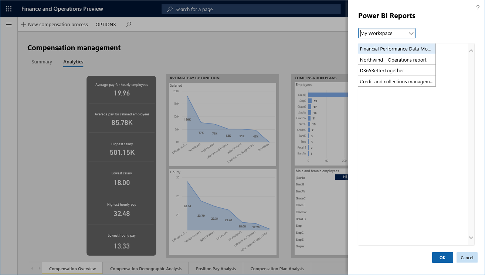
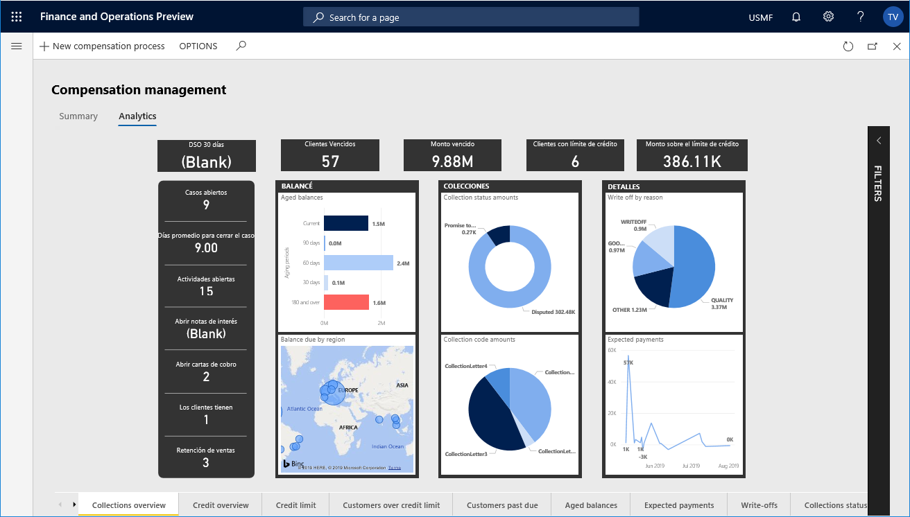
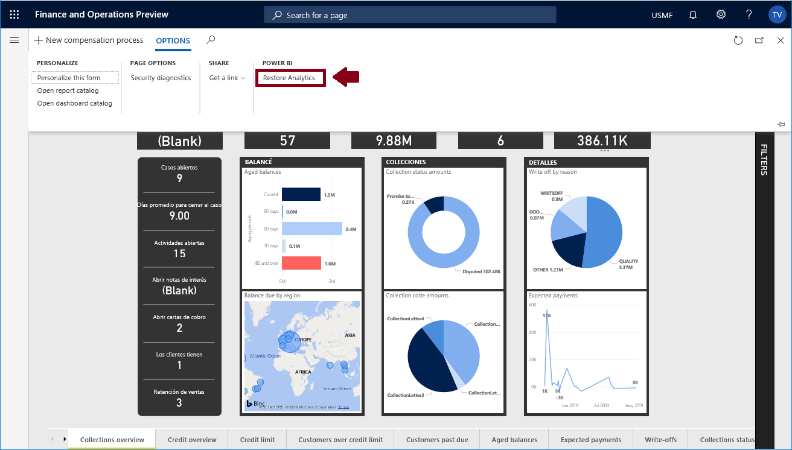

---
# required metadata

title: Select Analytical Workspace from PowerBI.com 
description: This topic explains how to select a report hosted on PowerBI.com for an application workspace.
author: tjvass
manager: AnnBe
ms.date: 06/19/2019
ms.topic: article
ms.prod: 
ms.service: dynamics-ax-applications
ms.technology: 

# optional metadata

# ms.search.form:
# ROBOTS:
audience: IT Pro
# ms.devlang: 
ms.reviewer: kfend
ms.search.scope: Operations
# ms.tgt_pltfrm: 
# ms.custom:
ms.search.region: Global
# ms.search.industry:
ms.author: tjvass
ms.search.validFrom: 2019-07-18 
ms.dyn365.ops.version: Platform update 27
---

# Select Analytical Workspace from PowerBI.com

[!include[banner](../includes/banner.md)]

## Analytical Workspaces
Analytical Workspaces that are bundled with the application Suite offer users relevant insights into their business data. However, there will be cases where it makes sense to replace the standard reports with custom solutions that are designed specifically for users in your organization.  

PowerBI.com provides world-class tooling for producing analytical solutions that contain mash-up views with data from external sources.  With the release of Microsoft Dynamics Finance and Operations Platform update 28, power users can replace the standard embedded solutions with reports that are hosted on PowerBI.com.    

> [!IMPORTANT]
> This is not an exercise of personalization. Customizing analytical workspaces applies to all users within the active Legal Entity.

### Motivations for embedding PowerBI.com report
Although standard solutions deliver insights tailored for a given business persona, there will be cases where an organization prefers a custom solution. Finance and Operations allows a Power User to promote custom solutions hosted on PowerBI.com which are shared with members of the organization.  

The following are a few of the top motivations for selecting reports hosted on PowerBI.com:

- PowerBI.com reports support data-mashups with external data sources and are accessible outside of Finance and Operations.
- These reports are appropriate for demonstrating custom solutions hosted on PowerBI.com that are embedded in the application on 1-Box deployment. 
- Organizations with Power BI Premium services want to augment the standard solutions.

### Embedding a PowerBI.com report into an Analytical Workspace
To replace the standard application solutions, you must be a member of the System Report Editors security group. Members of this security group have access to options in the Application Workspaces that allow them to customize the standard solution. In this example, we will replace the standard Analytical Workspace with a customer report hosted on PowerBI.com

1. Log into Finance and Operations and access the Application Workspace you'll be customizing. Here, we'll replace the standard analytical report embedded in the **Compensation management** Workspace.

  
2. Select the **Analytics** tab to access the workspace's embedded analytical report.

 
By default, you will see the standard Analytical Workspace solution that is packaged with your Finance and Operations application.  These reports are automatically deployed and configured for your environment during the provisioning process.

> [!NOTE]
> The Analytical Workspaces require a hosted Power BI service which is only available for dedicated environments. Review related articles for insights on **Accessing Analytical Workspaces on 1-Box environment**.

3. In the top navigation, select the **Options** menu, locate the **POWER BI** section, and then select **Select Analytics**. This will expand the **Power BI Reports** portfolio selection control.

  
This form allows you to select from the collection of reports that have been shared on PowerBI.com service. The reports are organized into Workspace collections.

4. Expand the drop-down to choose the workspace that contains the report.
5. Select the report to embed in the Application Workspace and then click **OK**.
6. Reload the page to view the workspace. To do this, you can navigate away fromthe workspace and return, or refresh your browser. 
7. In the **Compensation management** workspace, select the **Analytics** to access the PowerBI.com report embedded in the Analytical Workspace.

### Revert to the standard solution
After a PowerBI.com report has been embedded into an Application Workspace, updates to the solution are reflected immediately for Finance and Operations users. However, to replace the report with another PowerBI.com solution, a Power user must first revert back to the standard application solution. Use the following steps to revert back to the standard application solution.

1. In the top navigation, on the **Options** menu,  locate the **POWER BI** section, and then select **Restore Analytics**.  

  
2. To view the workspace updates you must reload the page be either navigating away or refreshing your browser. Enter the **Compensation management** workspace and then click on the **Analytics** tab to access the standard solution embedded in the Analytical Workspace.

