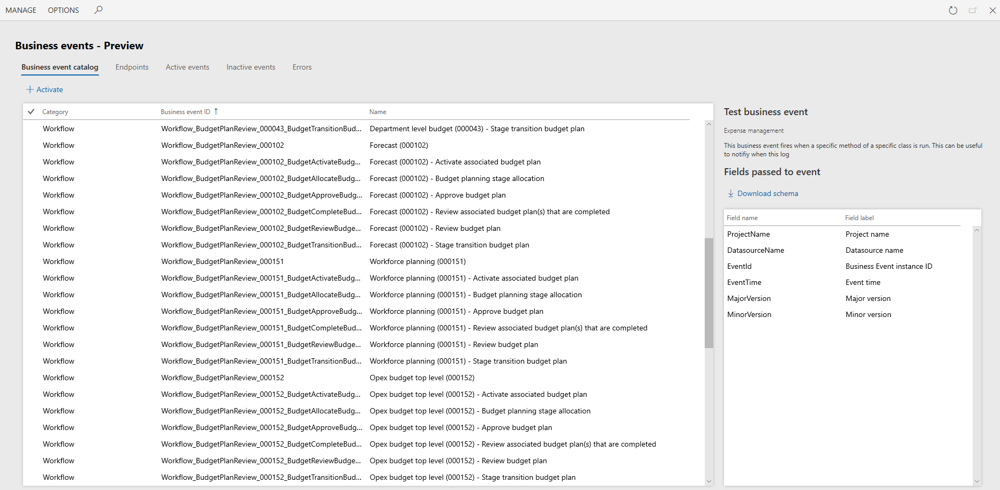
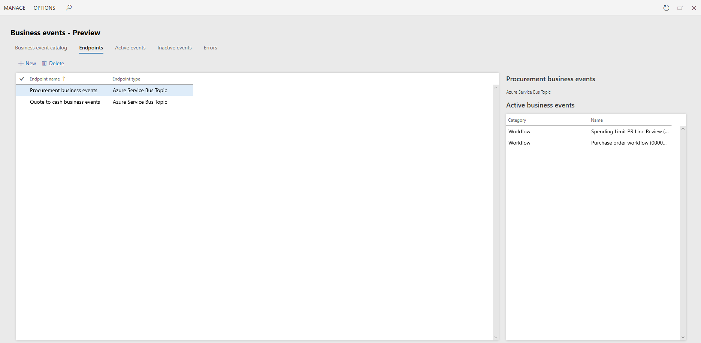
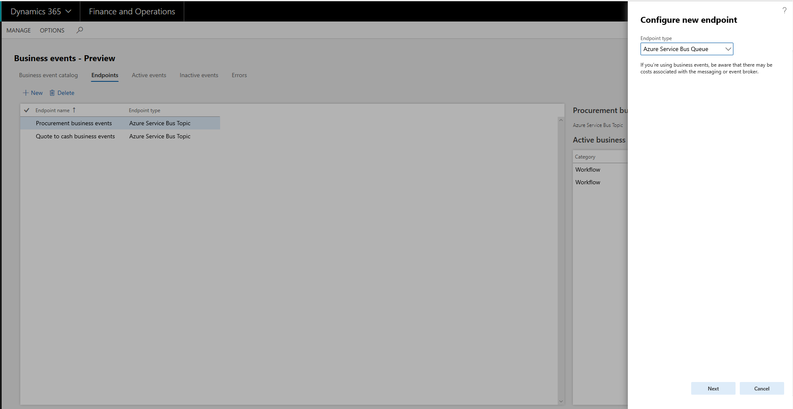
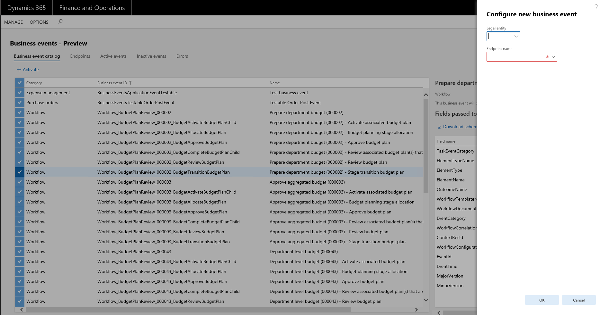
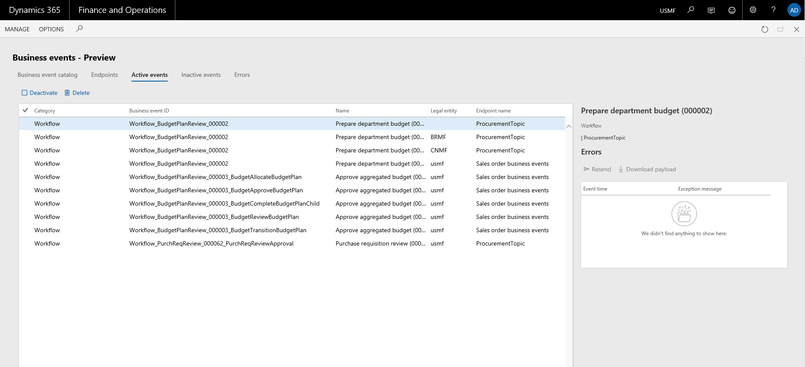

---
# required metadata

title: Business events home page
description: Business events happen when a business process gets executed. 
author: Sunil-Garg
manager: AnnBe
ms.date: 01/03/2019
ms.topic: article
ms.prod: 
ms.service: dynamics-ax-applications
ms.technology: 

# optional metadata

# ms.search.form:  [Operations AOT form name to tie this topic to]
audience: IT Pro
# ms.devlang: 
ms.reviewer: sericks
ms.search.scope: Operations, Core
# ms.custom: [used by loc for topics migrated from the wiki]
ms.search.region: Global for most topics. Set Country/Region name for localizations
# ms.search.industry: 
ms.author: sunilg
ms.search.validFrom: Platform update 24
ms.dyn365.ops.version: 2019-02-28
---

# Business events home page

[!include[banner](../includes/banner.md)]
[!include[banner](../includes/preview-banner.md)]

**Business events**

Business events happen when a business process gets executed. As part of
executing a business process, users participating in the business process take
business actions to complete tasks that make up the business process. In
Dynamics 365 for Finance and Operations, a business action taken by a user can
be a workflow action or a non-workflow action. Approving a purchase requisition
is an example of a workflow action while, confirming a purchase order is a
non-workflow action. However, both actions are eligible to generate business
events which could be of interest to external systems for integration and
notification use cases. Hence, business events in Finance and Operations enables
a mechanism for external systems receive business events and hence allowing such
applications to take a business action in response to the business event.

**Pre-requisites**

-   Since business events can be consumed via Microsoft Flow or Azure Service
    Bus or Azure Event Grid, customers must bring their subscriptions to the
    corresponding asset which would then help consume business events.
-   Business events is available from Platform update24 onwards. Hence, having this platform version at a minimum is a pre-requisite.

> [!IMPORTANT]
> Business events must not be construed as a mechanism to export data out of
Finance and Operations. The reason for this being, by definition, events are
supposed to be lightweight and nimble. Hence, it is not expected for a business
event to carry large payloads to fulfill data export scenarios.
**Enabling business events**

Business event functionality is disabled by default. This can be enabled by
following the below steps.

1.  Enabled the **BusinessEventsMaster** flight by executing the following SQL
    statement in non-production environments followed by an IIS reset.

    To enable on production environments, a support case must be created with
    Microsoft.

    INSERT INTO SYSFLIGHTING VALUES (‘**BusinessEventsMaster’**, 1, 12719367,
    Partition, RecID, 1)

-   Partition is the partition id from the environment, which can be obtained by
    querying (select) for any record. Every record will have a partition ID that
    must be copied and used here.

-   RecID can be same as partition. However, if multiple flights are enabled,
    then this can be partition ID + 'n' to ensure it has a unique value

**Business events implemented in Finance and Operations**

Dynamics 365 for Finance and Operations has business events implemented in
certain business processes out of the box. These business events cover both
workflow and non-workflow business events. This is explained in detail in the
corresponding documentation under business events.

Any new business event that must be implemented will be a developer experience
using extensions. This is explained in detail in the developer documentation.

**Business event catalog**

The business event catalog shows the list of business events available in the
specific instance of Finance and Operations. The catalog is useful to know which
business events are available and can be filtered by category, business event id
and name. The business event category identifies the source of the business
event in Finance & Operations. Business events that originate in workflow are
categorized as Workflow while business events from other modules will be
categorized using the corresponding module name. The business event catalog is
built during DB sync at deployment time and hence, it is expected for users to
see the complete list of business events in the catalog. However, if an explicit
refresh of the catalog is required under certain circumstances, it can be
affected from **Manage \> Rebuilt business events catalog**.

For a business event, the catalog shows the description of the business event
which helps to understand more about what the business event is about and its
context in the business process. The list of data fields which will be sent out
in the event is also shown in the catalog. For use cases where external
integration systems would like to know the schema of the payload for a business
event during development, the **Download schema** option can be used to download
the JSON schema.

In summary, the business event catalog helps to identify which business events
are needed for an implementation and the schema for each of the identified
business event. The next step is to manage the end points.

**Endpoints**

Endpoints allow to manage the destination to which business events must be sent
to by Finance & Operations. The following endpoint types are currently supported
and hence, endpoints can be created for these messaging and event brokers out of
the box.

-   Azure service bus queue

-   Azure service bus topic

-   Azure event grid

Scenarios where multiple end points are needed to allow for organized
distribution of business events to consumers, can be realized by creating
multiple endpoints as needed.

The Azure based end points must be in the customers’ Azure subscription. As an
example, if an Azure event grid is being used as an endpoint then, the event
grid must be from the customer’s Azure subscription. Finance and Operations does
not provision the endpoints but, will use the provided end point to send
business events to. There may be additional costs incurred by customers for
using these endpoints in their Azure subscription.

**Azure service bus queue**

Clicking **New** starts the experience to create a new endpoint. To create an
Azure service bus queue end point, select the appropriate endpoint type as
shown.

Click **Next** to configure the endpoint name and Azure service bus queue name.
In addition, Azure key vault must be set up to provide the necessary secret to
the Azure messaging resource. Azure active directory application id and
application secret must also be set up as shown below.

The **Azure active directory application Id is** the application ID created in
your azure active directory in the Azure portal as shown below.

The **Azure application secret** is the secret value for the application created
above. This is shown below.

The **Key vault DNS name** is the name from your key vault set up. This is shown
below.

The **Key vault secret name** is the secret name for the end point resource
which must be created in your Azure key vault. This is shown below.

**Azure service bus topic**

Like creating an Azure service bus queue, an endpoint to Azure service bus topic
can be created by choosing the appropriate end point type. The **topic name**
must be the name of the service bus topic. The key vault information set up is
like what is explained in the Azure service bus queue set up.

**Azure event grid**

An endpoint to Azure event grid can be created by choosing the appropriate
endpoint type. The **endpoint URL** will be the URL from your Azure event grid
topic. The key vault information set up is like what is explained in the Azure
service bus queue set up.

Once the endpoint(s) are created as needed, the next step is to activate the
business events.

**Activating a business event**

Business events in the catalog are not active by default. Business events that
are required must be activated from the catalog. One or more business events can
be selected for activation which is done by clicking the **activate** button.

Business events can be activated for ‘all’ legal entities or for specific legal
entities. If the legal entity is left blank, then the selected business event(s)
will be activated in all legal entities. If a business event is required only
for specific legal entities, then it must be configured separately per legal
entity. Endpoint must also be assigned to the selected business event(s) that
are being activated.

When business events happen as business processes are executed, the system will
perform outbound processing of the event only for activated business events.
Business events that are not activated will not be subjected to outbound
processing.

Activated business events will show up in the **active events** tab as shown
below.

From the **active events** tab, business events can be deactivated. The system
will not perform outbound processing for deactivated events. Deactivated events
will show up in the **inactive events** tab.

Deactivation of business events can be used in cases when business event
processing needs to be paused for a duration due to certain system maintenance
activities in the integration landscape.

When business requirements change and certain business events are no longer
needed, such business events can be deactivated as opposed to deleting them from
the active list. This approach will be useful in cases if the history of errors
on these business events must be preserved. Such deactivated business events can
be deleted later when there is no more business need to keep them deactivated.

**Errors**

While performing outbound processing of business events, errors can happen which
could prevent the system from successfully delivering the business event to the
endpoint. The system retries several times to successfully process the business
event. However, if all retries fail, the business event is saved in an error
log. Error logs are accessible from the **active events, inactive events** and
**errors** tab. The **errors** tab shows all errors across all business events
while the other tabs show errors in the context of a specific business event.

Each error can be subjected to on demand outbound processing via the **resend**
action. Resending invokes the outbound processing logic with retries. If the
outbound processing still fails, the error is logged in the error log. In such
cases, the **last process time** gives an indication of when the event was
attempted to be processed. This information is available in the **errors** tab.

In cases where the error cannot be successfully processed, the payload from the
event can be downloaded using the **download payload** option for offline
processing if needed.

**Note:**

If an endpoint is deleted and a new endpoint is associated to business events,
all errors associated to such business events are still available for resending.
In such cases, the system will perform outbound processing to send to the new
endpoint associated to the corresponding business event. This allows for a
graceful recovery from misconfiguration or other error states.

**Business event consumption models**

Integration requirements and integration solution design for implementations
vary. These requirements will play a role in identifying a consumption model for
business events. Finance and Operations enables the following consumption
models.

In summary, the following must be taken into consideration when designing
integrations using business events.

-   Business events can be consumed either via Microsoft Flow or Azure service
    bus or Azure event grid.

-   Customer’s must bring their own subscriptions for using Azure service bus or
    Azure event grid or Microsoft Flow.

-   A business event can be activated in all or specific legal entities

-   A business event in a legal entity can be sent to one and only one endpoint;
    messaging brokers enable 1:N consumption

-   A business event across unique legal entities can be sent to unique
    endpoints or same endpoints

-   Microsoft Flow can directly subscribe to business events

-   Endpoints like Azure service bus or Azure event grids enables ‘n’ consumers
    to subscribe and receive the events

