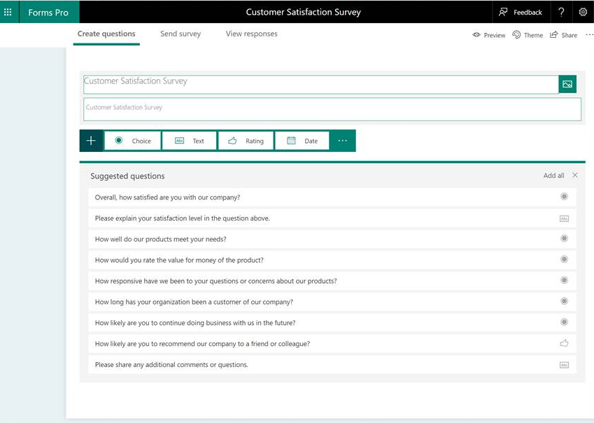
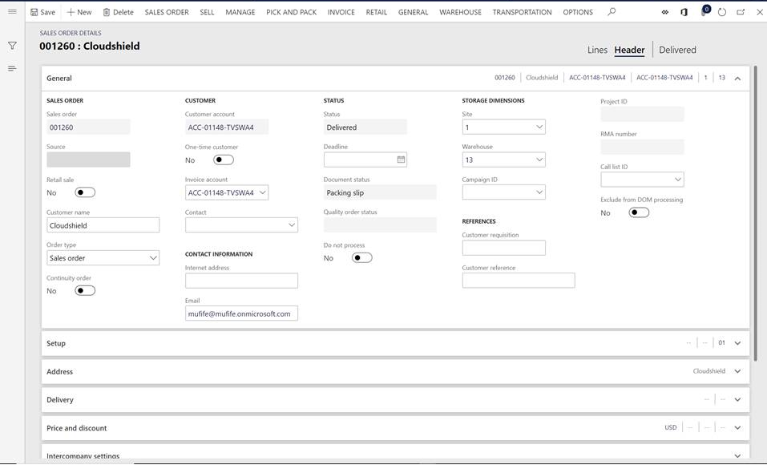
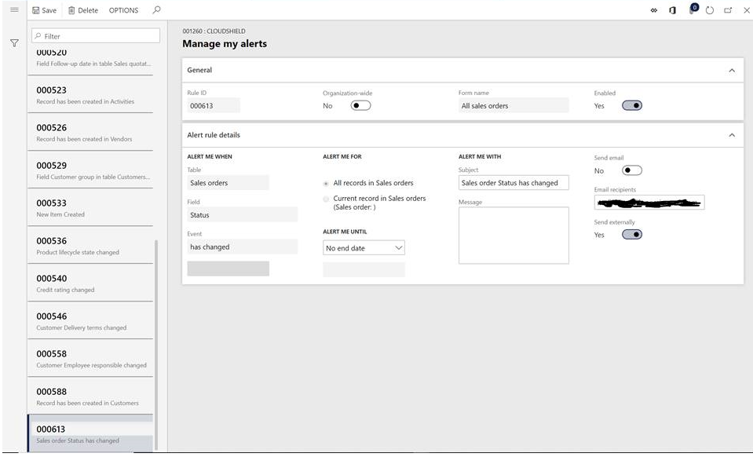
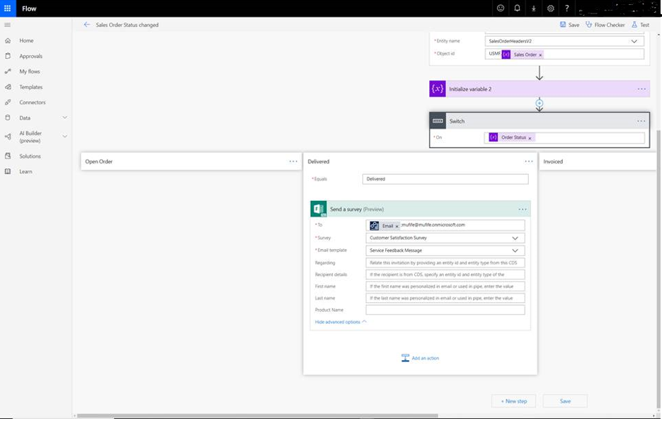
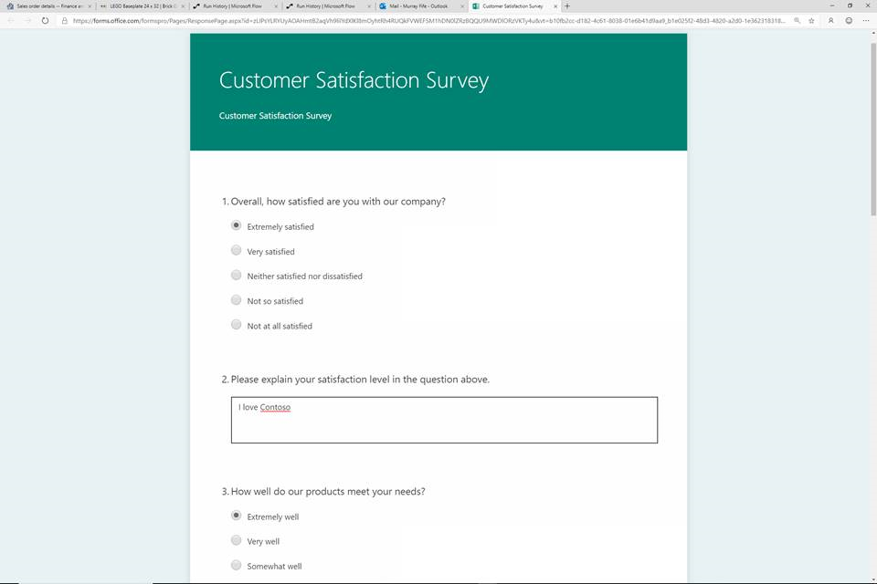
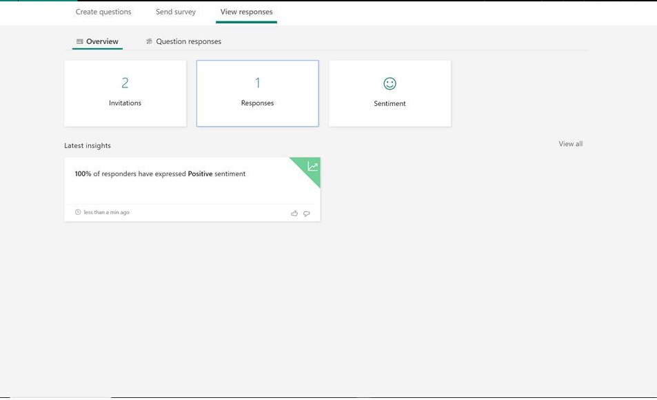

---
# required metadata

title: Use Microsoft Forms Pro with business events
description: This topic goes through a scenario where a survey is sent to users when a product has been shipped. The survey information is gathered by using Microsoft Forms Pro.
author: Sunil-Garg
manager: AnnBe
ms.date: 07/09/2019
ms.topic: article
ms.prod: 
ms.service: dynamics-ax-applications
ms.technology: 

# optional metadata

# ms.search.form:  [Operations AOT form name to tie this topic to]
audience: IT Pro
# ms.devlang: 
ms.reviewer: sericks
ms.search.scope: Operations, Core
# ms.custom: [used by loc for topics migrated from the wiki]
ms.search.region: Global for most topics. Set Country/Region name for localizations
# ms.search.industry: 
ms.author: sunilg
ms.search.validFrom: Platform update 27
ms.dyn365.ops.version: 2019-6-30 

---

# Use Microsoft Forms Pro with business events

[!include[banner](../../includes/banner.md)]

This topic goes through a scenario where Microsoft Forms Pro is used to create a survey that can be used with business events. Specifically, in the scenario that is described here, a survey is sent to customers when a product has been shipped. The survey information is gathered by using Forms Pro.

## Prerequisites

If you haven't used Forms Pro before, you should first read the [Forms Pro documentation](https://docs.microsoft.com/forms-pro/) to learn how to use it.

## Scenario

1. Create a survey. Based on the title that you enter for the survey, Forms Pro suggests survey questions.

    

2. The sales order tracks the shipment. When the product has been shipped, the status of the sales order is changed to **Delivered**.

    

    Therefore, configure an alert on the sales order, so that an alert is created whenever the value of the **Status** field is changed. Be sure to set the **Send externally** option to **Yes**, so that the alert will be sent out as a business event.

    

3. Set up the flow that will be triggered by the business event whenever the status of the sales order is updated (see the illustration in the next step). After it's triggered, the flow will use the Forms connector to send the survey to the customer email address that is registered on the sales order.

    The customer email address and other information that is required for the scenario must be in the payload of the business event. If the payload doesn't have this data, it can be extended so that it includes the appropriate fields. For more information, see the [Business events developer documentation](/business-events/business-events-dev-doc.md).

4. Because Microsoft Flow is used to orchestrate this scenario, don't activate the **When a change based alert occurs** business event in Microsoft Dynamics 365 for Finance and Operations. Instead, set up Microsoft Flow so that it subscribes directly to the business event.

    

5. After you've finished setting up the flow, it will be triggered and send out the survey whenever the sales order's status is updated.

    

    As users fill in the survey and submit it, Forms Pro shows some analytics.

    
