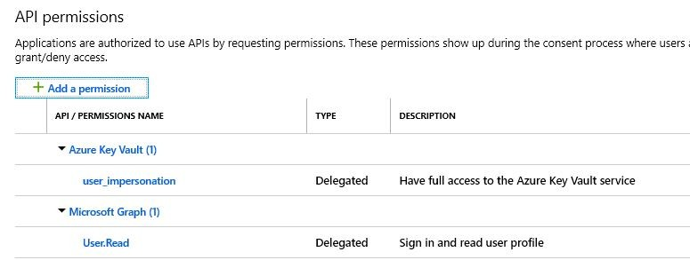
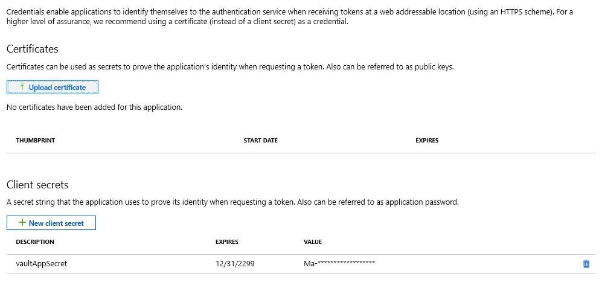
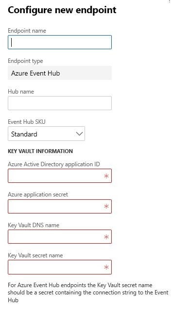

---
# required metadata

title: Use business events with Azure Event Hub
description: This tutorial provides the steps you must follow to make business events work with Azure Event Hub.
author: AXnU
manager: AnnBe
ms.date: 08/01/2019
ms.topic: article
ms.prod: 
ms.service: dynamics-ax-applications
ms.technology: 

# optional metadata

# ms.search.form:  [Operations AOT form name to tie this topic to]
audience: IT Pro
# ms.devlang: 
ms.reviewer: sericks
ms.search.scope: Operations, Core
# ms.custom: [used by loc for topics migrated from the wiki]
ms.search.region: Global
# ms.search.industry: 
ms.author: sunilg
ms.search.validFrom: Platform update 28
ms.dyn365.ops.version: 2019-07-31 

---

# Use business events with Azure Event Hub

[!include[banner](../../includes/banner.md)]

This tutorial provides the steps you must follow to make business events work with Azure Event Hub.

1. Create an active directory application registration. Be sure to note the app ID.

    

2. Give this app permissions to the Azure Key Vault API.

    

3. On the App registration, create an application secret (Copy down the value.)

   

4. On the azure key vault give permissions to the newly created app registration
    
    

5. Create a new secret in the vault , the value of this secret needs to be the connection string to your Event hub

    

6. Create a new endpoint configuration in Finance & Operations for the Event Hu.b Go to **System administration > Setup > Business events > Business events catalog > Tabpage Endpoints**.

    

7. Choose **Azure Event Hub** as the end point type in the **End point configuration wizard**.

8. Click **Next**.

9. Choose an endpoint name.

10. For the hub name, fill in the name of your Event Hub.

11. In the **Azure active directory application ID** field, enter the application ID that was created above.

12. In the **Application secret** field, enter the value that was created and copied above.

13. In the **Key vault name** field, enter the DNS name that can be found on the **Overview** tab of the Key vault configuration in your Azure portal.

14. In the **Key vault secret name** field, enter the name from the secret that was created above.

15. Click **OK**.

16. You can now activate one or more business events to be sent to this end point.

