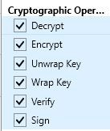
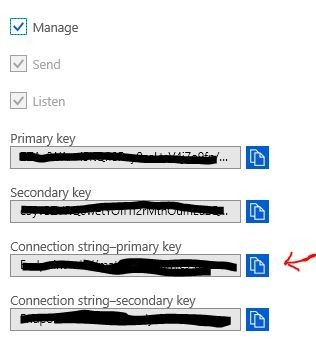

---
# required metadata

title: Business events and Azure Event Hubs
description: This tutorial describes the steps that you must follow to make business events work with Microsoft Azure Event Hubs.
author: AXnU
manager: AnnBe
ms.date: 08/13/2019
ms.topic: article
ms.prod: 
ms.service: dynamics-ax-applications
ms.technology: 

# optional metadata

# ms.search.form: [Operations AOT form name to tie this topic to]
audience: IT Pro
# ms.devlang: 
ms.reviewer: sericks
ms.search.scope: Operations, Core
# ms.custom: [used by loc for topics migrated from the wiki]
ms.search.region: Global
# ms.search.industry: 
ms.author: sunilg
ms.search.validFrom: Platform update 28
ms.dyn365.ops.version: 2019-07-31 

---

# Business events and Azure Event Hubs

[!include[banner](../../includes/banner.md)]

This tutorial describes the steps that you must follow to make business events work with Microsoft Azure Event Hubs.

1. In Azure portal, create an Active Directory application registration. Make a note of the application ID.

    

2. Give the app, permission to the Azure Key Vault application programming interface (API).

    

3. In the app registration, create an application secret. Make a note of the value.

    

4. In the key vault, give permission to the new app registration.

    

5. In the key vault, create a new secret. The value of this secret must be the connection string to your event hub. Make a note of the value.

    

6. In Finance and Operations, create an endpoint configuration for the event hub. Go to **System administration \> Setup \> Business events \> Business events catalog**, and then, on the **Endpoints** tab, select **New** to open the **Configure new endpoint** wizard.

    

7. In the **Endpoint type** field, select **Azure Event Hub**.
8. Select **Next**.
9. In the **Endpoint name** field, enter a name for the endpoint.
10. In the **Hub name** field, enter the name of your event hub.
11. In the **Azure Active Directory application ID** field, enter the application ID that was created earlier.
12. In the **Azure application secret** field, enter the value that was created earlier.
13. In the **Key Vault DNS name** field, enter the Domain Name System (DNS) name of your key vault. You can find this value on the **Overview** tab of the key vault configuration in the Azure portal.
14. In the **Key Vault secret name** field, enter the name from the secret that was created earlier.
15. Select **OK**.
16. You can now activate one or more business events that should be sent to this endpoint.
