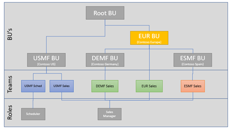

---
# required metadata

title: Company concept in Common Data Services
description: 
author: RamaKrishnamoorthy 
manager: AnnBe
ms.date: 07/15/2019
ms.topic: article
ms.prod: 
ms.service: dynamics-ax-applications
ms.technology: 

# optional metadata

ms.search.form: 
# ROBOTS: 
audience: Application User, IT Pro
# ms.devlang: 
ms.reviewer: rhaertle
ms.search.scope: Core, Operations
# ms.tgt_pltfrm: 
ms.custom: 
ms.assetid: 
ms.search.region: global
ms.search.industry: 
ms.author: ramasri
ms.dyn365.ops.version: 
ms.search.validFrom: 2019-07-15

---

## Company concept in Common Data Services

[!include [banner](../includes/banner.md)]

The concept of "Company" concept in Finance and Operations is both a legal and a business construct. It is also a security and visibility boundary for data. Users are always working in the context of a single company. The vast majority of the data is striped by company. We don't have an equivalent concept in the Common Data Service (CDS), but the closest one is "Business unit" (BU) and it is primarily a security and visibility boundary for user data. It does not have the same legal or business implications as as the Company entity in Finance and Operations. 

For CDS integration, because BU and Company are not equivalent constructs, we cannot force a 1:1 mapping between them. At the same time, it is necessary to ensure that by default a user will see the same records in Finance and Operations as that user sees in CDS. To support this, we introduce a new entity in CDS called cdm\_Company which is equivalent to Company in Finance and Operations. To ensure visibility of records is equivalent between Finance and Operations and CDS out of the box, we recommend the following setup of data in CDS: 

+ For each Finance and Operations Company is enabled for dual-write, an associated cdm\_Company record is created. 
+ When a cdm\_Company is created and enabled for dual-write, a default BU by the same name is created. That business unit gets a default team created automatically, but is not used.
+ A separate "Owner team" is created by the same name and also associated with that business unit. 
+ By default, any record created in Finance and Operations and dual-written to CDS will have its owner set to the DW "owner team", which is linked to the associated BU. 

The impact of this configuration is any Finance and Operations record related to the USMF company will be owned by a team linked to the USMF BU in CDS. Therefore, any user who has access to that Business Unit through a security role, set to BU-level visibility can now see those records. An example of how teams can be used to provide access to these records correctly is shown below. 

+ The "USMF Sales" team gives members of the team the "Sales manager" role. 
+ The Sales Manager role says people with the role can access any Account records which are members of the same BU as the user. 
+ The USMF Sales team is linked to the USMF BU mentioned earlier.  
+ This means members of the "USMF Sales" team can see any account owned by the "USMF DW" user, which would have come from the USMF company in Finance and Operations. 

As shown in the diagram, this one-to-one mapping between Business Unit, Company, and Team is just a starting point. In this example, a new "Europe BU" is manually created in CDS as the parent for both DEMF and ESMF. This new root BU is unrelated to dual-write, but can be used to give members of the "EUR Sales" team access to both DEMF and ESMF account data by setting the data visibility to "Parent/Child BU" in the associated security role. 

A final element to discuss is how dual-write recognized which owner team to assign records to. This is controlled by the "Default owning team" field on the cdm\_Company record. When a cdm\_Company record is enabled for dual-write, a plugin automatically creates the associated BU and owner team (if it does not exist) and sets the default owning team field. The administrator can change the default owning team to a different value, but can not clear the field as long as the entity is enabled for dual-write. 

## Company striping and bootstrapping

CDS integration brings company parity through striping of data with company identifier. All company specific entities are extended to have a N:1 relationship with cdm\_company entity as shown in the following diagram.

+ For a record, once a Company is added and saved, the value becomes read-only. Therefor, users should make sure they choose the right company in the first place.
+ Only records with company data are eligible for dual-write between Finance and Operations and CDS.
+ For the existing CDS data, an administrator-led bootstrapping experience will be available soon.

