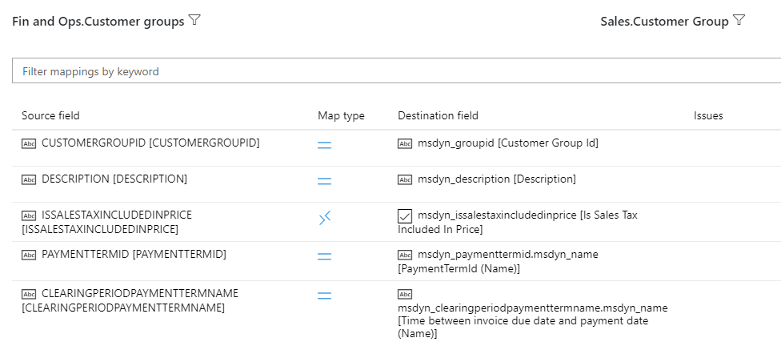
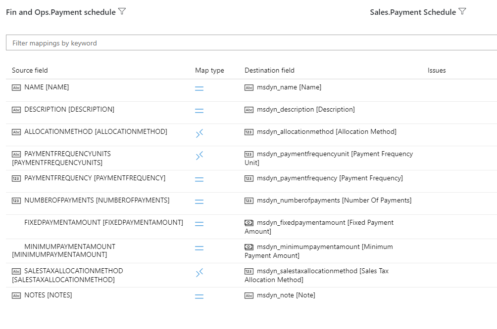

---
# required metadata

title: Near-real time data integration between Finance and Operations and Common Data Service
description: 
author: RamaKrishnamoorthy 
manager: AnnBe
ms.date: 07/15/2019
ms.topic: article
ms.prod: 
ms.service: dynamics-ax-applications
ms.technology: 

# optional metadata

ms.search.form: 
# ROBOTS: 
audience: Application User, IT Pro
# ms.devlang: 
ms.reviewer: rhaertle
ms.search.scope: Core, Operations
# ms.tgt_pltfrm: 
ms.custom: 
ms.assetid: 
ms.search.region: global
ms.search.industry: 
ms.author: ramasri
ms.dyn365.ops.version: 
ms.search.validFrom: 2019-07-15

---

## Integrated Customer Master

When a business eco-system is using D365 suite of applications, it's
natural that customer records get mastered in more than one application.
Say for example, SMB sales motion can bring in commercial customer
records through D365 for Sales application and ecommerce or retail sales
can bring in customer records through D365 for Finance and Operations
application. Irrespective of where the customer record is originating,
it gets integrated behind the scenes beyond application boundaries and
infrastructure differences. Integrated customer mastering helps to
handle multi-mastering scenarios and provides 360 view of the customer
to D365 application suite.

### Customer data flow

"Customer" is a well-defined concept in both F&O and CDS. So, integration of customer data involves harmonizing the customer concept between F&O and CDS applications. Here is how the customer data flow looks like:

Customers can be broadly classified into 2 types namely commercial/organizational customers and consumers/end users. These 2 types of customers are stored and handled differently in F&O and CDS.

In F&O, both commercial customers and consumers are mastered in a single table called "CustTable" (CustomerCustomerV3Entity) and they are classified based on the "Type" attribute. (Type=Organization =\> Commercial/organizational customer; Type=Person =\> consumer/end user).The primary contact person information is handled through
"SMMContactPersonEntity" entity.

In CDS, the commercial customers are mastered in "Account" entity and identified as a customer when "RelationshipType" attribute is set to "Customer". Both consumer/end user and the contact person are represented as "Contact". In order to have a clear separation between a contact person and a consumer/end user, we are introducing a new Boolean flag on the Contact entity called "Sellable". When "Sellable=True", the contact is a consumer/end user and can have quotes/orders created for him. When "Sellable=False", the contact is only a primary contact person of a customer.

Note: When a non-sellable contact participates in a quote or order process, the contact is flagged as a sellable contact by setting "Sellable=true". Once a contact becomes a sellable contact, he/she remains as a sellable contact.

### Templates

When we say Customer data, it includes all information about the customer like customer group, addresses, contact information, payment profile, invoice profile, loyalty status and so on. So, a collection of entity maps works together in customer data interaction as listed below.

Finance and Operations    | Customer Engagement Application
--------------------------|---------------------------------
Customer V3               | Account
Customer V3               | Contact
CDS Contacts V2           | Contact
Customer groups           | Msdyn\_customergroups
Customer Payment Method   | Msdyn\_customerpaymentmethods
Loyalty Card              | Msdyn\_loyaltycards
Payment Schedule          | Msdyn\_paymentschedules
Payment Schedule          | Msdyn\_paymentschedulelines
Payment day CDS           | Msdyn\_paymentdays
Payment day lines CDS     | Msdyn\_paymentdaylines
Terms of Payment          | Msdyn\_paymentterms
Name Affixes              | Msdyn\_nameaffixes

### Customer V3 to Account

It synchronizes the commercial/organization customer master information between F&O and CDS.

### Customer V3 to Contact

It synchronizes consumer/end user customer master data between F&O and CE.

### Contacts

It synchronized all primary, secondary and tertiary contact information of both customers and vendors between F&O and CE.

### Customer Groups

Synchronize customer group information between F&O and CE.

### Customer Payment Methods

Synchronize customer payment method information between F&O and CE.

### Loyalty Cards

It synchronizes customer loyalty card information between F&O and CE.

### Payment Schedules

It synchronizes payment schedule reference data between F&O and CE for both customers and vendors.

### Payment Schedule Lines

It synchronizes payment schedule lines reference data between F&O and CE for both customers and vendors.

### Payment days

It synchronizes payment days reference data between F&O and CE for both customers and vendors.

### Payment Day Lines

It synchronizes payment day lines reference data between F&O and CE for both customers and vendors.

### Payment Terms

It synchronizes payment terms (aka terms of payment) reference data between F&O and CE for both customers and vendors.

### Name Affixes

It synchronizes name affixes reference data between F&O and CE for both customers and vendors.

