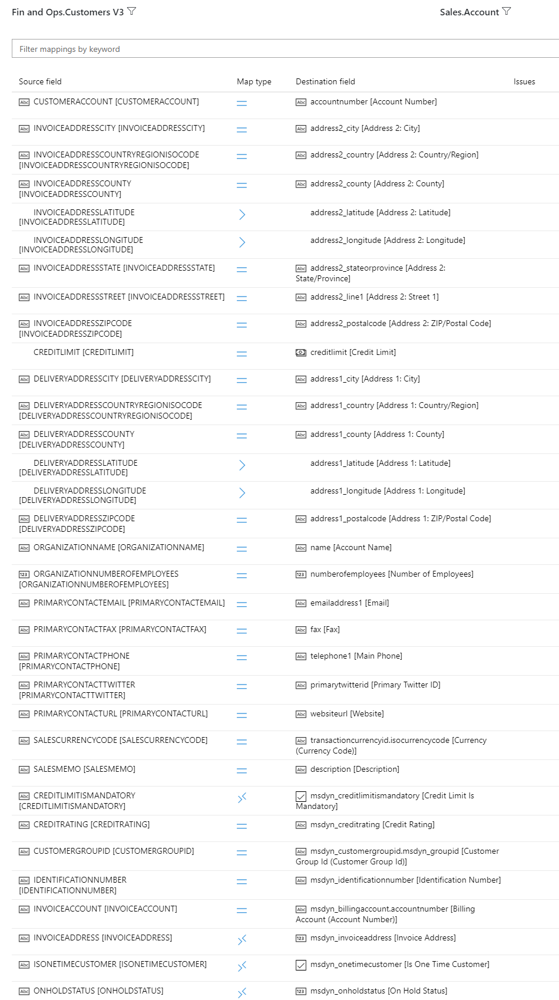
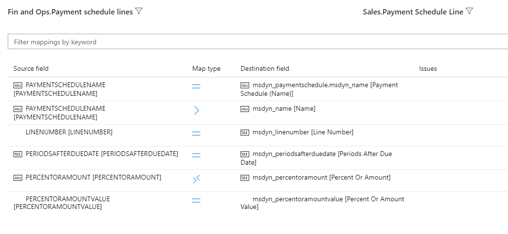

---
# required metadata

title: Integrated Customer Master
description: 
author: RamaKrishnamoorthy 
manager: AnnBe
ms.date: 07/15/2019
ms.topic: article
ms.prod: 
ms.service: dynamics-ax-applications
ms.technology: 

# optional metadata

ms.search.form: 
# ROBOTS: 
audience: Application User, IT Pro
# ms.devlang: 
ms.reviewer: rhaertle
ms.search.scope: Core, Operations
# ms.tgt_pltfrm: 
ms.custom: 
ms.assetid: 
ms.search.region: global
ms.search.industry: 
ms.author: ramasri
ms.dyn365.ops.version: 
ms.search.validFrom: 2019-07-15

---

## Integrated Customer Master

It's common for customer records to be mastered in more than one application. For example, SMB sales motion can bring in commercial customer records through a Dynamics 365 for Sales application and e-Commerce or retail sales can bring in customer records through a Dynamics 365 for Finance and Operations application. Regardless of where the customer record originates, it is integrated behind the scenes beyond application boundaries and infrastructure differences. Integrated customer mastering helps to handle multi-mastering scenarios and provides a comprehensive view of the customer to Dynamics 365 application suite.

## Customer data flow

*Customer* is a well-defined concept in both Finance and Operations and the Common Data Service (CDS). Therefore, the integration of customer data involves harmonizing the customer concept between Finance and Operations and CDS applications. The following diagram shows the customer data flow:

Customers can be broadly classified into two types - commercial/organizational customers and consumers/end users. These two types of customers are stored and handled differently in Finance and Operations and CDS.

In Finance and Operations, both commercial customers and consumers are mastered in a single table named **CustTable** (CustomerCustomerV3Entity) and they are classified based on the **Type** attribute. (Type=Organization =\> Commercial/organizational customer; Type=Person =\> consumer/end user).The primary contact person information is handled through the **SMMContactPersonEntity** entity.

In CDS, the commercial customers are mastered in **Account** entity and identified as a customer when the **RelationshipType** attribute is set to **Customer**. Both consumer/end user and the contact person are represented as **Contact**. To have a clear separation between a contact person and a consumer/end user, there is a Boolean flag on the **Contact** entity named **Sellable**. When **Sellable** is **True**, the contact is a consumer/end user and can have quotes and orders created for them. When **Sellable** is **False**, the contact is only a primary contact person of a customer.

When a non-sellable contact participates in a quote or order process, the contact is flagged as a sellable contact by setting **Sellable** to **True**. Once a contact becomes a sellable contact, the contact remains as a sellable contact.

## Templates

Customer data includes all information about the customer like customer group, addresses, contact information, payment profile, invoice profile, and loyalty status. A collection of entity maps works together in customer data interaction as shown in the following table.

Finance and Operations    | Customer Engagement Application
--------------------------|---------------------------------
Customer V3               | Account
Customer V3               | Contact
CDS Contacts V2           | Contact
Customer groups           | Msdyn\_customergroups
Customer Payment Method   | Msdyn\_customerpaymentmethods
Loyalty Card              | Msdyn\_loyaltycards
Payment Schedule          | Msdyn\_paymentschedules
Payment Schedule          | Msdyn\_paymentschedulelines
Payment day CDS           | Msdyn\_paymentdays
Payment day lines CDS     | Msdyn\_paymentdaylines
Terms of Payment          | Msdyn\_paymentterms
Name Affixes              | Msdyn\_nameaffixes

## Customer V3 to Account

Synchronizes the commercial and organization customer master information between Finance and Operations and CDS.

## Customer V3 to Contact

Synchronizes consumer and end user customer master data between Finance and Operations and Customer Engagement.

## Contacts

Synchronizes all primary, secondary, and tertiary contact information for both customers and vendors between Finance and Operations and Customer Engagement.

Source field | Map type | Destination field
---|---|---
CONTACTPERSONPARTYNUMBER | = | msdyn_partynumber
ASSOCIATEDCONTACTTYPE |  | none
FIRSTNAME | = | firstname
MIDDLENAME | = | middlename
LASTNAME | = | lastname
ASSOCIATEDCONTACTNUMBER | = | msdyn_vendorcontactid.msdyn_vendoraccountnumber
PRIMARYADDRESSCITY | = | address1_city
PRIMARYADDRESSCOUNTRYREGIONID | = | address1_country
PRIMARYADDRESSCOUNTYID | = | address1_county
PRIMARYFAXNUMBER | = | fax
PRIMARYADDRESSSTATEID | = | address1_stateorprovince
PRIMARYADDRESSSTREET | = | address1_line1
PRIMARYADDRESSZIPCODE | = | address1_postalcode
PRIMARYPHONENUMBER | = | telephone1
PRIMARYEMAILADDRESS | = | emailaddress1
EMPLOYMENTDEPARTMENT | = | department
NOTES | = | description
GENDER | = | gendercode
GOVERNMENTIDENTIFICATIONNUMBER | = | governmentid
PRIMARYURL | = | websiteurl
MARITALSTATUS | = | familystatuscode
ISRECEIVINGDIRECTMAIL | = | donotemail
EMPLOYMENTPROFESSION | = | jobtitle
SPOUSENAME | = | spousesname
none | >< | msdyn_contactforvendor
none | >< | msdyn_contactpersonid

## Customer Groups

Synchronizes customer group information between Finance and Operations and Customer Engagement.

## Customer Payment Methods

Synchronizes customer payment method information between Finance and Operations and Customer Engagement.

## Loyalty Cards

Synchronizes customer loyalty card information between Finance and Operations and Customer Engagement.

## Payment Schedules

Synchronizes payment schedule reference data between Finance and Operations and Customer Engagement for both customers and vendors.

## Payment Schedule Lines

Synchronizes payment schedule lines reference data between Finance and Operations and Customer Engagement for both customers and vendors.

## Payment days

Synchronizes payment days reference data between Finance and Operations and Customer Engagement for both customers and vendors.

## Payment Day Lines

Synchronizes payment day lines reference data between Finance and Operations and Customer Engagement for both customers and vendors.

## Payment Terms

Synchronizes payment terms (terms of payment) reference data between Finance and Operations and Customer Engagement for both customers and vendors.

## Name Affixes

Synchronizes name affixes reference data between Finance and Operations and Customer Engagement for both customers and vendors.

