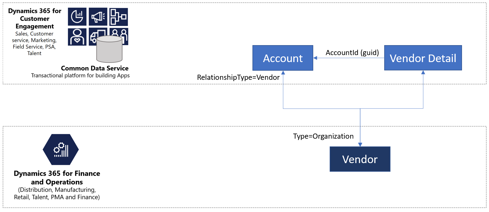

---
# required metadata

title: Vendor data flow
description: 
author: RamaKrishnamoorthy 
manager: AnnBe
ms.date: 07/15/2019
ms.topic: article
ms.prod: 
ms.service: dynamics-ax-applications
ms.technology: 

# optional metadata

ms.search.form: 
# ROBOTS: 
audience: Application User, IT Pro
# ms.devlang: 
ms.reviewer: rhaertle
ms.search.scope: Core, Operations
# ms.tgt_pltfrm: 
ms.custom: 
ms.assetid: 
ms.search.region: global
ms.search.industry: 
ms.author: ramasri
ms.dyn365.ops.version: 
ms.search.validFrom: 2019-07-15

---

## Integrated Vendor Master

*Vendor* refers to a supplier organization or a sole proprietor that is part of the supply chain process and supplies goods for the business. *Vendor* is an established concept in Finance and Operations. But in Customer Engagement, the *Vendor* concept does not exist. Some businesses overload the *Account* entity to store both customer and vendor information. Other uses a custom *Vendor* concept. Common Data Service (CDS) integration supports both these designs. You can choose to enable either of the designs based on your business scenario. Integrating the vendor data between Finance and Operations and Customer Engagement gives you the capability to multi-master vendor data. Regardless of where the vendor data originates, it is integrated behind the scenes across application boundaries and infrastructure differences. 

### Vendor data flow

If you want to use Customer Engagement for vendor-mastering and want to isolate vendor information from customers, then they can use the new vendor design that's been introduced.

For businesses who use CE for vendor mastering and want to continue to use "Account" entity for storing vendor information, they can use the extended vendor design that's been introduced. In this design, extended vendor information like vendor group, vendor post profile etc. will be stored in the "vendor detail".

Vendor contact information is similar to the customer contact information. Behind the scenes the contact person information is stored and retrieved from same entities.

### Templates

When we say Vendor data, it includes all information about the vendor like vendor group, addresses, contact information, payment profile and invoice profile and so on. So, a collection of entity maps works together in vendor data interaction as listed below.

Finance and Operations  | Customer Engagement Application
------------------------|---------------------------------
Vendor V2               | Account
Vendor V2               | Msdyn\_vendors
CDS Contacts V2         | Contact
Vendor groups           | Msdyn\_vendorgroups
Vendor Payment Method   | Msdyn\_vendorpaymentmethods
Payment Schedule        | Msdyn\_paymentschedules
Payment Schedule        | Msdyn\_paymentschedulelines
Payment day CDS         | Msdyn\_paymentdays
Payment day lines CDS   | Msdyn\_paymentdaylines
Terms of Payment        | Msdyn\_paymentterms
Name Affixes            | Msdyn\_nameaffixes

### Vendor V2 to Account 

Businesses using Account entity to store vendor information can continue to use the same way and also take advantage of the explicit vendor functionality coming due to F&O integration.

### Vendor V2 to Msdyn\_vendors

Businesses using a custom solution for vendors can take advantage of the out-of-the-box vendor concept introduced in CDS due to F&O integration. 

### Contacts

It synchronized all primary, secondary and tertiary contact information of both customers and vendors between F&O and CE. Refer to the entity map details provided under Integrated Customer Master > Templates section.

### Vendor Groups

Synchronize vendor group information between F&O and CE.

### Vendor Payment Method

Synchronize vendor payment method information between F&O and CE.

